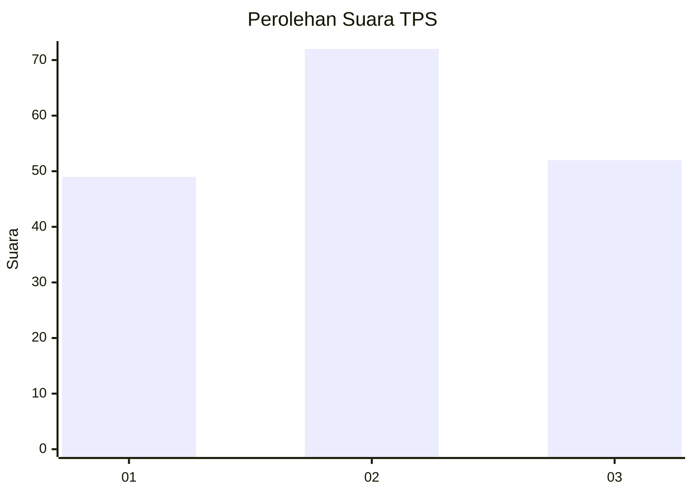
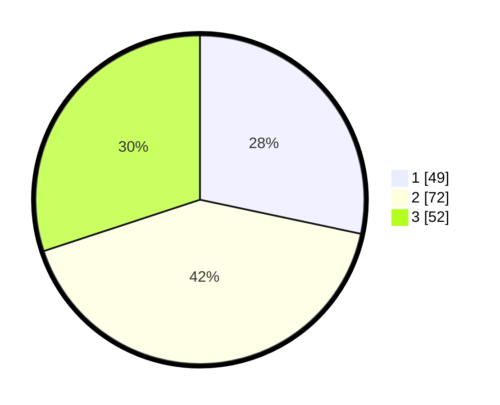

# Hasil

## Grafik

## Tabel

| No. | Nama Paslon    | Suara | Suara (raw) | Persentase |
|:--- |:-------------- | -----:| -----------:| ----------:|
| 1   | ANIES MUHAIMIN | 49    | [49][p-1]   | 28,32      |
| 2   | PRABOWO GIBRAN | 72    | [72][p-2]   | 41,62      |
| 3   | GANJAR MAHFUD  | 52    | [52][p-3]   | 30,06      |

[p-1]: https://github.com/gigit-pemilu/pemilu-2024-35-jawa-timur/blob/main/pilpres/hitung-suara/sub/35-jawa-timur/sub/05-blitar/sub/21-selorejo/sub/2001-banjarsari/sub/006-tps/sub/paslon-1.txt
[p-2]: https://github.com/gigit-pemilu/pemilu-2024-35-jawa-timur/blob/main/pilpres/hitung-suara/sub/35-jawa-timur/sub/05-blitar/sub/21-selorejo/sub/2001-banjarsari/sub/006-tps/sub/paslon-2.txt
[p-3]: https://github.com/gigit-pemilu/pemilu-2024-35-jawa-timur/blob/main/pilpres/hitung-suara/sub/35-jawa-timur/sub/05-blitar/sub/21-selorejo/sub/2001-banjarsari/sub/006-tps/sub/paslon-3.txt

## Foto C Plano

https://sirekap-obj-formc.kpu.go.id/da50/pemilu/ppwp/35/05/21/20/01/3505212001006-20240214-212430--ce3cade6-bdab-4c8f-9084-1c56948cafab.jpg

https://sirekap-obj-formc.kpu.go.id/da50/pemilu/ppwp/35/05/21/20/01/3505212001006-20240214-212525--b29ea8fb-109d-451e-9d48-0af06a78347b.jpg

https://sirekap-obj-formc.kpu.go.id/da50/pemilu/ppwp/35/05/21/20/01/3505212001006-20240214-212532--e84ef24e-6616-424e-983b-89cf87ed0940.jpg

## Metadata

| Key        | Value               |
| ---------- | ------------------- |
| Time Stamp | 2024-02-15 12:00:28 |

