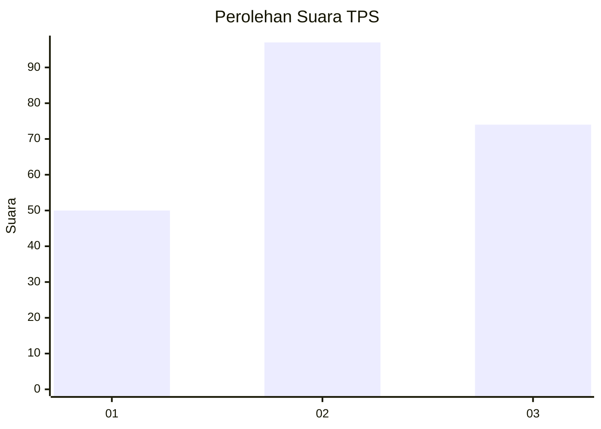
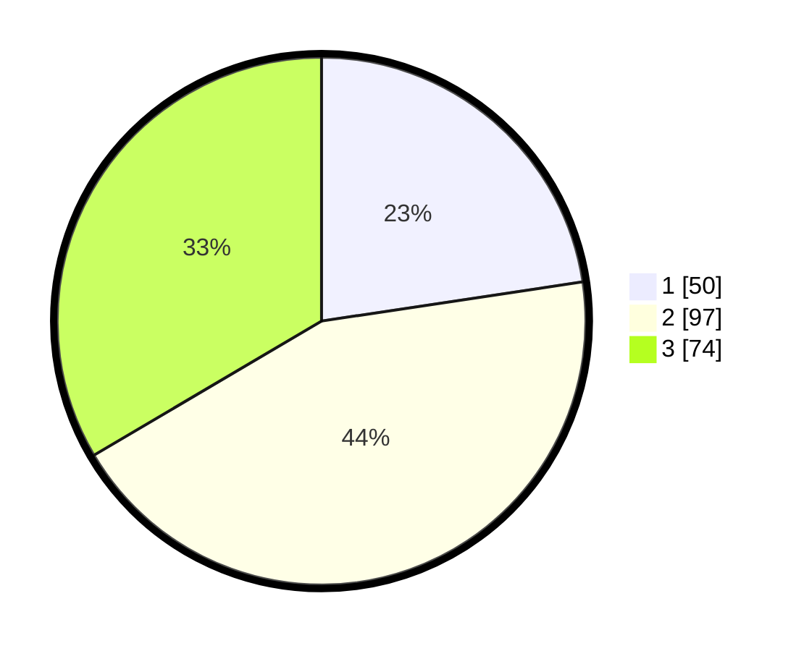

# Hasil

## Grafik

## Tabel

| No. | Nama Paslon    | Suara | Suara (raw) | Persentase |
|:--- |:-------------- | -----:| -----------:| ----------:|
| 1   | ANIES MUHAIMIN | 50    | [50][p-1]   | 22,62      |
| 2   | PRABOWO GIBRAN | 97    | [97][p-2]   | 43,89      |
| 3   | GANJAR MAHFUD  | 74    | [74][p-3]   | 33,48      |

[p-1]: https://github.com/gigit-pemilu/pemilu-2024-35-jawa-timur/blob/main/pilpres/hitung-suara/sub/35-jawa-timur/sub/05-blitar/sub/21-selorejo/sub/2001-banjarsari/sub/009-tps/sub/paslon-1.txt
[p-2]: https://github.com/gigit-pemilu/pemilu-2024-35-jawa-timur/blob/main/pilpres/hitung-suara/sub/35-jawa-timur/sub/05-blitar/sub/21-selorejo/sub/2001-banjarsari/sub/009-tps/sub/paslon-2.txt
[p-3]: https://github.com/gigit-pemilu/pemilu-2024-35-jawa-timur/blob/main/pilpres/hitung-suara/sub/35-jawa-timur/sub/05-blitar/sub/21-selorejo/sub/2001-banjarsari/sub/009-tps/sub/paslon-3.txt

## Foto C Plano

https://sirekap-obj-formc.kpu.go.id/c927/pemilu/ppwp/35/05/21/20/01/3505212001009-20240217-055722--e5b460c4-1082-4b43-b502-aa4efae54fe9.jpg

https://sirekap-obj-formc.kpu.go.id/c927/pemilu/ppwp/35/05/21/20/01/3505212001009-20240217-060208--45ac17d5-90f7-48ab-a54e-4a197eb25bcc.jpg

https://sirekap-obj-formc.kpu.go.id/c927/pemilu/ppwp/35/05/21/20/01/3505212001009-20240217-061154--12d6769e-9352-4278-9635-a5f82a7c2536.jpg

## Metadata

| Key        | Value               |
| ---------- | ------------------- |
| Time Stamp | 2024-02-17 06:30:03 |

