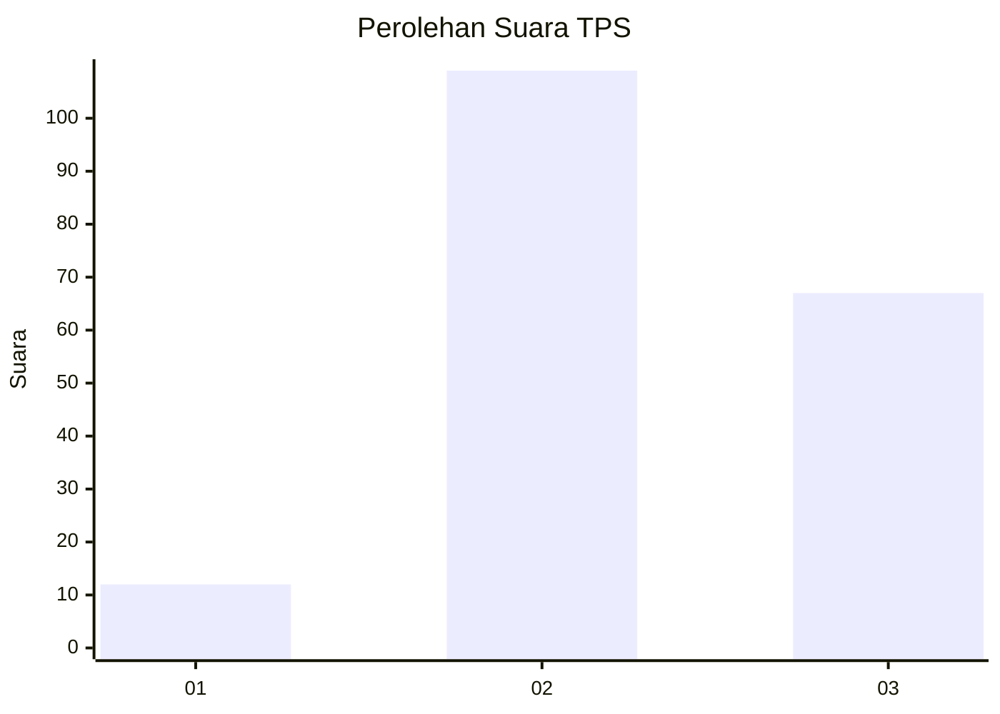
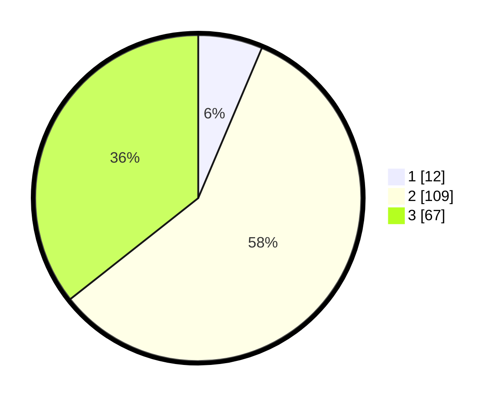

# Hasil

## Grafik

## Tabel

| No. | Nama Paslon    | Suara | Suara (raw) | Persentase |
|:--- |:-------------- | -----:| -----------:| ----------:|
| 1   | ANIES MUHAIMIN | 12    | [12][p-1]   | 6,38       |
| 2   | PRABOWO GIBRAN | 109   | [109][p-2]  | 57,98      |
| 3   | GANJAR MAHFUD  | 67    | [67][p-3]   | 35,64      |

[p-1]: https://github.com/gigit-pemilu/pemilu-2024-35-jawa-timur/blob/main/pilpres/hitung-suara/sub/35-jawa-timur/sub/05-blitar/sub/21-selorejo/sub/2005-ngrendeng/sub/004-tps/sub/paslon-1.txt
[p-2]: https://github.com/gigit-pemilu/pemilu-2024-35-jawa-timur/blob/main/pilpres/hitung-suara/sub/35-jawa-timur/sub/05-blitar/sub/21-selorejo/sub/2005-ngrendeng/sub/004-tps/sub/paslon-2.txt
[p-3]: https://github.com/gigit-pemilu/pemilu-2024-35-jawa-timur/blob/main/pilpres/hitung-suara/sub/35-jawa-timur/sub/05-blitar/sub/21-selorejo/sub/2005-ngrendeng/sub/004-tps/sub/paslon-3.txt

## Foto C Plano

https://sirekap-obj-formc.kpu.go.id/b115/pemilu/ppwp/35/05/21/20/05/3505212005004-20240218-145418--7bdfaac2-14dc-4fed-b4a1-31100dcbf0ee.jpg

https://sirekap-obj-formc.kpu.go.id/b115/pemilu/ppwp/35/05/21/20/05/3505212005004-20240214-192847--d4a4f98f-bf6c-42c7-b5f6-48c62f1fb62c.jpg

https://sirekap-obj-formc.kpu.go.id/b115/pemilu/ppwp/35/05/21/20/05/3505212005004-20240214-192922--06500080-c742-4700-83af-7d0b1235c6f7.jpg

## Metadata

| Key        | Value               |
| ---------- | ------------------- |
| Time Stamp | 2024-02-19 06:16:00 |

