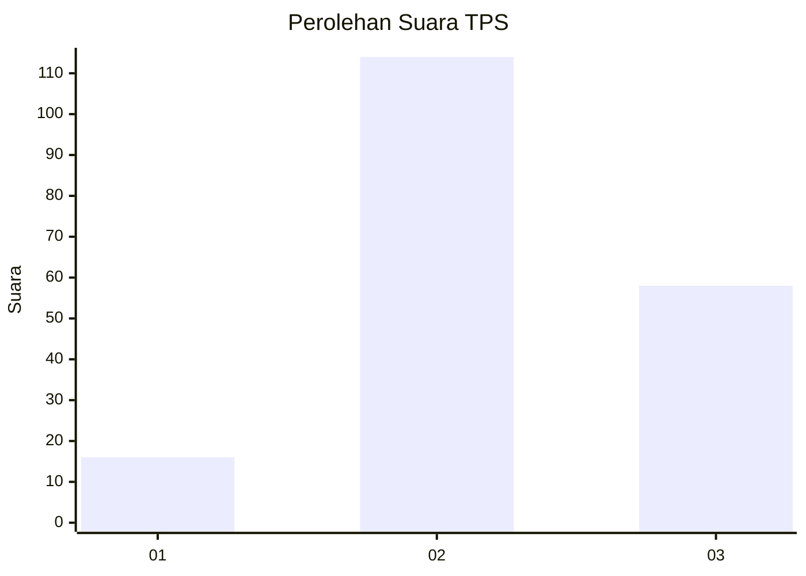
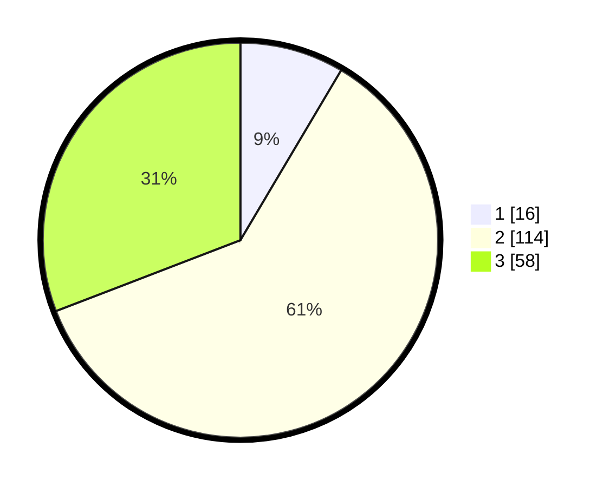

# Hasil

## Grafik

## Tabel

| No. | Nama Paslon    | Suara | Suara (raw) | Persentase |
|:--- |:-------------- | -----:| -----------:| ----------:|
| 1   | ANIES MUHAIMIN | 16    | [16][p-1]   | 8,51       |
| 2   | PRABOWO GIBRAN | 114   | [114][p-2]  | 60,64      |
| 3   | GANJAR MAHFUD  | 58    | [58][p-3]   | 30,85      |

[p-1]: https://github.com/gigit-pemilu/pemilu-2024-35-jawa-timur/blob/main/pilpres/hitung-suara/sub/35-jawa-timur/sub/05-blitar/sub/21-selorejo/sub/2007-ampelgading/sub/009-tps/sub/paslon-1.txt
[p-2]: https://github.com/gigit-pemilu/pemilu-2024-35-jawa-timur/blob/main/pilpres/hitung-suara/sub/35-jawa-timur/sub/05-blitar/sub/21-selorejo/sub/2007-ampelgading/sub/009-tps/sub/paslon-2.txt
[p-3]: https://github.com/gigit-pemilu/pemilu-2024-35-jawa-timur/blob/main/pilpres/hitung-suara/sub/35-jawa-timur/sub/05-blitar/sub/21-selorejo/sub/2007-ampelgading/sub/009-tps/sub/paslon-3.txt

## Foto C Plano

https://sirekap-obj-formc.kpu.go.id/e70b/pemilu/ppwp/35/05/21/20/07/3505212007009-20240216-213129--a579f3a8-2c32-4fd0-af27-0fedaa813cfb.jpg

https://sirekap-obj-formc.kpu.go.id/e70b/pemilu/ppwp/35/05/21/20/07/3505212007009-20240216-213336--cf828701-5209-4a90-b2a0-a311221609b9.jpg

https://sirekap-obj-formc.kpu.go.id/e70b/pemilu/ppwp/35/05/21/20/07/3505212007009-20240216-213605--ce92b05d-daff-4a65-96b5-0ef7136281bc.jpg

## Metadata

| Key        | Value               |
| ---------- | ------------------- |
| Time Stamp | 2024-02-16 22:30:00 |

