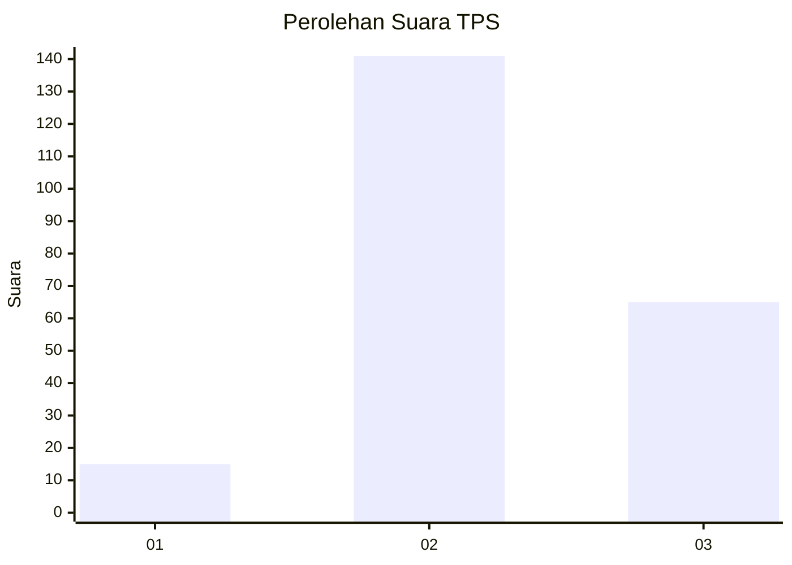
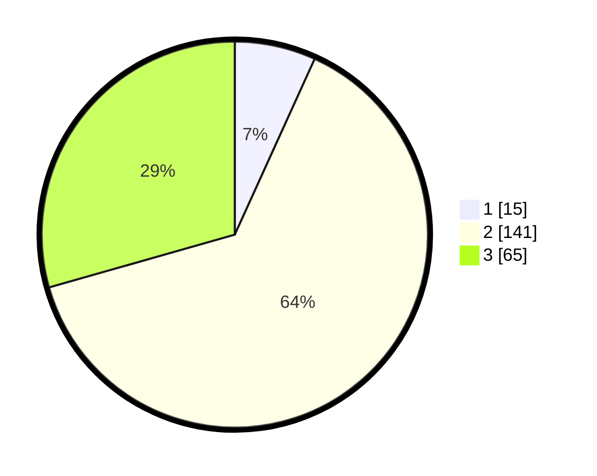

# Hasil

## Grafik

## Tabel

| No. | Nama Paslon    | Suara | Suara (raw) | Persentase |
|:--- |:-------------- | -----:| -----------:| ----------:|
| 1   | ANIES MUHAIMIN | 15    | [15][p-1]   | 6,79       |
| 2   | PRABOWO GIBRAN | 141   | [141][p-2]  | 63,80      |
| 3   | GANJAR MAHFUD  | 65    | [65][p-3]   | 29,41      |

[p-1]: https://github.com/gigit-pemilu/pemilu-2024-35-jawa-timur/blob/main/pilpres/hitung-suara/sub/35-jawa-timur/sub/05-blitar/sub/21-selorejo/sub/2008-olak-alen/sub/009-tps/sub/paslon-1.txt
[p-2]: https://github.com/gigit-pemilu/pemilu-2024-35-jawa-timur/blob/main/pilpres/hitung-suara/sub/35-jawa-timur/sub/05-blitar/sub/21-selorejo/sub/2008-olak-alen/sub/009-tps/sub/paslon-2.txt
[p-3]: https://github.com/gigit-pemilu/pemilu-2024-35-jawa-timur/blob/main/pilpres/hitung-suara/sub/35-jawa-timur/sub/05-blitar/sub/21-selorejo/sub/2008-olak-alen/sub/009-tps/sub/paslon-3.txt

## Foto C Plano

https://sirekap-obj-formc.kpu.go.id/7a15/pemilu/ppwp/35/05/21/20/08/3505212008009-20240214-233800--78d66dd2-2cbe-4510-b32d-c8d9cea0efc3.jpg

https://sirekap-obj-formc.kpu.go.id/7a15/pemilu/ppwp/35/05/21/20/08/3505212008009-20240214-212609--78d79cff-d91e-4040-ab39-5d510f73adad.jpg

https://sirekap-obj-formc.kpu.go.id/7a15/pemilu/ppwp/35/05/21/20/08/3505212008009-20240214-211323--97ae0997-2c1b-4bf0-b306-d4192cfb9ff7.jpg

## Metadata

| Key        | Value               |
| ---------- | ------------------- |
| Time Stamp | 2024-02-16 22:01:00 |

