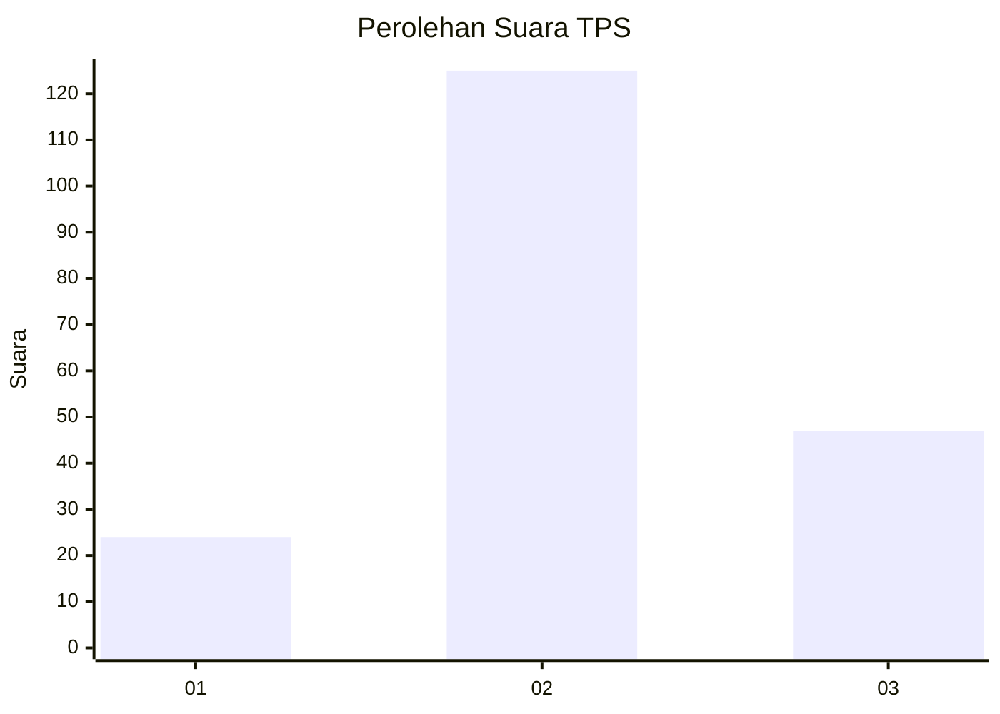
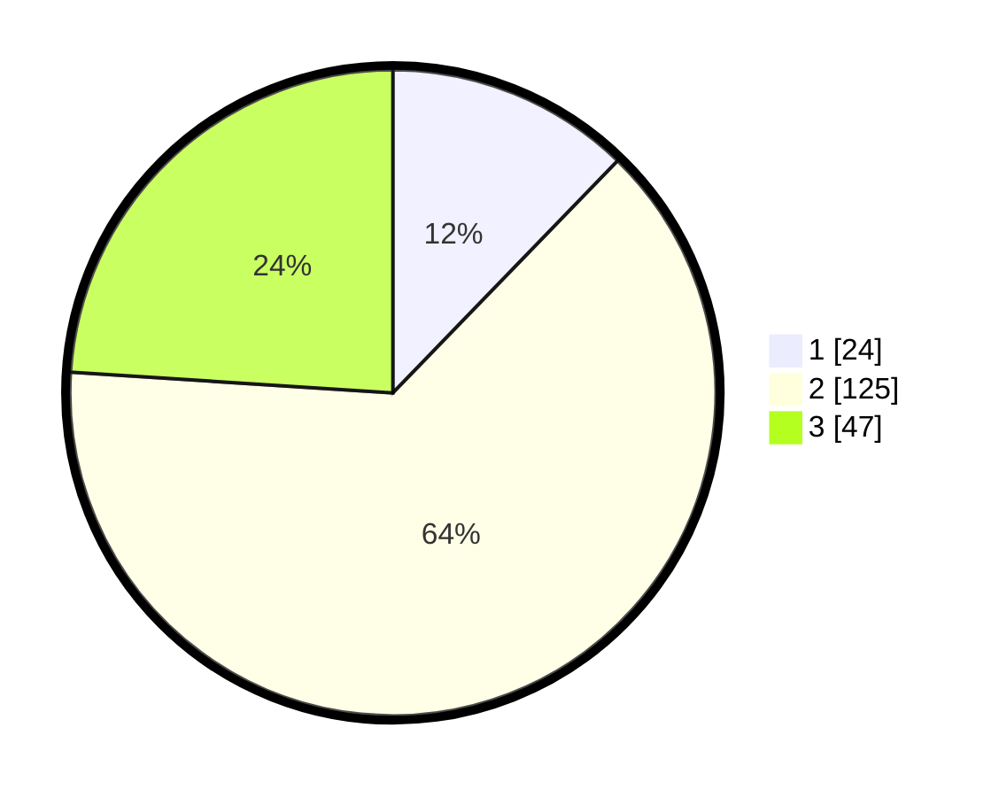

# Hasil

## Grafik

## Tabel

| No. | Nama Paslon    | Suara | Suara (raw) | Persentase |
|:--- |:-------------- | -----:| -----------:| ----------:|
| 1   | ANIES MUHAIMIN | 24    | [24][p-1]   | 12,24      |
| 2   | PRABOWO GIBRAN | 125   | [125][p-2]  | 63,78      |
| 3   | GANJAR MAHFUD  | 47    | [47][p-3]   | 23,98      |

[p-1]: https://github.com/gigit-pemilu/pemilu-2024-35-jawa-timur/blob/main/pilpres/hitung-suara/sub/35-jawa-timur/sub/05-blitar/sub/22-selopuro/sub/2004-selopuro/sub/003-tps/sub/paslon-1.txt
[p-2]: https://github.com/gigit-pemilu/pemilu-2024-35-jawa-timur/blob/main/pilpres/hitung-suara/sub/35-jawa-timur/sub/05-blitar/sub/22-selopuro/sub/2004-selopuro/sub/003-tps/sub/paslon-2.txt
[p-3]: https://github.com/gigit-pemilu/pemilu-2024-35-jawa-timur/blob/main/pilpres/hitung-suara/sub/35-jawa-timur/sub/05-blitar/sub/22-selopuro/sub/2004-selopuro/sub/003-tps/sub/paslon-3.txt

## Foto C Plano

https://sirekap-obj-formc.kpu.go.id/46ff/pemilu/ppwp/35/05/22/20/04/3505222004003-20240216-212303--038cd1ce-cb71-4c10-87c9-16ce3c1cc425.jpg

https://sirekap-obj-formc.kpu.go.id/46ff/pemilu/ppwp/35/05/22/20/04/3505222004003-20240216-210957--c9ad9dcd-afaa-4e7f-b6c0-4d80d80de54d.jpg

https://sirekap-obj-formc.kpu.go.id/46ff/pemilu/ppwp/35/05/22/20/04/3505222004003-20240216-203857--c335ac48-56e0-4ff6-be85-07b99db1ccdd.jpg

## Metadata

| Key        | Value               |
| ---------- | ------------------- |
| Time Stamp | 2024-02-16 22:01:00 |

