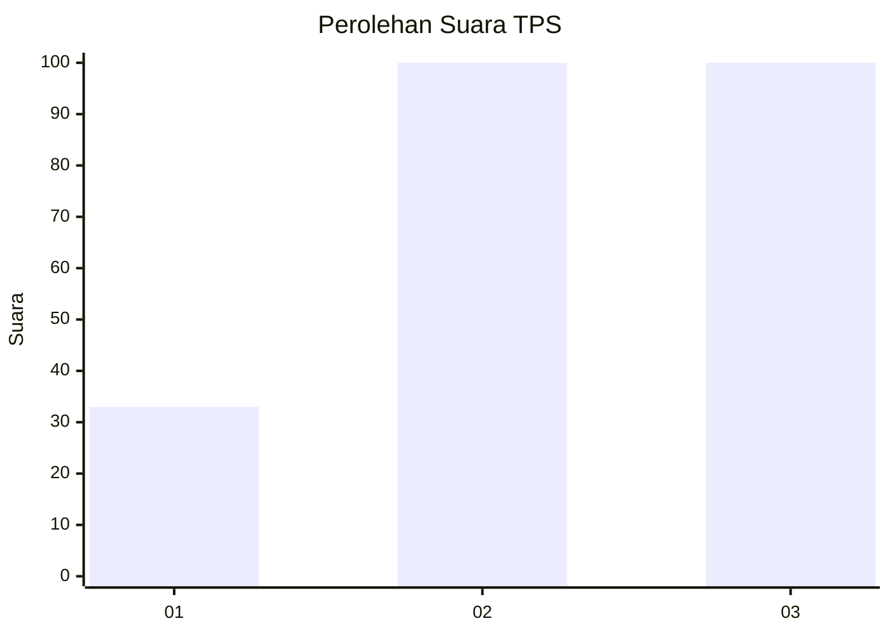
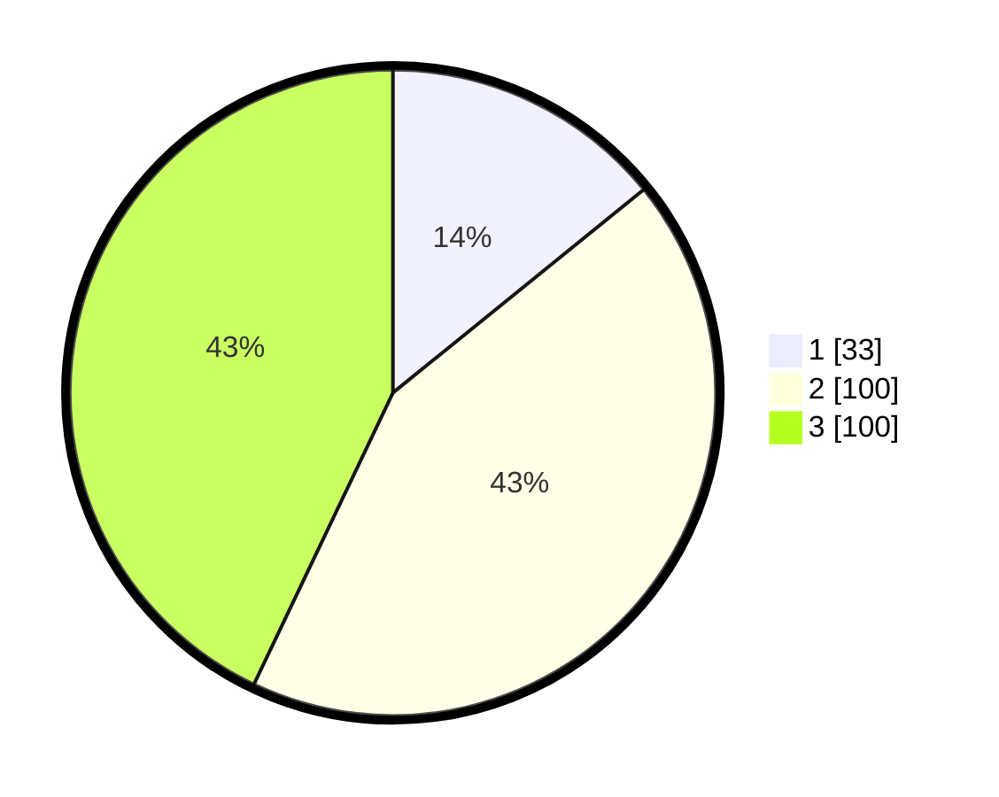

# Hasil

## Grafik

## Tabel

| No. | Nama Paslon    | Suara | Suara (raw) | Persentase |
|:--- |:-------------- | -----:| -----------:| ----------:|
| 1   | ANIES MUHAIMIN | 33    | [33][p-1]   | 14,16      |
| 2   | PRABOWO GIBRAN | 100   | [100][p-2]  | 42,92      |
| 3   | GANJAR MAHFUD  | 100   | [100][p-3]  | 42,92      |

[p-1]: https://github.com/gigit-pemilu/pemilu-2024-35-jawa-timur/blob/main/pilpres/hitung-suara/sub/35-jawa-timur/sub/05-blitar/sub/22-selopuro/sub/2006-ploso/sub/007-tps/sub/paslon-1.txt
[p-2]: https://github.com/gigit-pemilu/pemilu-2024-35-jawa-timur/blob/main/pilpres/hitung-suara/sub/35-jawa-timur/sub/05-blitar/sub/22-selopuro/sub/2006-ploso/sub/007-tps/sub/paslon-2.txt
[p-3]: https://github.com/gigit-pemilu/pemilu-2024-35-jawa-timur/blob/main/pilpres/hitung-suara/sub/35-jawa-timur/sub/05-blitar/sub/22-selopuro/sub/2006-ploso/sub/007-tps/sub/paslon-3.txt

## Foto C Plano

https://sirekap-obj-formc.kpu.go.id/5d7d/pemilu/ppwp/35/05/22/20/06/3505222006007-20240214-193828--f2c97db8-b2dc-447d-8ae1-32bf870cf5d7.jpg

https://sirekap-obj-formc.kpu.go.id/5d7d/pemilu/ppwp/35/05/22/20/06/3505222006007-20240214-194212--b834fbe3-4944-43e2-9326-fa335baa800d.jpg

https://sirekap-obj-formc.kpu.go.id/5d7d/pemilu/ppwp/35/05/22/20/06/3505222006007-20240214-213718--3817e667-2004-48f2-8791-a54f486a7b62.jpg

## Metadata

| Key        | Value               |
| ---------- | ------------------- |
| Time Stamp | 2024-02-15 15:00:29 |

