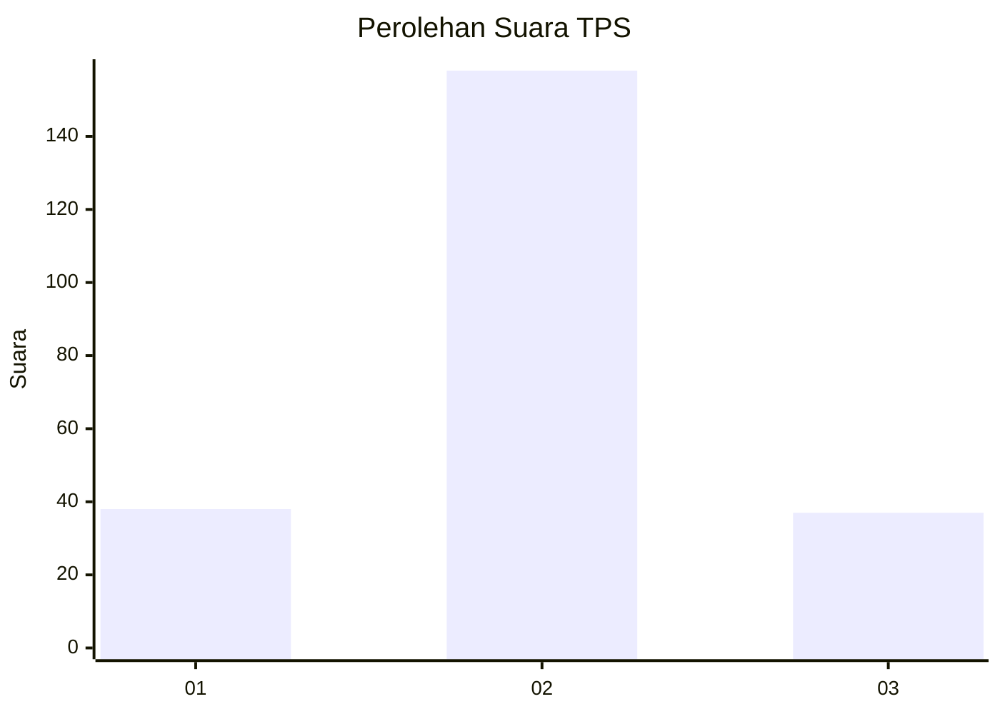
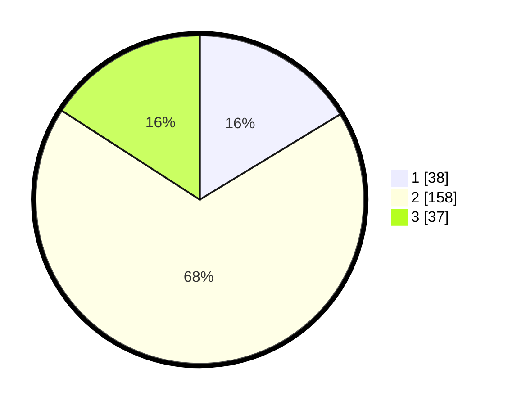

# Hasil

## Grafik

## Tabel

| No. | Nama Paslon    | Suara | Suara (raw) | Persentase |
|:--- |:-------------- | -----:| -----------:| ----------:|
| 1   | ANIES MUHAIMIN | 38    | [38][p-1]   | 16,31      |
| 2   | PRABOWO GIBRAN | 158   | [158][p-2]  | 67,81      |
| 3   | GANJAR MAHFUD  | 37    | [37][p-3]   | 15,88      |

[p-1]: https://github.com/gigit-pemilu/pemilu-2024-35-jawa-timur/blob/main/pilpres/hitung-suara/sub/35-jawa-timur/sub/06-kediri/sub/01-semen/sub/2001-bulu/sub/002-tps/sub/paslon-1.txt
[p-2]: https://github.com/gigit-pemilu/pemilu-2024-35-jawa-timur/blob/main/pilpres/hitung-suara/sub/35-jawa-timur/sub/06-kediri/sub/01-semen/sub/2001-bulu/sub/002-tps/sub/paslon-2.txt
[p-3]: https://github.com/gigit-pemilu/pemilu-2024-35-jawa-timur/blob/main/pilpres/hitung-suara/sub/35-jawa-timur/sub/06-kediri/sub/01-semen/sub/2001-bulu/sub/002-tps/sub/paslon-3.txt

## Foto C Plano

https://sirekap-obj-formc.kpu.go.id/9d04/pemilu/ppwp/35/06/01/20/01/3506012001002-20240216-135415--f785b363-46ef-4795-bf8a-99667b67fdca.jpg

https://sirekap-obj-formc.kpu.go.id/9d04/pemilu/ppwp/35/06/01/20/01/3506012001002-20240216-135416--75541f31-90df-4063-9edf-d3340a6ac871.jpg

https://sirekap-obj-formc.kpu.go.id/9d04/pemilu/ppwp/35/06/01/20/01/3506012001002-20240216-135415--11944602-4add-4599-af30-5e5a245db1de.jpg

## Metadata

| Key        | Value               |
| ---------- | ------------------- |
| Time Stamp | 2024-02-16 16:25:10 |

## DATA PEMILIH TETAP

Jumlah pemilih dalam DPT: **276**.
 * L: **154**.
 * P: **122**.

## DATA PENGGUNA HAK PILIH

Jumlah pengguna hak pilih dalam DPT: **236**.
 * L: **127**.
 * P: **109**.

Jumlah pengguna hak pilih dalam DPTb: **2**.
 * L: **0**.
 * P: **2**.

Jumlah pengguna hak pilih dalam DPK: **2**.
 * L: **1**.
 * P: **1**.

Jumlah pengguna hak pilih: **240**.
 * L: **128**.
 * P: **112**.

## JUMLAH SUARA SAH DAN TIDAK SAH

JUMLAH SELURUH SUARA SAH: **233**.

JUMLAH SUARA TIDAK SAH: **7**.

JUMLAH SELURUH SUARA SAH DAN SUARA TIDAK SAH: **240**.

