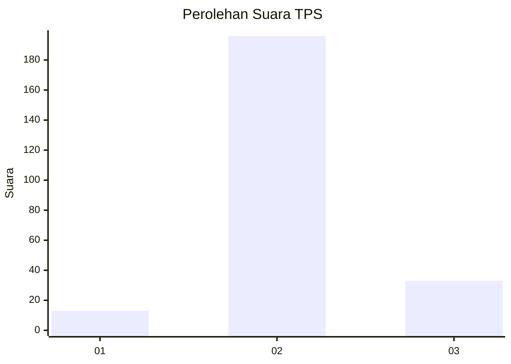
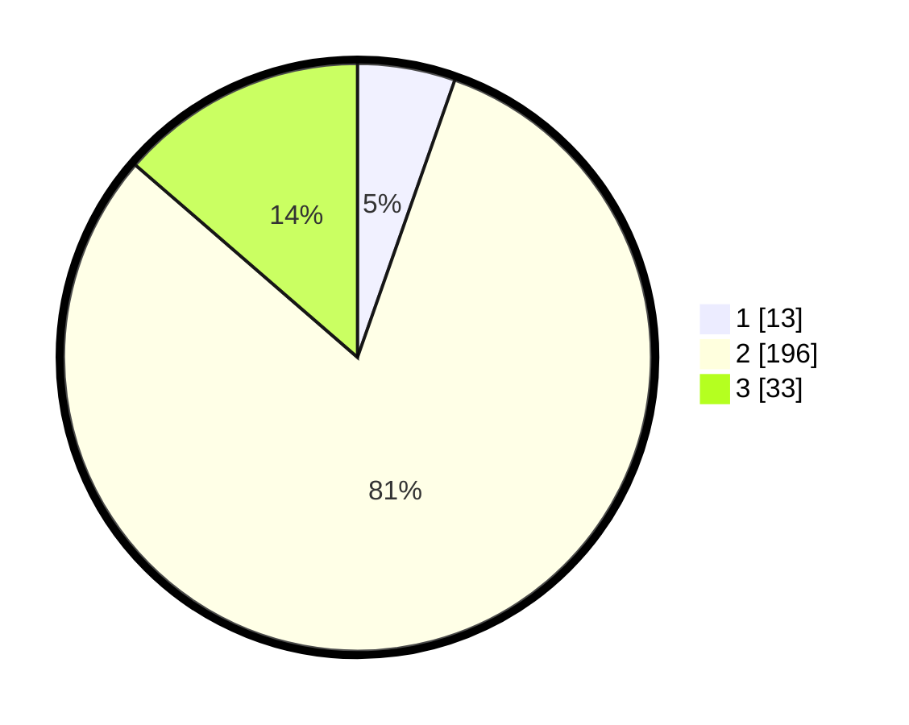

# Hasil

## Grafik

## Tabel

| No. | Nama Paslon    | Suara | Suara (raw) | Persentase |
|:--- |:-------------- | -----:| -----------:| ----------:|
| 1   | ANIES MUHAIMIN | 13    | [13][p-1]   | 5,37       |
| 2   | PRABOWO GIBRAN | 196   | [196][p-2]  | 80,99      |
| 3   | GANJAR MAHFUD  | 33    | [33][p-3]   | 13,64      |

[p-1]: https://github.com/gigit-pemilu/pemilu-2024-35-jawa-timur/blob/main/pilpres/hitung-suara/sub/35-jawa-timur/sub/06-kediri/sub/01-semen/sub/2001-bulu/sub/005-tps/sub/paslon-1.txt
[p-2]: https://github.com/gigit-pemilu/pemilu-2024-35-jawa-timur/blob/main/pilpres/hitung-suara/sub/35-jawa-timur/sub/06-kediri/sub/01-semen/sub/2001-bulu/sub/005-tps/sub/paslon-2.txt
[p-3]: https://github.com/gigit-pemilu/pemilu-2024-35-jawa-timur/blob/main/pilpres/hitung-suara/sub/35-jawa-timur/sub/06-kediri/sub/01-semen/sub/2001-bulu/sub/005-tps/sub/paslon-3.txt

## Foto C Plano

https://sirekap-obj-formc.kpu.go.id/6c63/pemilu/ppwp/35/06/01/20/01/3506012001005-20240217-204112--f34826ff-d459-4420-bf44-740ea4047d8a.jpg

https://sirekap-obj-formc.kpu.go.id/6c63/pemilu/ppwp/35/06/01/20/01/3506012001005-20240217-064839--0aaaabfe-b5f1-44f4-ac4c-b1e3d6c5016a.jpg

https://sirekap-obj-formc.kpu.go.id/6c63/pemilu/ppwp/35/06/01/20/01/3506012001005-20240217-204112--b22f9bb9-febc-46b2-bd0c-3ce65fbb6b20.jpg

## Metadata

| Key        | Value               |
| ---------- | ------------------- |
| Time Stamp | 2024-02-19 06:16:00 |

## DATA PEMILIH TETAP

Jumlah pemilih dalam DPT: **272**.
 * L: **134**.
 * P: **138**.

## DATA PENGGUNA HAK PILIH

Jumlah pengguna hak pilih dalam DPT: **245**.
 * L: **121**.
 * P: **124**.

Jumlah pengguna hak pilih dalam DPTb: **0**.
 * L: **0**.
 * P: **0**.

Jumlah pengguna hak pilih dalam DPK: **2**.
 * L: **1**.
 * P: **1**.

Jumlah pengguna hak pilih: **247**.
 * L: **122**.
 * P: **125**.

## JUMLAH SUARA SAH DAN TIDAK SAH

JUMLAH SELURUH SUARA SAH: **242**.

JUMLAH SUARA TIDAK SAH: **5**.

JUMLAH SELURUH SUARA SAH DAN SUARA TIDAK SAH: **247**.

