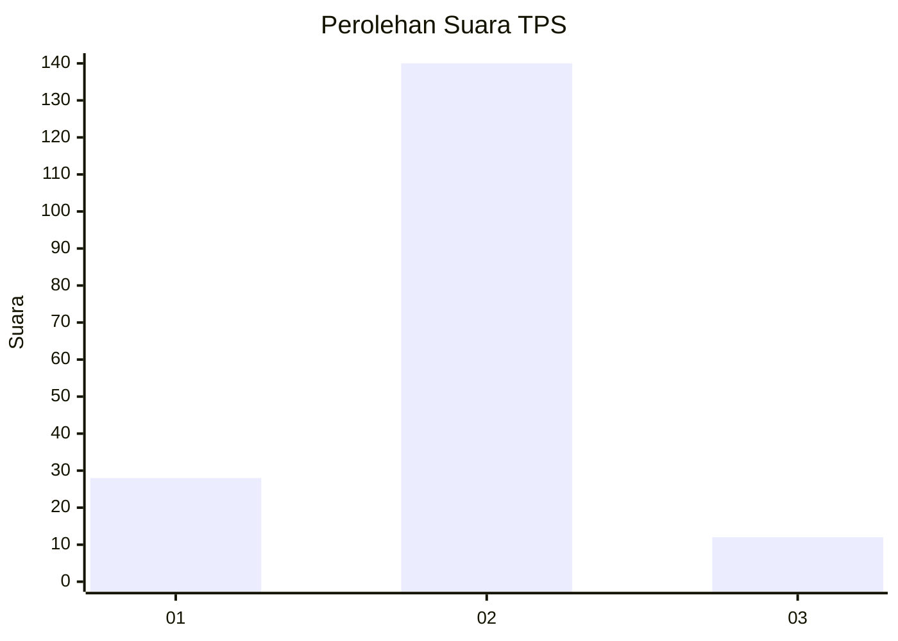
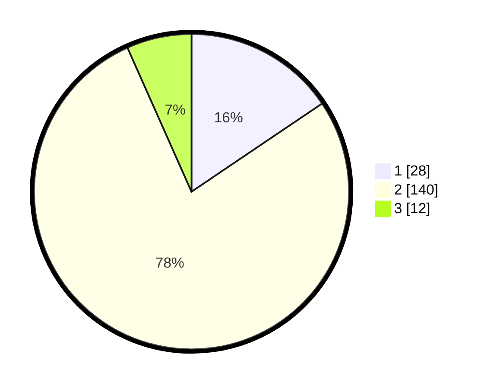

# Hasil

## Grafik

## Tabel

| No. | Nama Paslon    | Suara | Suara (raw) | Persentase |
|:--- |:-------------- | -----:| -----------:| ----------:|
| 1   | ANIES MUHAIMIN | 28    | [28][p-1]   | 15,56      |
| 2   | PRABOWO GIBRAN | 140   | [140][p-2]  | 77,78      |
| 3   | GANJAR MAHFUD  | 12    | [12][p-3]   | 6,67       |

[p-1]: https://github.com/gigit-pemilu/pemilu-2024-35-jawa-timur/blob/main/pilpres/hitung-suara/sub/35-jawa-timur/sub/06-kediri/sub/01-semen/sub/2002-sidomulyo/sub/901-tps/sub/paslon-1.txt
[p-2]: https://github.com/gigit-pemilu/pemilu-2024-35-jawa-timur/blob/main/pilpres/hitung-suara/sub/35-jawa-timur/sub/06-kediri/sub/01-semen/sub/2002-sidomulyo/sub/901-tps/sub/paslon-2.txt
[p-3]: https://github.com/gigit-pemilu/pemilu-2024-35-jawa-timur/blob/main/pilpres/hitung-suara/sub/35-jawa-timur/sub/06-kediri/sub/01-semen/sub/2002-sidomulyo/sub/901-tps/sub/paslon-3.txt

## Foto C Plano

https://sirekap-obj-formc.kpu.go.id/2b78/pemilu/ppwp/35/06/01/20/02/3506012002901-20240214-235541--56afd0f6-c92d-42bd-a86f-f59c7e750d76.jpg

https://sirekap-obj-formc.kpu.go.id/2b78/pemilu/ppwp/35/06/01/20/02/3506012002901-20240214-202436--fb2b013e-d600-42ef-8cd2-22fb26c48ff2.jpg

https://sirekap-obj-formc.kpu.go.id/2b78/pemilu/ppwp/35/06/01/20/02/3506012002901-20240214-202500--d0ab751e-8e2d-4f3f-bc43-8b1b149402fd.jpg

## Metadata

| Key        | Value               |
| ---------- | ------------------- |
| Time Stamp | 2024-02-15 20:00:44 |

## DATA PEMILIH TETAP

Jumlah pemilih dalam DPT: **212**.
 * L: **123**.
 * P: **89**.

## DATA PENGGUNA HAK PILIH

Jumlah pengguna hak pilih dalam DPT: **158**.
 * L: **95**.
 * P: **63**.

Jumlah pengguna hak pilih dalam DPTb: **22**.
 * L: **8**.
 * P: **14**.

Jumlah pengguna hak pilih dalam DPK: **0**.
 * L: **0**.
 * P: **0**.

Jumlah pengguna hak pilih: **180**.
 * L: **103**.
 * P: **77**.

## JUMLAH SUARA SAH DAN TIDAK SAH

JUMLAH SELURUH SUARA SAH: **180**.

JUMLAH SUARA TIDAK SAH: **0**.

JUMLAH SELURUH SUARA SAH DAN SUARA TIDAK SAH: **180**.

