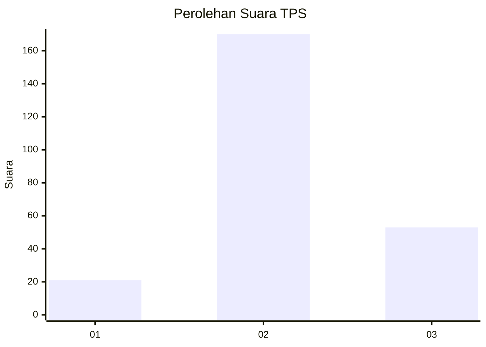
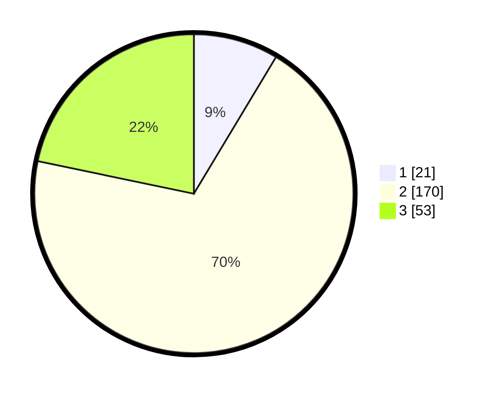

# Hasil

## Grafik

## Tabel

| No. | Nama Paslon    | Suara | Suara (raw) | Persentase |
|:--- |:-------------- | -----:| -----------:| ----------:|
| 1   | ANIES MUHAIMIN | 21    | [21][p-1]   | 8,61       |
| 2   | PRABOWO GIBRAN | 170   | [170][p-2]  | 69,67      |
| 3   | GANJAR MAHFUD  | 53    | [53][p-3]   | 21,72      |

[p-1]: https://github.com/gigit-pemilu/pemilu-2024-35-jawa-timur/blob/main/pilpres/hitung-suara/sub/35-jawa-timur/sub/06-kediri/sub/01-semen/sub/2003-puhrubuh/sub/008-tps/sub/paslon-1.txt
[p-2]: https://github.com/gigit-pemilu/pemilu-2024-35-jawa-timur/blob/main/pilpres/hitung-suara/sub/35-jawa-timur/sub/06-kediri/sub/01-semen/sub/2003-puhrubuh/sub/008-tps/sub/paslon-2.txt
[p-3]: https://github.com/gigit-pemilu/pemilu-2024-35-jawa-timur/blob/main/pilpres/hitung-suara/sub/35-jawa-timur/sub/06-kediri/sub/01-semen/sub/2003-puhrubuh/sub/008-tps/sub/paslon-3.txt

## Foto C Plano

https://sirekap-obj-formc.kpu.go.id/75ff/pemilu/ppwp/35/06/01/20/03/3506012003008-20240217-104000--c7a072e9-4929-4e17-a899-99091d755f5c.jpg

https://sirekap-obj-formc.kpu.go.id/75ff/pemilu/ppwp/35/06/01/20/03/3506012003008-20240217-104001--6f6ee00b-19e5-452a-8283-48767eeb7ee9.jpg

https://sirekap-obj-formc.kpu.go.id/75ff/pemilu/ppwp/35/06/01/20/03/3506012003008-20240217-104000--910a0bc2-8e96-458c-bc6b-85274c8bbfc4.jpg

## Metadata

| Key        | Value               |
| ---------- | ------------------- |
| Time Stamp | 2024-02-17 11:00:02 |

## DATA PEMILIH TETAP

Jumlah pemilih dalam DPT: **283**.
 * L: **148**.
 * P: **135**.

## DATA PENGGUNA HAK PILIH

Jumlah pengguna hak pilih dalam DPT: **260**.
 * L: **136**.
 * P: **124**.

Jumlah pengguna hak pilih dalam DPTb: **260**.
 * L: **136**.
 * P: **124**.

Jumlah pengguna hak pilih dalam DPK: **0**.
 * L: **0**.
 * P: **0**.

Jumlah pengguna hak pilih: **260**.
 * L: **136**.
 * P: **124**.

## JUMLAH SUARA SAH DAN TIDAK SAH

JUMLAH SELURUH SUARA SAH: **244**.

JUMLAH SUARA TIDAK SAH: **16**.

JUMLAH SELURUH SUARA SAH DAN SUARA TIDAK SAH: **260**.

