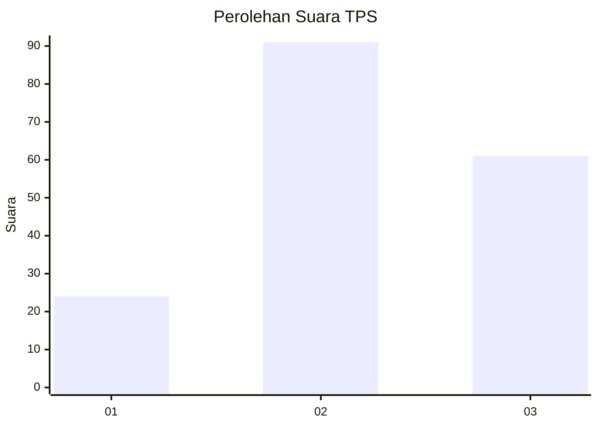
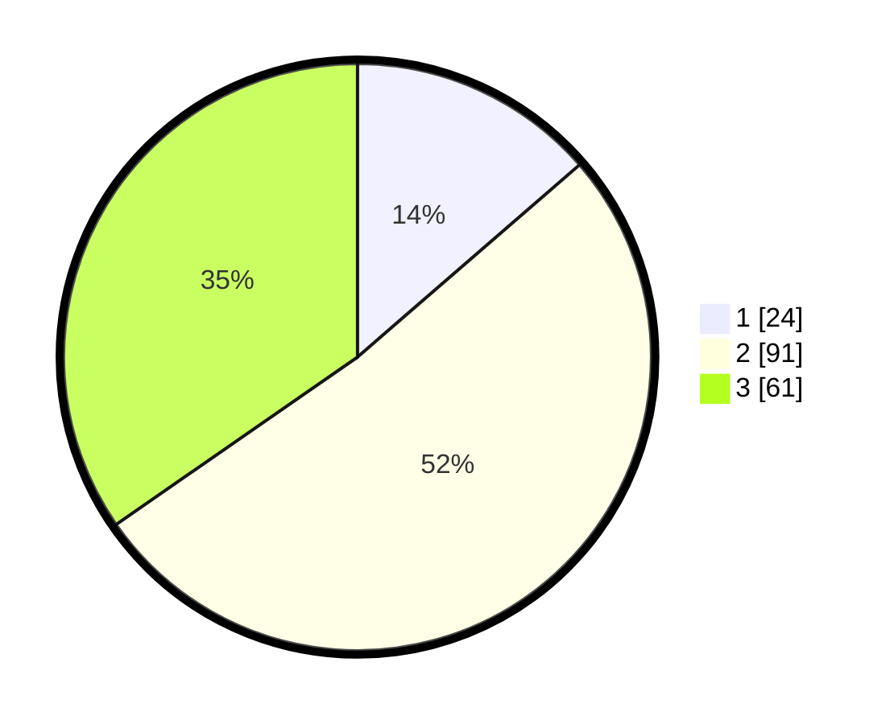

# Hasil

## Grafik

## Tabel

| No. | Nama Paslon    | Suara | Suara (raw) | Persentase |
|:--- |:-------------- | -----:| -----------:| ----------:|
| 1   | ANIES MUHAIMIN | 24    | [24][p-1]   | 13,64      |
| 2   | PRABOWO GIBRAN | 91    | [91][p-2]   | 51,70      |
| 3   | GANJAR MAHFUD  | 61    | [61][p-3]   | 34,66      |

[p-1]: https://github.com/gigit-pemilu/pemilu-2024/blob/main/pilpres/hitung-suara/sub/35-jawa-timur/sub/06-kediri/sub/02-mojo/sub/2010-kedawung/sub/003-tps/sub/paslon-1.txt
[p-2]: https://github.com/gigit-pemilu/pemilu-2024/blob/main/pilpres/hitung-suara/sub/35-jawa-timur/sub/06-kediri/sub/02-mojo/sub/2010-kedawung/sub/003-tps/sub/paslon-2.txt
[p-3]: https://github.com/gigit-pemilu/pemilu-2024/blob/main/pilpres/hitung-suara/sub/35-jawa-timur/sub/06-kediri/sub/02-mojo/sub/2010-kedawung/sub/003-tps/sub/paslon-3.txt

## Foto C Plano

https://sirekap-obj-formc.kpu.go.id/8d3d/pemilu/ppwp/35/06/02/20/10/3506022010003-20240215-005407--f1bbb365-4125-4fd1-962d-2c867860ff7d.jpg

https://sirekap-obj-formc.kpu.go.id/8d3d/pemilu/ppwp/35/06/02/20/10/3506022010003-20240215-005413--7aac504d-a222-4962-8126-d83721ab6338.jpg

https://sirekap-obj-formc.kpu.go.id/8d3d/pemilu/ppwp/35/06/02/20/10/3506022010003-20240215-005418--e16f56ec-8e3f-4a2c-97d8-bf20506c37db.jpg

## Metadata

| Key        | Value               |
| ---------- | ------------------- |
| Time Stamp | 2024-02-16 21:01:00 |

## DATA PEMILIH TETAP

Jumlah pemilih dalam DPT: **222**.
 * L: **525**.
 * P: **507**.

## DATA PENGGUNA HAK PILIH

Jumlah pengguna hak pilih dalam DPT: **579**.
 * L: **88**.
 * P: **41**.

Jumlah pengguna hak pilih dalam DPTb: **0**.
 * L: **0**.
 * P: **0**.

Jumlah pengguna hak pilih dalam DPK: **0**.
 * L: **0**.
 * P: **0**.

Jumlah pengguna hak pilih: **179**.
 * L: **88**.
 * P: **91**.

## JUMLAH SUARA SAH DAN TIDAK SAH

JUMLAH SELURUH SUARA SAH: **176**.

JUMLAH SUARA TIDAK SAH: **3**.

JUMLAH SELURUH SUARA SAH DAN SUARA TIDAK SAH: **179**.

