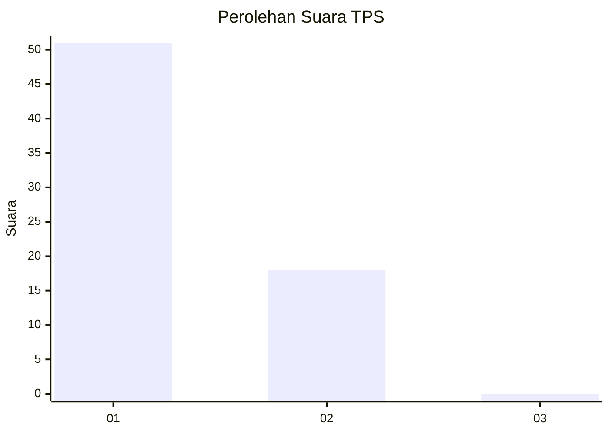
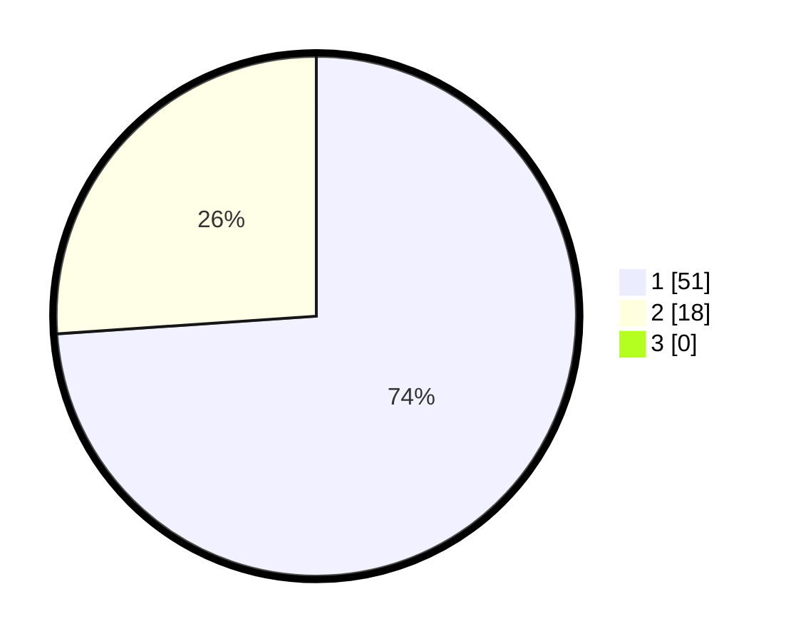

# Hasil

## Grafik

## Tabel

| No. | Nama Paslon    | Suara | Suara (raw) | Persentase |
|:--- |:-------------- | -----:| -----------:| ----------:|
| 1   | ANIES MUHAIMIN | 51    | [51][p-1]   | 73,91      |
| 2   | PRABOWO GIBRAN | 18    | [18][p-2]   | 26,09      |
| 3   | GANJAR MAHFUD  | 0     | [0][p-3]    | 0,00       |

[p-1]: https://github.com/gigit-pemilu/pemilu-2024/blob/main/pilpres/hitung-suara/sub/35-jawa-timur/sub/06-kediri/sub/02-mojo/sub/2011-ploso/sub/901-tps/sub/paslon-1.txt
[p-2]: https://github.com/gigit-pemilu/pemilu-2024/blob/main/pilpres/hitung-suara/sub/35-jawa-timur/sub/06-kediri/sub/02-mojo/sub/2011-ploso/sub/901-tps/sub/paslon-2.txt
[p-3]: https://github.com/gigit-pemilu/pemilu-2024/blob/main/pilpres/hitung-suara/sub/35-jawa-timur/sub/06-kediri/sub/02-mojo/sub/2011-ploso/sub/901-tps/sub/paslon-3.txt

## Foto C Plano

https://sirekap-obj-formc.kpu.go.id/2ec3/pemilu/ppwp/35/06/02/20/11/3506022011901-20240217-060801--367c1fc2-3963-4f92-9542-06f55931e5b9.jpg

https://sirekap-obj-formc.kpu.go.id/2ec3/pemilu/ppwp/35/06/02/20/11/3506022011901-20240217-062627--c9d05e4f-f942-47d1-a68f-7361ecf47125.jpg

https://sirekap-obj-formc.kpu.go.id/2ec3/pemilu/ppwp/35/06/02/20/11/3506022011901-20240217-062937--11dbbf12-54e2-4cf0-a7dc-b4d981cf70f3.jpg

## Metadata

| Key        | Value               |
| ---------- | ------------------- |
| Time Stamp | 2024-02-17 13:37:34 |

## DATA PEMILIH TETAP

Jumlah pemilih dalam DPT: **278**.
 * L: **278**.
 * P: **0**.

## DATA PENGGUNA HAK PILIH

Jumlah pengguna hak pilih dalam DPT: **35**.
 * L: **35**.
 * P: **0**.

Jumlah pengguna hak pilih dalam DPTb: **35**.
 * L: **21**.
 * P: **14**.

Jumlah pengguna hak pilih dalam DPK: **0**.
 * L: **0**.
 * P: **0**.

Jumlah pengguna hak pilih: **70**.
 * L: **56**.
 * P: **14**.

## JUMLAH SUARA SAH DAN TIDAK SAH

JUMLAH SELURUH SUARA SAH: **69**.

JUMLAH SUARA TIDAK SAH: **1**.

JUMLAH SELURUH SUARA SAH DAN SUARA TIDAK SAH: **70**.

