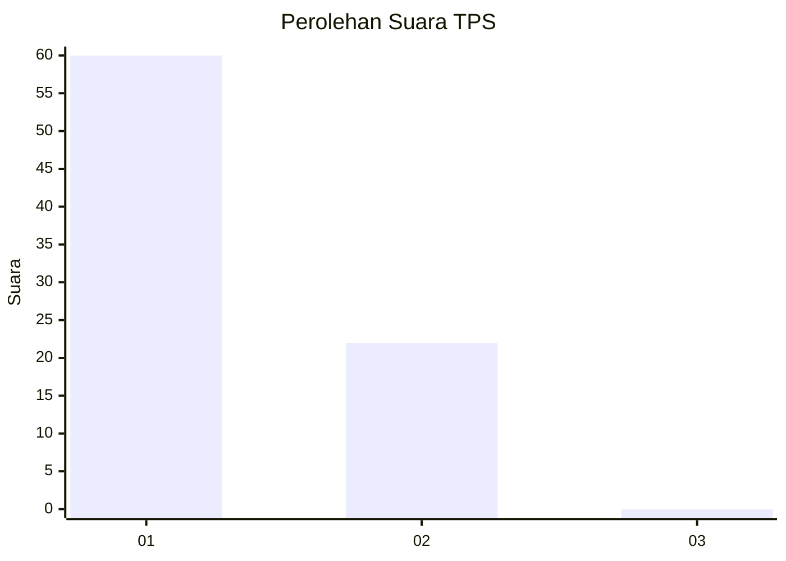
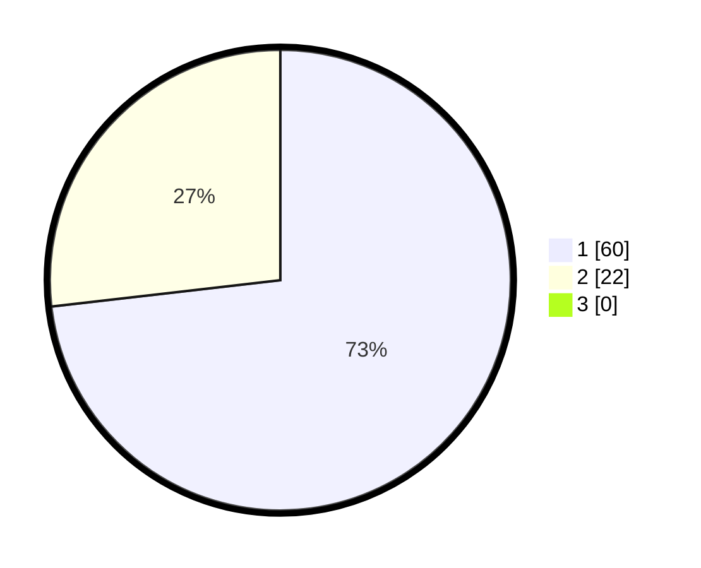

# Hasil

## Grafik

## Tabel

| No. | Nama Paslon    | Suara | Suara (raw) | Persentase |
|:--- |:-------------- | -----:| -----------:| ----------:|
| 1   | ANIES MUHAIMIN | 60    | [60][p-1]   | 73,17      |
| 2   | PRABOWO GIBRAN | 22    | [22][p-2]   | 26,83      |
| 3   | GANJAR MAHFUD  | 0     | [0][p-3]    | 0,00       |

[p-1]: https://github.com/gigit-pemilu/pemilu-2024/blob/main/pilpres/hitung-suara/sub/35-jawa-timur/sub/06-kediri/sub/02-mojo/sub/2011-ploso/sub/902-tps/sub/paslon-1.txt
[p-2]: https://github.com/gigit-pemilu/pemilu-2024/blob/main/pilpres/hitung-suara/sub/35-jawa-timur/sub/06-kediri/sub/02-mojo/sub/2011-ploso/sub/902-tps/sub/paslon-2.txt
[p-3]: https://github.com/gigit-pemilu/pemilu-2024/blob/main/pilpres/hitung-suara/sub/35-jawa-timur/sub/06-kediri/sub/02-mojo/sub/2011-ploso/sub/902-tps/sub/paslon-3.txt

## Foto C Plano

https://sirekap-obj-formc.kpu.go.id/f4f3/pemilu/ppwp/35/06/02/20/11/3506022011902-20240216-134541--8dadc6d9-611b-4e15-8392-b83ac6dc1c61.jpg

https://sirekap-obj-formc.kpu.go.id/f4f3/pemilu/ppwp/35/06/02/20/11/3506022011902-20240216-135020--e9a57448-75a1-4317-a457-ca5ac326abc8.jpg

https://sirekap-obj-formc.kpu.go.id/f4f3/pemilu/ppwp/35/06/02/20/11/3506022011902-20240216-140055--6e38eff5-fc9e-4665-b7b6-a0e4171e6fad.jpg

## Metadata

| Key        | Value               |
| ---------- | ------------------- |
| Time Stamp | 2024-02-16 14:30:33 |

## DATA PEMILIH TETAP

Jumlah pemilih dalam DPT: **272**.
 * L: **272**.
 * P: **0**.

## DATA PENGGUNA HAK PILIH

Jumlah pengguna hak pilih dalam DPT: **36**.
 * L: **36**.
 * P: **0**.

Jumlah pengguna hak pilih dalam DPTb: **46**.
 * L: **13**.
 * P: **33**.

Jumlah pengguna hak pilih dalam DPK: **0**.
 * L: **0**.
 * P: **0**.

Jumlah pengguna hak pilih: **82**.
 * L: **49**.
 * P: **33**.

## JUMLAH SUARA SAH DAN TIDAK SAH

JUMLAH SELURUH SUARA SAH: **82**.

JUMLAH SUARA TIDAK SAH: **0**.

JUMLAH SELURUH SUARA SAH DAN SUARA TIDAK SAH: **82**.

