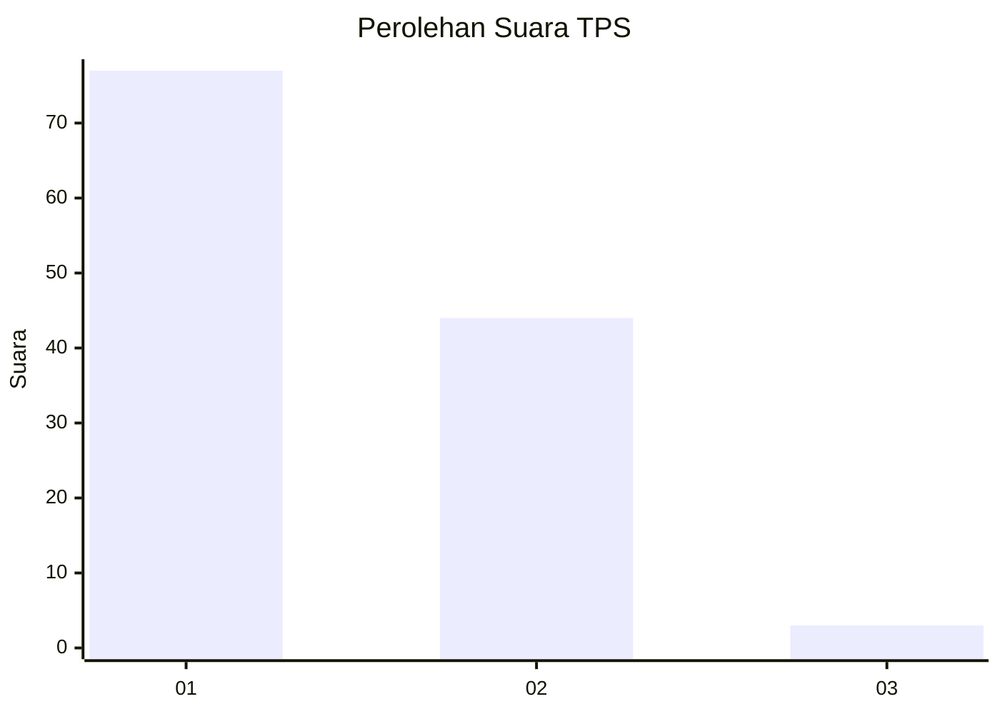
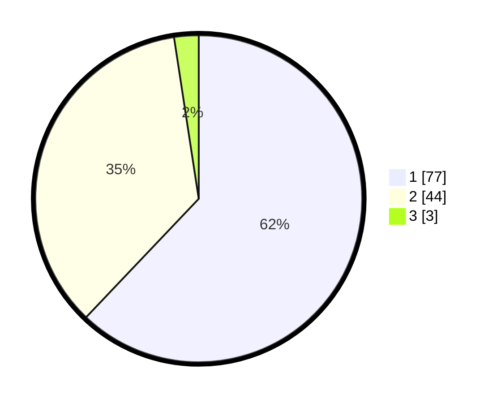

# Hasil

## Grafik

## Tabel

| No. | Nama Paslon    | Suara | Suara (raw) | Persentase |
|:--- |:-------------- | -----:| -----------:| ----------:|
| 1   | ANIES MUHAIMIN | 77    | [77][p-1]   | 62,10      |
| 2   | PRABOWO GIBRAN | 44    | [44][p-2]   | 35,48      |
| 3   | GANJAR MAHFUD  | 3     | [3][p-3]    | 2,42       |

[p-1]: https://github.com/gigit-pemilu/pemilu-2024-35-jawa-timur/blob/main/pilpres/hitung-suara/sub/35-jawa-timur/sub/06-kediri/sub/02-mojo/sub/2011-ploso/sub/903-tps/sub/paslon-1.txt
[p-2]: https://github.com/gigit-pemilu/pemilu-2024-35-jawa-timur/blob/main/pilpres/hitung-suara/sub/35-jawa-timur/sub/06-kediri/sub/02-mojo/sub/2011-ploso/sub/903-tps/sub/paslon-2.txt
[p-3]: https://github.com/gigit-pemilu/pemilu-2024-35-jawa-timur/blob/main/pilpres/hitung-suara/sub/35-jawa-timur/sub/06-kediri/sub/02-mojo/sub/2011-ploso/sub/903-tps/sub/paslon-3.txt

## Foto C Plano

https://sirekap-obj-formc.kpu.go.id/5fe8/pemilu/ppwp/35/06/02/20/11/3506022011903-20240214-195748--f4fa0f81-7e45-423c-9db7-1aa072e71913.jpg

https://sirekap-obj-formc.kpu.go.id/5fe8/pemilu/ppwp/35/06/02/20/11/3506022011903-20240214-195934--0c706c38-70dc-4997-b975-eb40d5457dca.jpg

https://sirekap-obj-formc.kpu.go.id/5fe8/pemilu/ppwp/35/06/02/20/11/3506022011903-20240214-200048--a47bff23-ca27-4e39-b85b-6998f0389484.jpg

## Metadata

| Key        | Value               |
| ---------- | ------------------- |
| Time Stamp | 2024-02-15 00:41:44 |

## DATA PEMILIH TETAP

Jumlah pemilih dalam DPT: **278**.
 * L: **278**.
 * P: **0**.

## DATA PENGGUNA HAK PILIH

Jumlah pengguna hak pilih dalam DPT: **61**.
 * L: **61**.
 * P: **0**.

Jumlah pengguna hak pilih dalam DPTb: **63**.
 * L: **34**.
 * P: **29**.

Jumlah pengguna hak pilih dalam DPK: **0**.
 * L: **0**.
 * P: **0**.

Jumlah pengguna hak pilih: **124**.
 * L: **95**.
 * P: **29**.

## JUMLAH SUARA SAH DAN TIDAK SAH

JUMLAH SELURUH SUARA SAH: **124**.

JUMLAH SUARA TIDAK SAH: **0**.

JUMLAH SELURUH SUARA SAH DAN SUARA TIDAK SAH: **124**.

