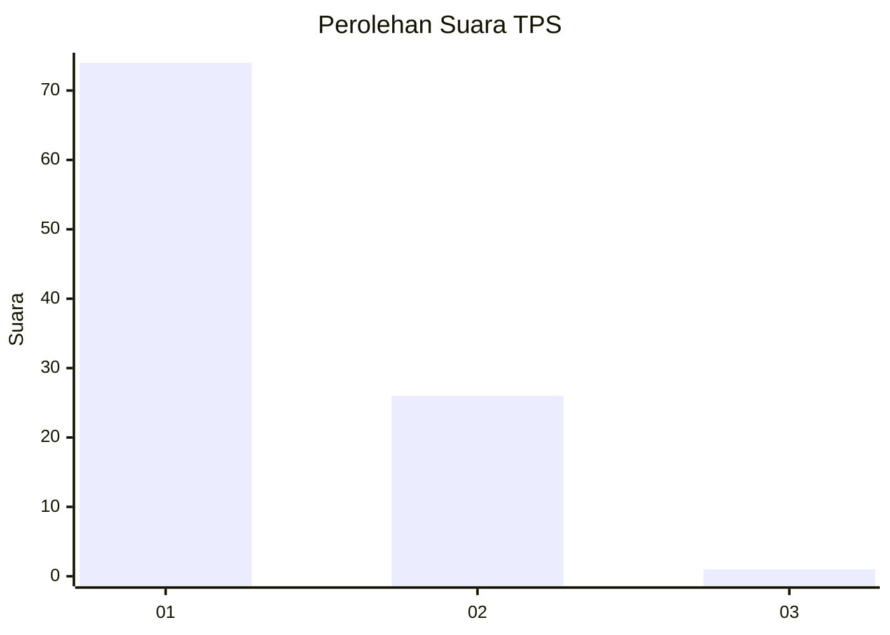
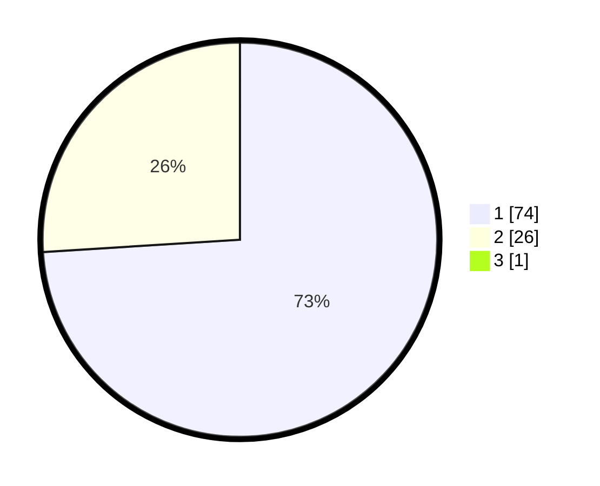

# Hasil

## Grafik

## Tabel

| No. | Nama Paslon    | Suara | Suara (raw) | Persentase |
|:--- |:-------------- | -----:| -----------:| ----------:|
| 1   | ANIES MUHAIMIN | 74    | [74][p-1]   | 73,27      |
| 2   | PRABOWO GIBRAN | 26    | [26][p-2]   | 25,74      |
| 3   | GANJAR MAHFUD  | 1     | [1][p-3]    | 0,99       |

[p-1]: https://github.com/gigit-pemilu/pemilu-2024-35-jawa-timur/blob/main/pilpres/hitung-suara/sub/35-jawa-timur/sub/06-kediri/sub/02-mojo/sub/2011-ploso/sub/904-tps/sub/paslon-1.txt
[p-2]: https://github.com/gigit-pemilu/pemilu-2024-35-jawa-timur/blob/main/pilpres/hitung-suara/sub/35-jawa-timur/sub/06-kediri/sub/02-mojo/sub/2011-ploso/sub/904-tps/sub/paslon-2.txt
[p-3]: https://github.com/gigit-pemilu/pemilu-2024-35-jawa-timur/blob/main/pilpres/hitung-suara/sub/35-jawa-timur/sub/06-kediri/sub/02-mojo/sub/2011-ploso/sub/904-tps/sub/paslon-3.txt

## Foto C Plano

https://sirekap-obj-formc.kpu.go.id/8299/pemilu/ppwp/35/06/02/20/11/3506022011904-20240215-010953--0241d75f-46d4-4a2c-95af-178f8f8e5e2c.jpg

https://sirekap-obj-formc.kpu.go.id/8299/pemilu/ppwp/35/06/02/20/11/3506022011904-20240215-011051--dd25c244-3d3d-4c8b-8b7d-28dbbfdb73f4.jpg

https://sirekap-obj-formc.kpu.go.id/8299/pemilu/ppwp/35/06/02/20/11/3506022011904-20240215-011159--a61c45e7-73ac-4305-a6ae-3de5fa87a069.jpg

## Metadata

| Key        | Value               |
| ---------- | ------------------- |
| Time Stamp | 2024-02-16 21:01:00 |

## DATA PEMILIH TETAP

Jumlah pemilih dalam DPT: **271**.
 * L: **271**.
 * P: **0**.

## DATA PENGGUNA HAK PILIH

Jumlah pengguna hak pilih dalam DPT: **52**.
 * L: **52**.
 * P: **0**.

Jumlah pengguna hak pilih dalam DPTb: **49**.
 * L: **19**.
 * P: **30**.

Jumlah pengguna hak pilih dalam DPK: **0**.
 * L: **0**.
 * P: **0**.

Jumlah pengguna hak pilih: **101**.
 * L: **71**.
 * P: **30**.

## JUMLAH SUARA SAH DAN TIDAK SAH

JUMLAH SELURUH SUARA SAH: **101**.

JUMLAH SUARA TIDAK SAH: **0**.

JUMLAH SELURUH SUARA SAH DAN SUARA TIDAK SAH: **101**.

