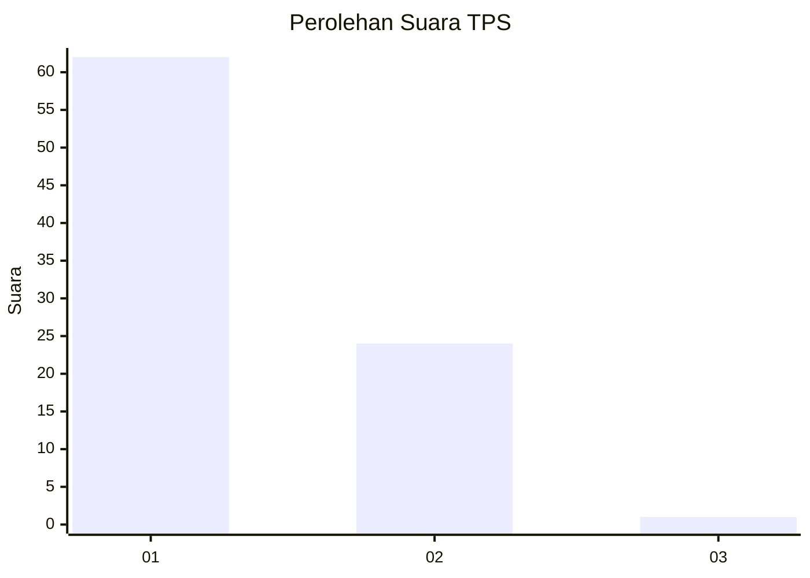
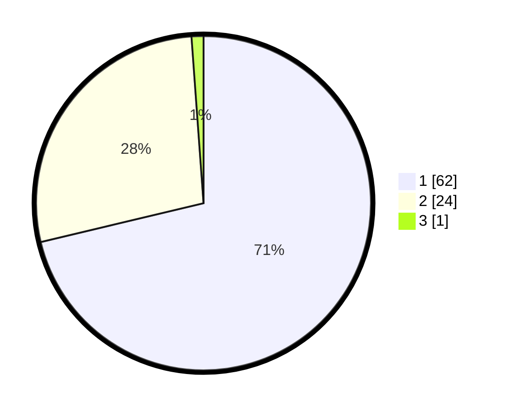

# Hasil

## Grafik

## Tabel

| No. | Nama Paslon    | Suara | Suara (raw) | Persentase |
|:--- |:-------------- | -----:| -----------:| ----------:|
| 1   | ANIES MUHAIMIN | 62    | [62][p-1]   | 71,26      |
| 2   | PRABOWO GIBRAN | 24    | [24][p-2]   | 27,59      |
| 3   | GANJAR MAHFUD  | 1     | [1][p-3]    | 1,15       |

[p-1]: https://github.com/gigit-pemilu/pemilu-2024-35-jawa-timur/blob/main/pilpres/hitung-suara/sub/35-jawa-timur/sub/06-kediri/sub/02-mojo/sub/2011-ploso/sub/905-tps/sub/paslon-1.txt
[p-2]: https://github.com/gigit-pemilu/pemilu-2024-35-jawa-timur/blob/main/pilpres/hitung-suara/sub/35-jawa-timur/sub/06-kediri/sub/02-mojo/sub/2011-ploso/sub/905-tps/sub/paslon-2.txt
[p-3]: https://github.com/gigit-pemilu/pemilu-2024-35-jawa-timur/blob/main/pilpres/hitung-suara/sub/35-jawa-timur/sub/06-kediri/sub/02-mojo/sub/2011-ploso/sub/905-tps/sub/paslon-3.txt

## Foto C Plano

https://sirekap-obj-formc.kpu.go.id/6f0e/pemilu/ppwp/35/06/02/20/11/3506022011905-20240217-011343--2fba3c0c-026c-49d8-88c8-b1d26b743226.jpg

https://sirekap-obj-formc.kpu.go.id/6f0e/pemilu/ppwp/35/06/02/20/11/3506022011905-20240215-003941--1122637c-c972-4372-bd4a-175c66d2f35b.jpg

https://sirekap-obj-formc.kpu.go.id/6f0e/pemilu/ppwp/35/06/02/20/11/3506022011905-20240215-004041--e9544214-3688-41d6-ace8-9c3fd6c94456.jpg

## Metadata

| Key        | Value               |
| ---------- | ------------------- |
| Time Stamp | 2024-02-17 01:22:58 |

## DATA PEMILIH TETAP

Jumlah pemilih dalam DPT: **273**.
 * L: **273**.
 * P: **0**.

## DATA PENGGUNA HAK PILIH

Jumlah pengguna hak pilih dalam DPT: **30**.
 * L: **30**.
 * P: **0**.

Jumlah pengguna hak pilih dalam DPTb: **57**.
 * L: **18**.
 * P: **39**.

Jumlah pengguna hak pilih dalam DPK: **0**.
 * L: **0**.
 * P: **0**.

Jumlah pengguna hak pilih: **87**.
 * L: **48**.
 * P: **39**.

## JUMLAH SUARA SAH DAN TIDAK SAH

JUMLAH SELURUH SUARA SAH: **87**.

JUMLAH SUARA TIDAK SAH: **0**.

JUMLAH SELURUH SUARA SAH DAN SUARA TIDAK SAH: **87**.

