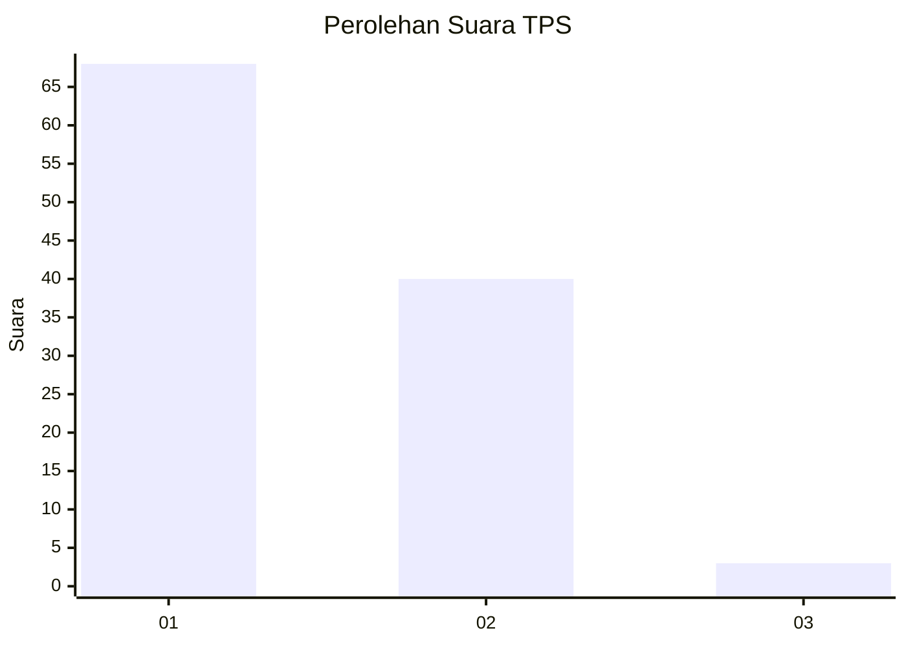
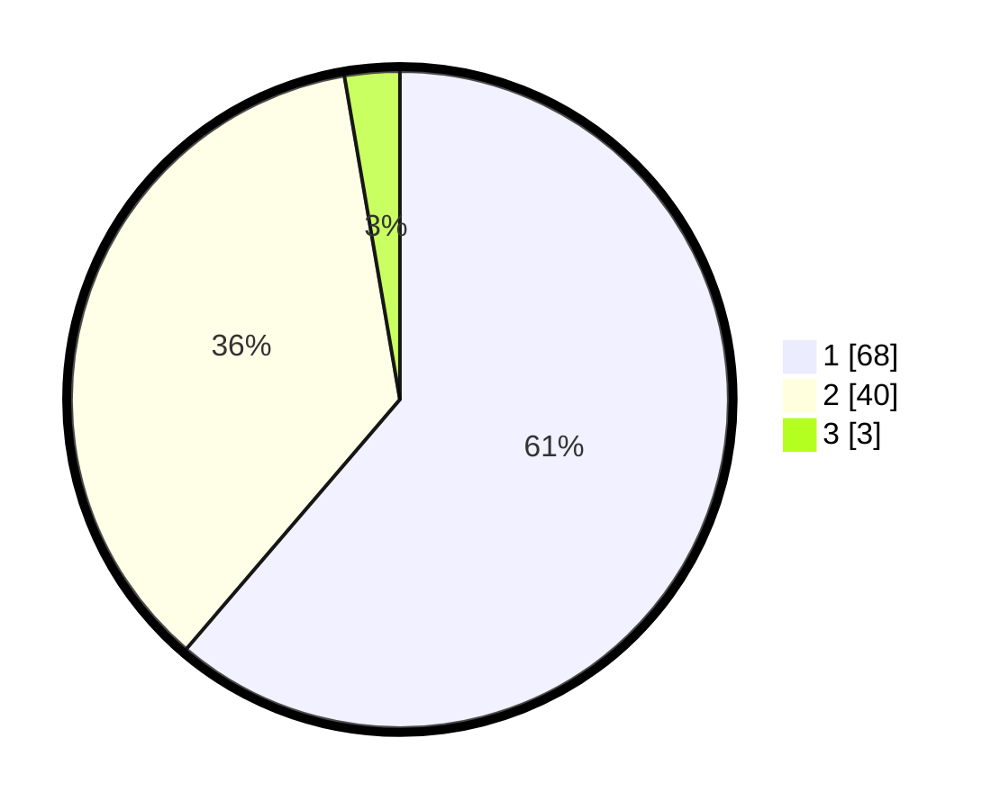

# Hasil

## Grafik

## Tabel

| No. | Nama Paslon    | Suara | Suara (raw) | Persentase |
|:--- |:-------------- | -----:| -----------:| ----------:|
| 1   | ANIES MUHAIMIN | 68    | [68][p-1]   | 61,26      |
| 2   | PRABOWO GIBRAN | 40    | [40][p-2]   | 36,04      |
| 3   | GANJAR MAHFUD  | 3     | [3][p-3]    | 2,70       |

[p-1]: https://github.com/gigit-pemilu/pemilu-2024-35-jawa-timur/blob/main/pilpres/hitung-suara/sub/35-jawa-timur/sub/06-kediri/sub/02-mojo/sub/2011-ploso/sub/906-tps/sub/paslon-1.txt
[p-2]: https://github.com/gigit-pemilu/pemilu-2024-35-jawa-timur/blob/main/pilpres/hitung-suara/sub/35-jawa-timur/sub/06-kediri/sub/02-mojo/sub/2011-ploso/sub/906-tps/sub/paslon-2.txt
[p-3]: https://github.com/gigit-pemilu/pemilu-2024-35-jawa-timur/blob/main/pilpres/hitung-suara/sub/35-jawa-timur/sub/06-kediri/sub/02-mojo/sub/2011-ploso/sub/906-tps/sub/paslon-3.txt

## Foto C Plano

https://sirekap-obj-formc.kpu.go.id/c31a/pemilu/ppwp/35/06/02/20/11/3506022011906-20240214-195958--23d07941-5143-4de3-b2a8-e7c8af9b682e.jpg

https://sirekap-obj-formc.kpu.go.id/c31a/pemilu/ppwp/35/06/02/20/11/3506022011906-20240214-200136--b03e81e7-f826-428e-916e-3145a5e24c9d.jpg

https://sirekap-obj-formc.kpu.go.id/c31a/pemilu/ppwp/35/06/02/20/11/3506022011906-20240214-200216--2f773eee-4d87-4cb9-bfe9-e904a9ee1de6.jpg

## Metadata

| Key        | Value               |
| ---------- | ------------------- |
| Time Stamp | 2024-02-15 00:41:44 |

## DATA PEMILIH TETAP

Jumlah pemilih dalam DPT: **277**.
 * L: **277**.
 * P: **0**.

## DATA PENGGUNA HAK PILIH

Jumlah pengguna hak pilih dalam DPT: **69**.
 * L: **69**.
 * P: **0**.

Jumlah pengguna hak pilih dalam DPTb: **43**.
 * L: **6**.
 * P: **37**.

Jumlah pengguna hak pilih dalam DPK: **0**.
 * L: **0**.
 * P: **0**.

Jumlah pengguna hak pilih: **112**.
 * L: **75**.
 * P: **37**.

## JUMLAH SUARA SAH DAN TIDAK SAH

JUMLAH SELURUH SUARA SAH: **111**.

JUMLAH SUARA TIDAK SAH: **1**.

JUMLAH SELURUH SUARA SAH DAN SUARA TIDAK SAH: **112**.

