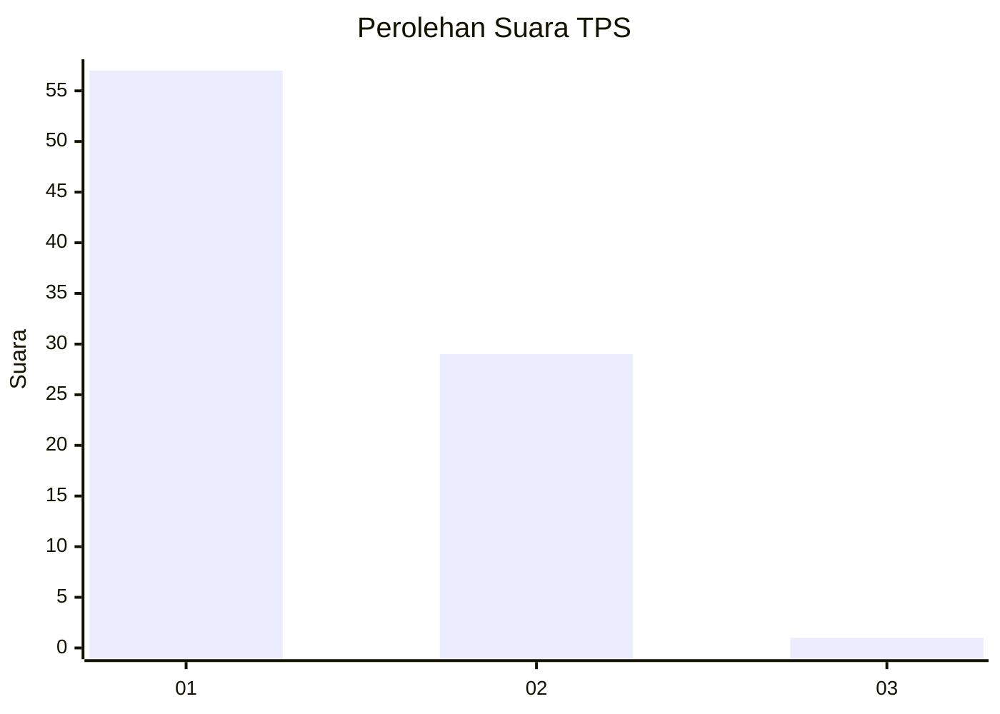
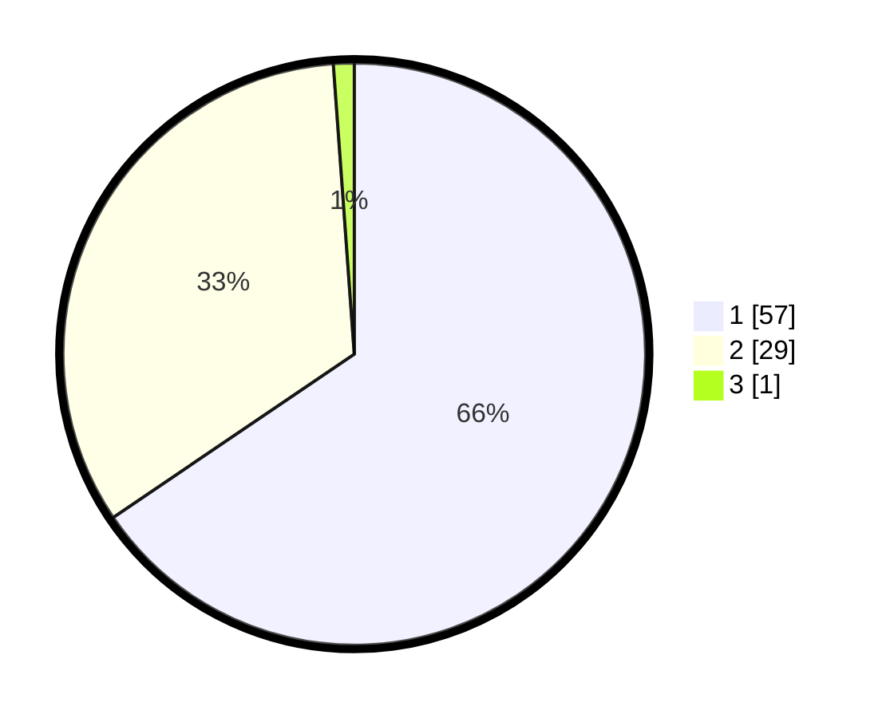

# Hasil

## Grafik

## Tabel

| No. | Nama Paslon    | Suara | Suara (raw) | Persentase |
|:--- |:-------------- | -----:| -----------:| ----------:|
| 1   | ANIES MUHAIMIN | 57    | [57][p-1]   | 65,52      |
| 2   | PRABOWO GIBRAN | 29    | [29][p-2]   | 33,33      |
| 3   | GANJAR MAHFUD  | 1     | [1][p-3]    | 1,15       |

[p-1]: https://github.com/gigit-pemilu/pemilu-2024/blob/main/pilpres/hitung-suara/sub/35-jawa-timur/sub/06-kediri/sub/02-mojo/sub/2011-ploso/sub/909-tps/sub/paslon-1.txt
[p-2]: https://github.com/gigit-pemilu/pemilu-2024/blob/main/pilpres/hitung-suara/sub/35-jawa-timur/sub/06-kediri/sub/02-mojo/sub/2011-ploso/sub/909-tps/sub/paslon-2.txt
[p-3]: https://github.com/gigit-pemilu/pemilu-2024/blob/main/pilpres/hitung-suara/sub/35-jawa-timur/sub/06-kediri/sub/02-mojo/sub/2011-ploso/sub/909-tps/sub/paslon-3.txt

## Foto C Plano

https://sirekap-obj-formc.kpu.go.id/e327/pemilu/ppwp/35/06/02/20/11/3506022011909-20240214-184850--9058e664-5aaf-40b3-b05a-dbb6598c4e7d.jpg

https://sirekap-obj-formc.kpu.go.id/e327/pemilu/ppwp/35/06/02/20/11/3506022011909-20240214-185126--8189aac4-f8c4-477c-aaf7-4678c4b2514f.jpg

https://sirekap-obj-formc.kpu.go.id/e327/pemilu/ppwp/35/06/02/20/11/3506022011909-20240214-185427--a66a5104-b8db-47fa-974c-030c9fcfb81a.jpg

## Metadata

| Key        | Value               |
| ---------- | ------------------- |
| Time Stamp | 2024-02-16 21:01:00 |

## DATA PEMILIH TETAP

Jumlah pemilih dalam DPT: **280**.
 * L: **280**.
 * P: **0**.

## DATA PENGGUNA HAK PILIH

Jumlah pengguna hak pilih dalam DPT: **41**.
 * L: **41**.
 * P: **0**.

Jumlah pengguna hak pilih dalam DPTb: **47**.
 * L: **10**.
 * P: **37**.

Jumlah pengguna hak pilih dalam DPK: **0**.
 * L: **0**.
 * P: **0**.

Jumlah pengguna hak pilih: **88**.
 * L: **51**.
 * P: **37**.

## JUMLAH SUARA SAH DAN TIDAK SAH

JUMLAH SELURUH SUARA SAH: **87**.

JUMLAH SUARA TIDAK SAH: **1**.

JUMLAH SELURUH SUARA SAH DAN SUARA TIDAK SAH: **88**.

