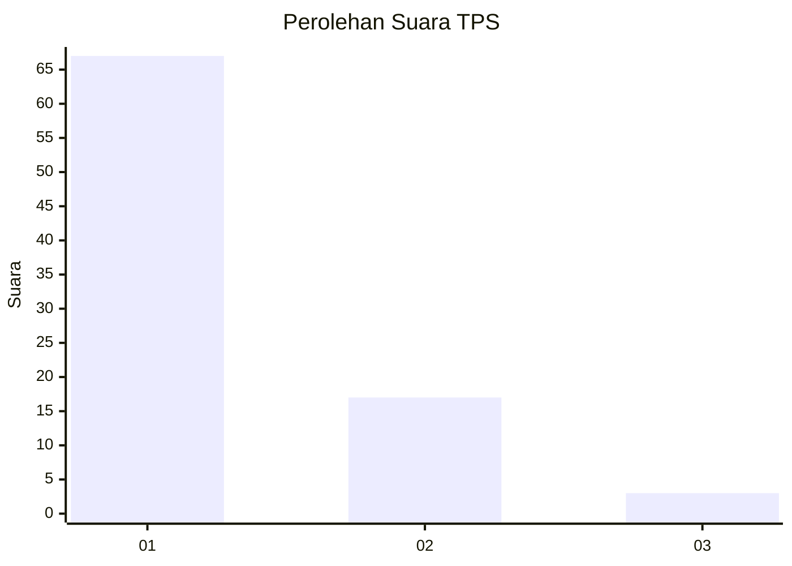
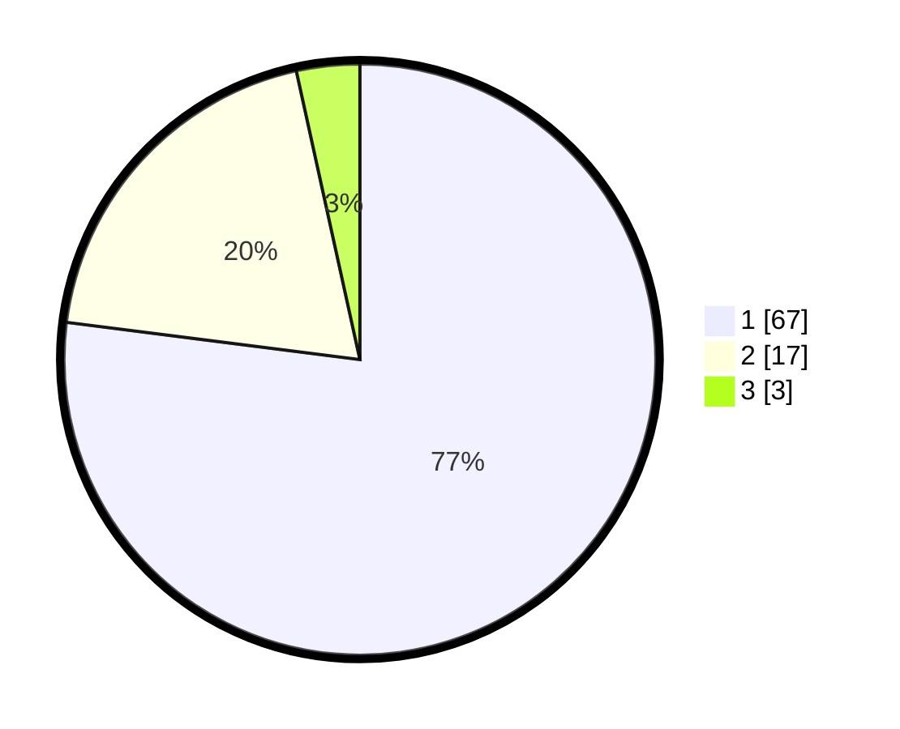

# Hasil

## Grafik

## Tabel

| No. | Nama Paslon    | Suara | Suara (raw) | Persentase |
|:--- |:-------------- | -----:| -----------:| ----------:|
| 1   | ANIES MUHAIMIN | 67    | [67][p-1]   | 77,01      |
| 2   | PRABOWO GIBRAN | 17    | [17][p-2]   | 19,54      |
| 3   | GANJAR MAHFUD  | 3     | [3][p-3]    | 3,45       |

[p-1]: https://github.com/gigit-pemilu/pemilu-2024/blob/main/pilpres/hitung-suara/sub/35-jawa-timur/sub/06-kediri/sub/02-mojo/sub/2011-ploso/sub/910-tps/sub/paslon-1.txt
[p-2]: https://github.com/gigit-pemilu/pemilu-2024/blob/main/pilpres/hitung-suara/sub/35-jawa-timur/sub/06-kediri/sub/02-mojo/sub/2011-ploso/sub/910-tps/sub/paslon-2.txt
[p-3]: https://github.com/gigit-pemilu/pemilu-2024/blob/main/pilpres/hitung-suara/sub/35-jawa-timur/sub/06-kediri/sub/02-mojo/sub/2011-ploso/sub/910-tps/sub/paslon-3.txt

## Foto C Plano

https://sirekap-obj-formc.kpu.go.id/a29d/pemilu/ppwp/35/06/02/20/11/3506022011910-20240214-190702--f6fb04a2-1a45-4cec-894c-a6719f6a7602.jpg

https://sirekap-obj-formc.kpu.go.id/a29d/pemilu/ppwp/35/06/02/20/11/3506022011910-20240214-192123--9fa6dc81-9aa2-46e5-975d-f3b7a2fbeee8.jpg

https://sirekap-obj-formc.kpu.go.id/a29d/pemilu/ppwp/35/06/02/20/11/3506022011910-20240214-192127--9ed7c4b6-df62-4881-a830-b2fdf2d023f8.jpg

## Metadata

| Key        | Value               |
| ---------- | ------------------- |
| Time Stamp | 2024-02-16 21:01:00 |

## DATA PEMILIH TETAP

Jumlah pemilih dalam DPT: **272**.
 * L: **272**.
 * P: **0**.

## DATA PENGGUNA HAK PILIH

Jumlah pengguna hak pilih dalam DPT: **35**.
 * L: **35**.
 * P: **0**.

Jumlah pengguna hak pilih dalam DPTb: **53**.
 * L: **10**.
 * P: **43**.

Jumlah pengguna hak pilih dalam DPK: **0**.
 * L: **0**.
 * P: **0**.

Jumlah pengguna hak pilih: **88**.
 * L: **45**.
 * P: **43**.

## JUMLAH SUARA SAH DAN TIDAK SAH

JUMLAH SELURUH SUARA SAH: **87**.

JUMLAH SUARA TIDAK SAH: **1**.

JUMLAH SELURUH SUARA SAH DAN SUARA TIDAK SAH: **88**.

