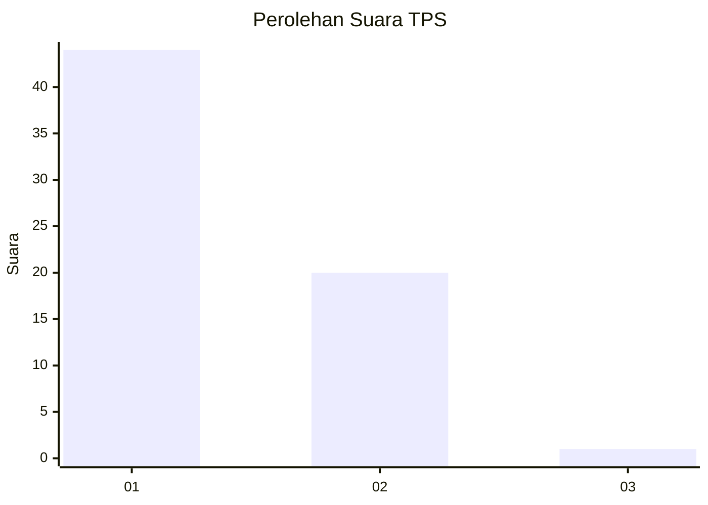
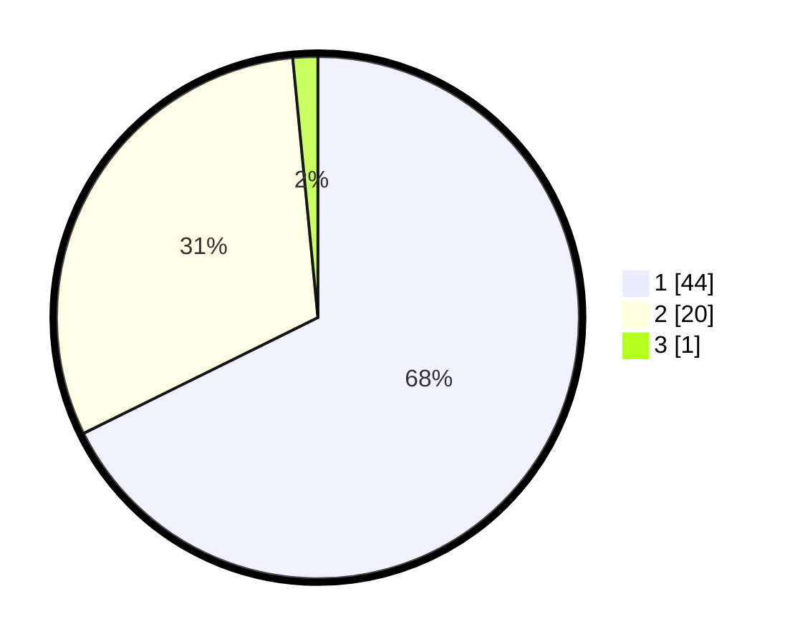

# Hasil

## Grafik

## Tabel

| No. | Nama Paslon    | Suara | Suara (raw) | Persentase |
|:--- |:-------------- | -----:| -----------:| ----------:|
| 1   | ANIES MUHAIMIN | 44    | [44][p-1]   | 67,69      |
| 2   | PRABOWO GIBRAN | 20    | [20][p-2]   | 30,77      |
| 3   | GANJAR MAHFUD  | 1     | [1][p-3]    | 1,54       |

[p-1]: https://github.com/gigit-pemilu/pemilu-2024/blob/main/pilpres/hitung-suara/sub/35-jawa-timur/sub/06-kediri/sub/02-mojo/sub/2011-ploso/sub/911-tps/sub/paslon-1.txt
[p-2]: https://github.com/gigit-pemilu/pemilu-2024/blob/main/pilpres/hitung-suara/sub/35-jawa-timur/sub/06-kediri/sub/02-mojo/sub/2011-ploso/sub/911-tps/sub/paslon-2.txt
[p-3]: https://github.com/gigit-pemilu/pemilu-2024/blob/main/pilpres/hitung-suara/sub/35-jawa-timur/sub/06-kediri/sub/02-mojo/sub/2011-ploso/sub/911-tps/sub/paslon-3.txt

## Foto C Plano

https://sirekap-obj-formc.kpu.go.id/c908/pemilu/ppwp/35/06/02/20/11/3506022011911-20240217-135407--88740852-8217-4f63-aef6-1f6df3a9c883.jpg

https://sirekap-obj-formc.kpu.go.id/c908/pemilu/ppwp/35/06/02/20/11/3506022011911-20240217-141028--828bdbb0-8d9c-4a10-9238-b4183aea012b.jpg

https://sirekap-obj-formc.kpu.go.id/c908/pemilu/ppwp/35/06/02/20/11/3506022011911-20240217-135811--fdb43920-22dc-4b39-9b7a-a75d9c1af435.jpg

## Metadata

| Key        | Value               |
| ---------- | ------------------- |
| Time Stamp | 2024-02-17 14:45:18 |

## DATA PEMILIH TETAP

Jumlah pemilih dalam DPT: **271**.
 * L: **271**.
 * P: **0**.

## DATA PENGGUNA HAK PILIH

Jumlah pengguna hak pilih dalam DPT: **38**.
 * L: **38**.
 * P: **0**.

Jumlah pengguna hak pilih dalam DPTb: **38**.
 * L: **3**.
 * P: **35**.

Jumlah pengguna hak pilih dalam DPK: **0**.
 * L: **0**.
 * P: **0**.

Jumlah pengguna hak pilih: **76**.
 * L: **41**.
 * P: **35**.

## JUMLAH SUARA SAH DAN TIDAK SAH

JUMLAH SELURUH SUARA SAH: **65**.

JUMLAH SUARA TIDAK SAH: **11**.

JUMLAH SELURUH SUARA SAH DAN SUARA TIDAK SAH: **76**.

