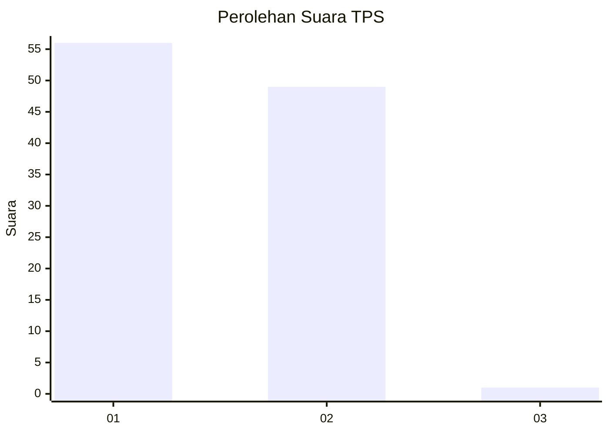
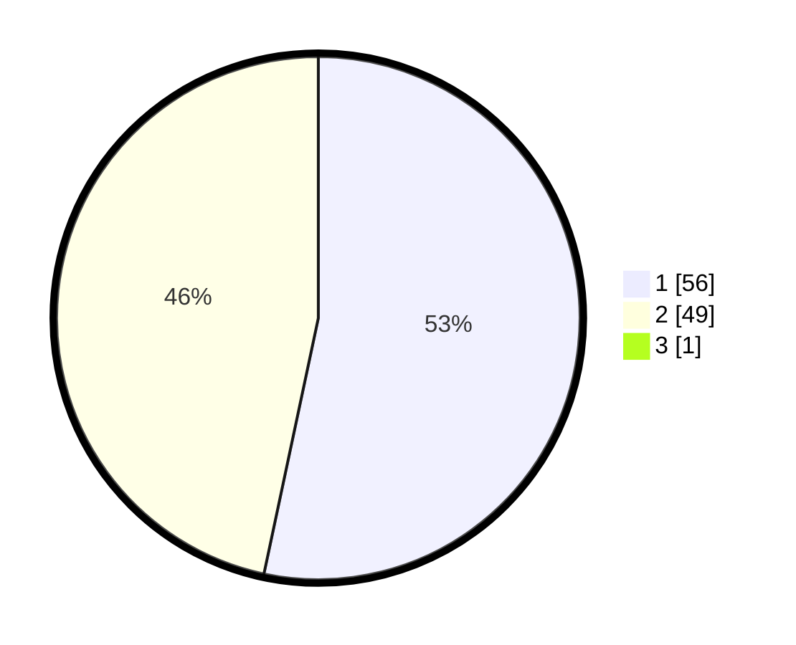

# Hasil

## Grafik

## Tabel

| No. | Nama Paslon    | Suara | Suara (raw) | Persentase |
|:--- |:-------------- | -----:| -----------:| ----------:|
| 1   | ANIES MUHAIMIN | 56    | [56][p-1]   | 52,83      |
| 2   | PRABOWO GIBRAN | 49    | [49][p-2]   | 46,23      |
| 3   | GANJAR MAHFUD  | 1     | [1][p-3]    | 0,94       |

[p-1]: https://github.com/gigit-pemilu/pemilu-2024-35-jawa-timur/blob/main/pilpres/hitung-suara/sub/35-jawa-timur/sub/06-kediri/sub/02-mojo/sub/2011-ploso/sub/912-tps/sub/paslon-1.txt
[p-2]: https://github.com/gigit-pemilu/pemilu-2024-35-jawa-timur/blob/main/pilpres/hitung-suara/sub/35-jawa-timur/sub/06-kediri/sub/02-mojo/sub/2011-ploso/sub/912-tps/sub/paslon-2.txt
[p-3]: https://github.com/gigit-pemilu/pemilu-2024-35-jawa-timur/blob/main/pilpres/hitung-suara/sub/35-jawa-timur/sub/06-kediri/sub/02-mojo/sub/2011-ploso/sub/912-tps/sub/paslon-3.txt

## Foto C Plano

https://sirekap-obj-formc.kpu.go.id/8c7c/pemilu/ppwp/35/06/02/20/11/3506022011912-20240217-115412--4f4bcd46-5cbd-4478-a6de-cab295228d94.jpg

https://sirekap-obj-formc.kpu.go.id/8c7c/pemilu/ppwp/35/06/02/20/11/3506022011912-20240217-115414--2629d118-402d-4501-a652-913cc04d9bb1.jpg

https://sirekap-obj-formc.kpu.go.id/8c7c/pemilu/ppwp/35/06/02/20/11/3506022011912-20240217-115413--07a07342-ac71-4695-94c8-aab100e69056.jpg

## Metadata

| Key        | Value               |
| ---------- | ------------------- |
| Time Stamp | 2024-02-17 13:37:34 |

## DATA PEMILIH TETAP

Jumlah pemilih dalam DPT: **292**.
 * L: **292**.
 * P: **0**.

## DATA PENGGUNA HAK PILIH

Jumlah pengguna hak pilih dalam DPT: **68**.
 * L: **68**.
 * P: **0**.

Jumlah pengguna hak pilih dalam DPTb: **40**.
 * L: **6**.
 * P: **34**.

Jumlah pengguna hak pilih dalam DPK: **0**.
 * L: **0**.
 * P: **0**.

Jumlah pengguna hak pilih: **108**.
 * L: **74**.
 * P: **34**.

## JUMLAH SUARA SAH DAN TIDAK SAH

JUMLAH SELURUH SUARA SAH: **106**.

JUMLAH SUARA TIDAK SAH: **2**.

JUMLAH SELURUH SUARA SAH DAN SUARA TIDAK SAH: **108**.

