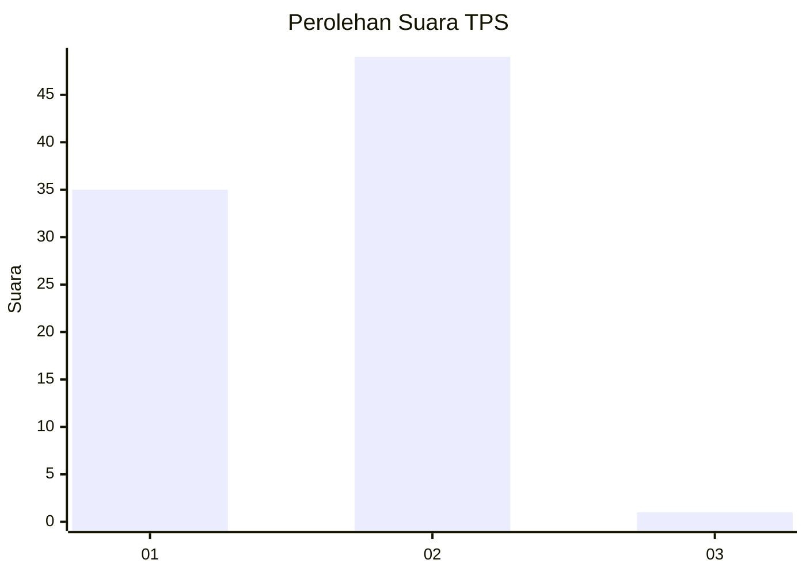
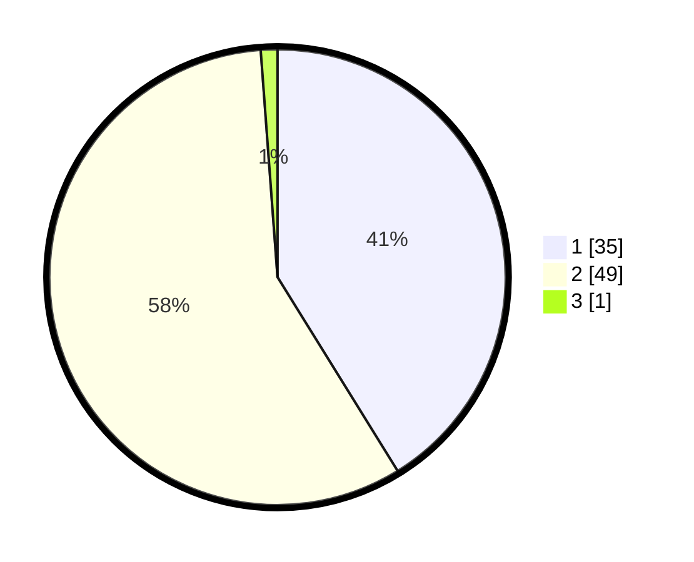

# Hasil

## Grafik

## Tabel

| No. | Nama Paslon    | Suara | Suara (raw) | Persentase |
|:--- |:-------------- | -----:| -----------:| ----------:|
| 1   | ANIES MUHAIMIN | 35    | [35][p-1]   | 41,18      |
| 2   | PRABOWO GIBRAN | 49    | [49][p-2]   | 57,65      |
| 3   | GANJAR MAHFUD  | 1     | [1][p-3]    | 1,18       |

[p-1]: https://github.com/gigit-pemilu/pemilu-2024/blob/main/pilpres/hitung-suara/sub/35-jawa-timur/sub/06-kediri/sub/02-mojo/sub/2011-ploso/sub/913-tps/sub/paslon-1.txt
[p-2]: https://github.com/gigit-pemilu/pemilu-2024/blob/main/pilpres/hitung-suara/sub/35-jawa-timur/sub/06-kediri/sub/02-mojo/sub/2011-ploso/sub/913-tps/sub/paslon-2.txt
[p-3]: https://github.com/gigit-pemilu/pemilu-2024/blob/main/pilpres/hitung-suara/sub/35-jawa-timur/sub/06-kediri/sub/02-mojo/sub/2011-ploso/sub/913-tps/sub/paslon-3.txt

## Foto C Plano

https://sirekap-obj-formc.kpu.go.id/716d/pemilu/ppwp/35/06/02/20/11/3506022011913-20240217-093640--911b7d2a-9c35-4a37-9b08-4311a76491e6.jpg

https://sirekap-obj-formc.kpu.go.id/716d/pemilu/ppwp/35/06/02/20/11/3506022011913-20240217-103319--ba479a60-e7c7-4189-a51c-1893682eda69.jpg

https://sirekap-obj-formc.kpu.go.id/716d/pemilu/ppwp/35/06/02/20/11/3506022011913-20240217-084354--0cbcb9b8-ab8a-4ca9-b317-0504d30a5207.jpg

## Metadata

| Key        | Value               |
| ---------- | ------------------- |
| Time Stamp | 2024-02-17 13:37:34 |

## DATA PEMILIH TETAP

Jumlah pemilih dalam DPT: **243**.
 * L: **243**.
 * P: **0**.

## DATA PENGGUNA HAK PILIH

Jumlah pengguna hak pilih dalam DPT: **60**.
 * L: **60**.
 * P: **0**.

Jumlah pengguna hak pilih dalam DPTb: **25**.
 * L: **10**.
 * P: **15**.

Jumlah pengguna hak pilih dalam DPK: **0**.
 * L: **0**.
 * P: **0**.

Jumlah pengguna hak pilih: **85**.
 * L: **70**.
 * P: **15**.

## JUMLAH SUARA SAH DAN TIDAK SAH

JUMLAH SELURUH SUARA SAH: **85**.

JUMLAH SUARA TIDAK SAH: **0**.

JUMLAH SELURUH SUARA SAH DAN SUARA TIDAK SAH: **85**.

