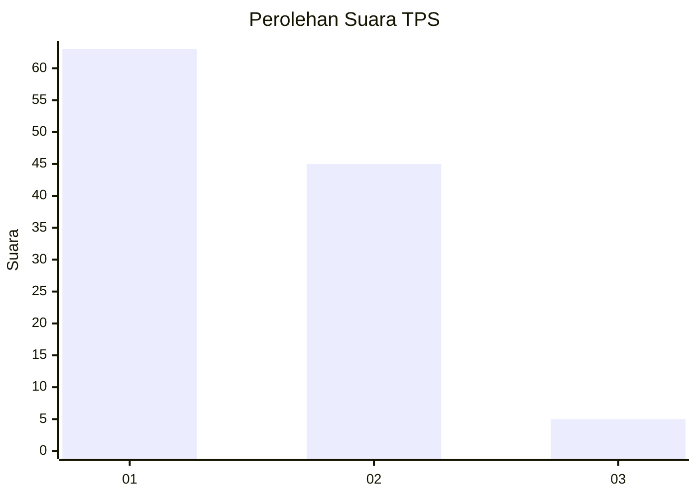
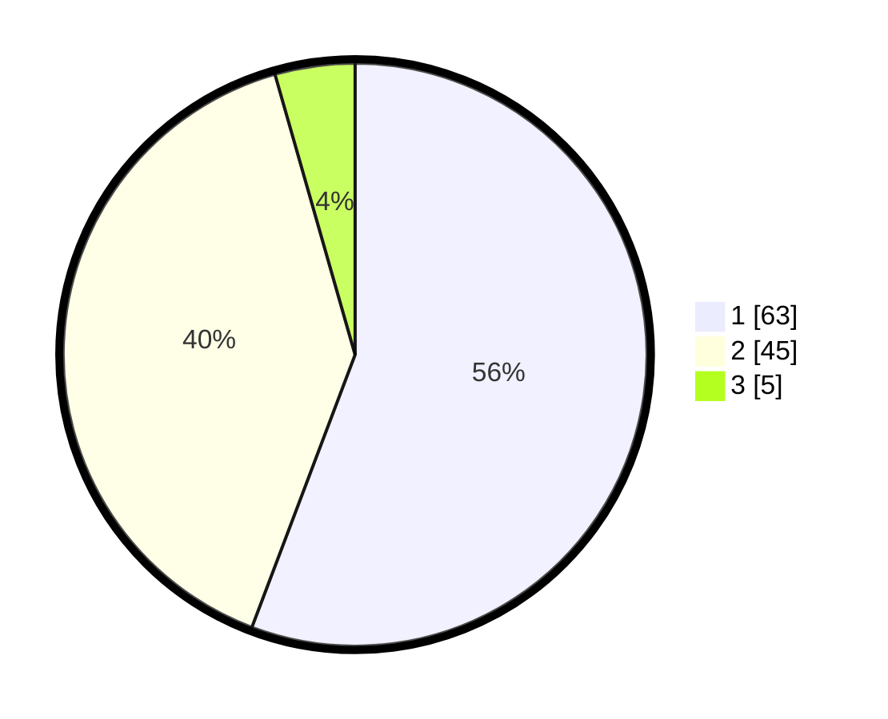

# Hasil

## Grafik

## Tabel

| No. | Nama Paslon    | Suara | Suara (raw) | Persentase |
|:--- |:-------------- | -----:| -----------:| ----------:|
| 1   | ANIES MUHAIMIN | 63    | [63][p-1]   | 55,75      |
| 2   | PRABOWO GIBRAN | 45    | [45][p-2]   | 39,82      |
| 3   | GANJAR MAHFUD  | 5     | [5][p-3]    | 4,42       |

[p-1]: https://github.com/gigit-pemilu/pemilu-2024/blob/main/pilpres/hitung-suara/sub/35-jawa-timur/sub/06-kediri/sub/02-mojo/sub/2011-ploso/sub/914-tps/sub/paslon-1.txt
[p-2]: https://github.com/gigit-pemilu/pemilu-2024/blob/main/pilpres/hitung-suara/sub/35-jawa-timur/sub/06-kediri/sub/02-mojo/sub/2011-ploso/sub/914-tps/sub/paslon-2.txt
[p-3]: https://github.com/gigit-pemilu/pemilu-2024/blob/main/pilpres/hitung-suara/sub/35-jawa-timur/sub/06-kediri/sub/02-mojo/sub/2011-ploso/sub/914-tps/sub/paslon-3.txt

## Foto C Plano

https://sirekap-obj-formc.kpu.go.id/cd3c/pemilu/ppwp/35/06/02/20/11/3506022011914-20240217-113342--a62c4554-e4dc-4a9b-a09a-450c19e805ee.jpg

https://sirekap-obj-formc.kpu.go.id/cd3c/pemilu/ppwp/35/06/02/20/11/3506022011914-20240215-024133--e88284eb-0c05-4f82-9ac0-5fff0221bd27.jpg

https://sirekap-obj-formc.kpu.go.id/cd3c/pemilu/ppwp/35/06/02/20/11/3506022011914-20240215-025940--a4670277-ede4-4d5d-9c09-1cc005a04165.jpg

## Metadata

| Key        | Value               |
| ---------- | ------------------- |
| Time Stamp | 2024-02-17 12:00:00 |

## DATA PEMILIH TETAP

Jumlah pemilih dalam DPT: **242**.
 * L: **107**.
 * P: **135**.

## DATA PENGGUNA HAK PILIH

Jumlah pengguna hak pilih dalam DPT: **82**.
 * L: **24**.
 * P: **58**.

Jumlah pengguna hak pilih dalam DPTb: **32**.
 * L: **12**.
 * P: **20**.

Jumlah pengguna hak pilih dalam DPK: **0**.
 * L: **0**.
 * P: **0**.

Jumlah pengguna hak pilih: **114**.
 * L: **36**.
 * P: **78**.

## JUMLAH SUARA SAH DAN TIDAK SAH

JUMLAH SELURUH SUARA SAH: **113**.

JUMLAH SUARA TIDAK SAH: **1**.

JUMLAH SELURUH SUARA SAH DAN SUARA TIDAK SAH: **114**.

