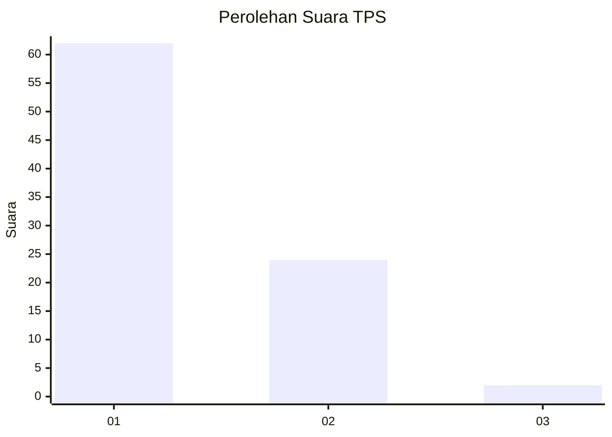
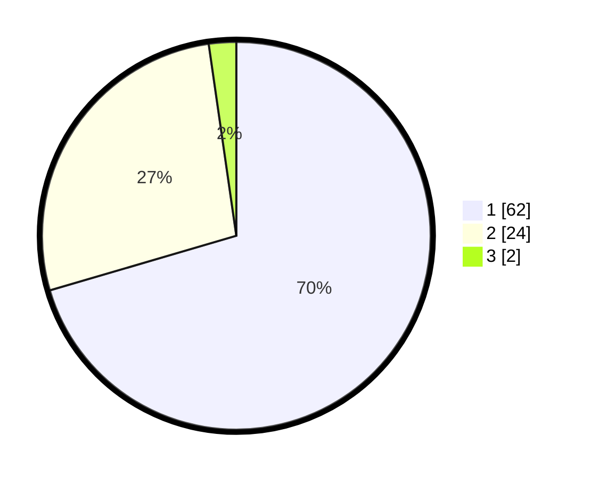

# Hasil

## Grafik

## Tabel

| No. | Nama Paslon    | Suara | Suara (raw) | Persentase |
|:--- |:-------------- | -----:| -----------:| ----------:|
| 1   | ANIES MUHAIMIN | 62    | [62][p-1]   | 70,45      |
| 2   | PRABOWO GIBRAN | 24    | [24][p-2]   | 27,27      |
| 3   | GANJAR MAHFUD  | 2     | [2][p-3]    | 2,27       |

[p-1]: https://github.com/gigit-pemilu/pemilu-2024/blob/main/pilpres/hitung-suara/sub/35-jawa-timur/sub/06-kediri/sub/02-mojo/sub/2011-ploso/sub/916-tps/sub/paslon-1.txt
[p-2]: https://github.com/gigit-pemilu/pemilu-2024/blob/main/pilpres/hitung-suara/sub/35-jawa-timur/sub/06-kediri/sub/02-mojo/sub/2011-ploso/sub/916-tps/sub/paslon-2.txt
[p-3]: https://github.com/gigit-pemilu/pemilu-2024/blob/main/pilpres/hitung-suara/sub/35-jawa-timur/sub/06-kediri/sub/02-mojo/sub/2011-ploso/sub/916-tps/sub/paslon-3.txt

## Foto C Plano

https://sirekap-obj-formc.kpu.go.id/7245/pemilu/ppwp/35/06/02/20/11/3506022011916-20240214-203152--48a53cf5-acf7-48dc-a101-e4d6e5bdc82f.jpg

https://sirekap-obj-formc.kpu.go.id/7245/pemilu/ppwp/35/06/02/20/11/3506022011916-20240214-203206--fd689beb-5ddd-4876-8a35-85b1b98659e2.jpg

https://sirekap-obj-formc.kpu.go.id/7245/pemilu/ppwp/35/06/02/20/11/3506022011916-20240214-155137--f7b19462-d0ba-40a3-a6f0-a0a637ec6d60.jpg

## Metadata

| Key        | Value               |
| ---------- | ------------------- |
| Time Stamp | 2024-02-15 00:41:44 |

## DATA PEMILIH TETAP

Jumlah pemilih dalam DPT: **220**.
 * L: **0**.
 * P: **220**.

## DATA PENGGUNA HAK PILIH

Jumlah pengguna hak pilih dalam DPT: **70**.
 * L: **0**.
 * P: **70**.

Jumlah pengguna hak pilih dalam DPTb: **19**.
 * L: **0**.
 * P: **19**.

Jumlah pengguna hak pilih dalam DPK: **0**.
 * L: **0**.
 * P: **0**.

Jumlah pengguna hak pilih: **89**.
 * L: **0**.
 * P: **89**.

## JUMLAH SUARA SAH DAN TIDAK SAH

JUMLAH SELURUH SUARA SAH: **88**.

JUMLAH SUARA TIDAK SAH: **1**.

JUMLAH SELURUH SUARA SAH DAN SUARA TIDAK SAH: **89**.

