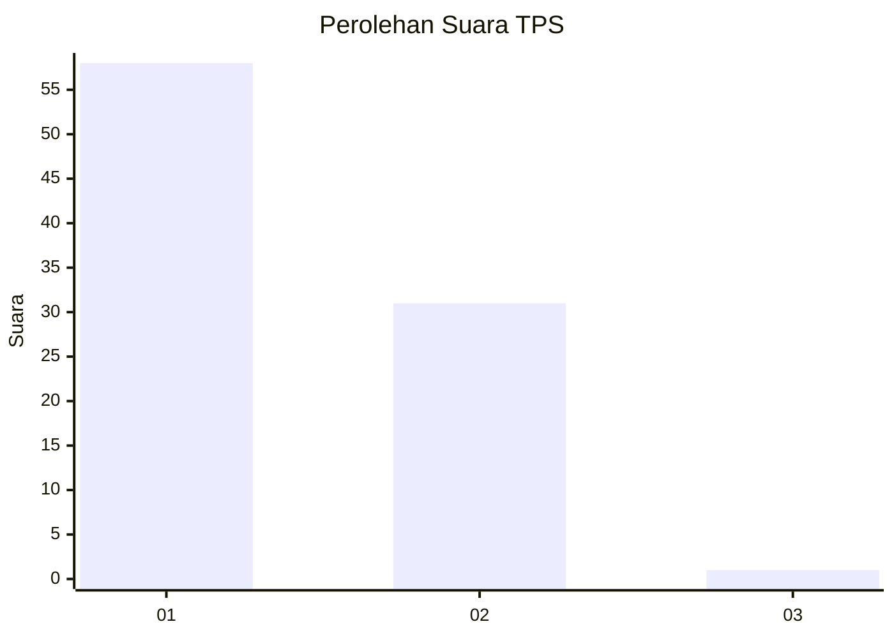
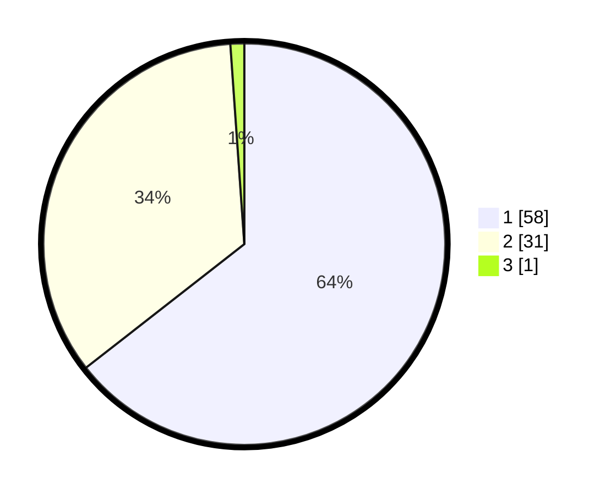

# Hasil

## Grafik

## Tabel

| No. | Nama Paslon    | Suara | Suara (raw) | Persentase |
|:--- |:-------------- | -----:| -----------:| ----------:|
| 1   | ANIES MUHAIMIN | 58    | [58][p-1]   | 64,44      |
| 2   | PRABOWO GIBRAN | 31    | [31][p-2]   | 34,44      |
| 3   | GANJAR MAHFUD  | 1     | [1][p-3]    | 1,11       |

[p-1]: https://github.com/gigit-pemilu/pemilu-2024/blob/main/pilpres/hitung-suara/sub/35-jawa-timur/sub/06-kediri/sub/02-mojo/sub/2011-ploso/sub/917-tps/sub/paslon-1.txt
[p-2]: https://github.com/gigit-pemilu/pemilu-2024/blob/main/pilpres/hitung-suara/sub/35-jawa-timur/sub/06-kediri/sub/02-mojo/sub/2011-ploso/sub/917-tps/sub/paslon-2.txt
[p-3]: https://github.com/gigit-pemilu/pemilu-2024/blob/main/pilpres/hitung-suara/sub/35-jawa-timur/sub/06-kediri/sub/02-mojo/sub/2011-ploso/sub/917-tps/sub/paslon-3.txt

## Foto C Plano

https://sirekap-obj-formc.kpu.go.id/1d71/pemilu/ppwp/35/06/02/20/11/3506022011917-20240216-025914--6e5795cb-d4dc-48ba-8d3b-f95a252c9424.jpg

https://sirekap-obj-formc.kpu.go.id/1d71/pemilu/ppwp/35/06/02/20/11/3506022011917-20240216-025916--1abf608a-5684-4d71-92de-9fcc52161df8.jpg

https://sirekap-obj-formc.kpu.go.id/1d71/pemilu/ppwp/35/06/02/20/11/3506022011917-20240216-025915--d6526e1a-b193-477c-aa00-038162dd263e.jpg

## Metadata

| Key        | Value               |
| ---------- | ------------------- |
| Time Stamp | 2024-02-16 21:01:00 |

## DATA PEMILIH TETAP

Jumlah pemilih dalam DPT: **276**.
 * L: **0**.
 * P: **276**.

## DATA PENGGUNA HAK PILIH

Jumlah pengguna hak pilih dalam DPT: **74**.
 * L: **0**.
 * P: **74**.

Jumlah pengguna hak pilih dalam DPTb: **16**.
 * L: **0**.
 * P: **16**.

Jumlah pengguna hak pilih dalam DPK: **0**.
 * L: **0**.
 * P: **0**.

Jumlah pengguna hak pilih: **90**.
 * L: **0**.
 * P: **90**.

## JUMLAH SUARA SAH DAN TIDAK SAH

JUMLAH SELURUH SUARA SAH: **90**.

JUMLAH SUARA TIDAK SAH: **0**.

JUMLAH SELURUH SUARA SAH DAN SUARA TIDAK SAH: **90**.

