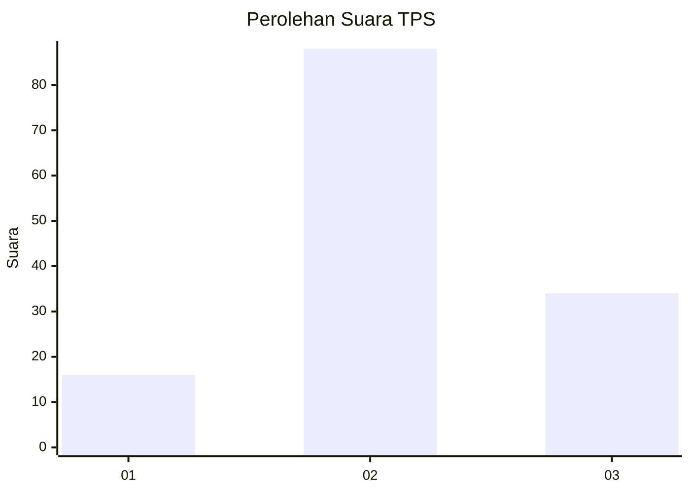
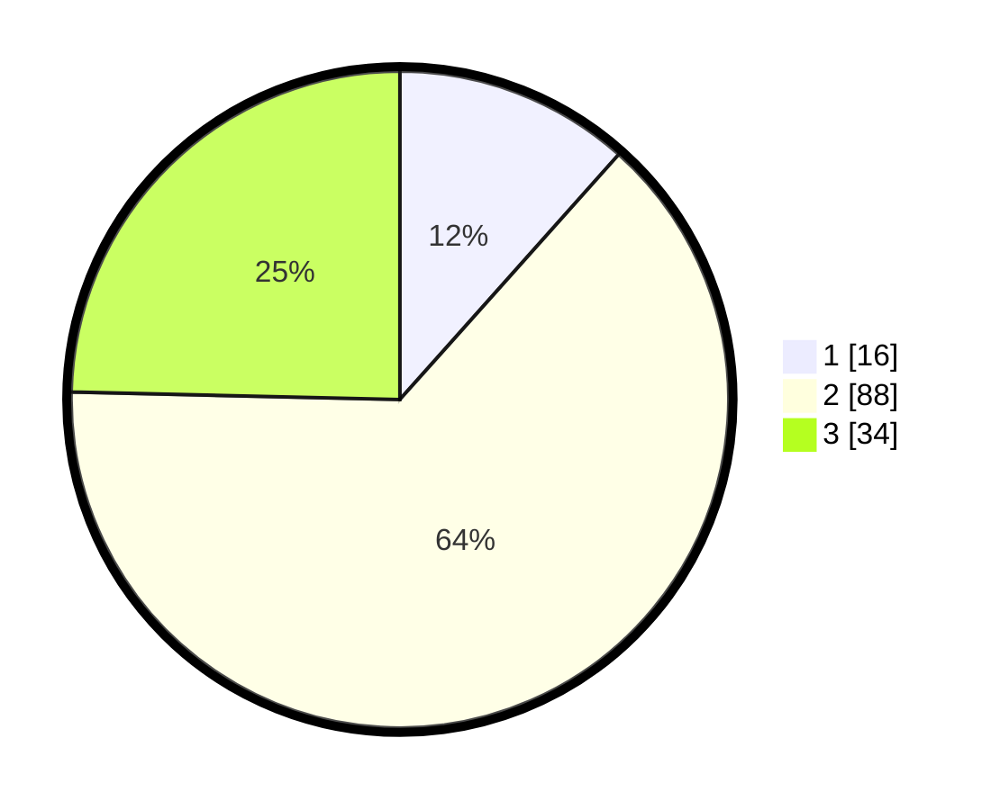

# Hasil

## Grafik

## Tabel

| No. | Nama Paslon    | Suara | Suara (raw) | Persentase |
|:--- |:-------------- | -----:| -----------:| ----------:|
| 1   | ANIES MUHAIMIN | 16    | [16][p-1]   | 11,59      |
| 2   | PRABOWO GIBRAN | 88    | [88][p-2]   | 63,77      |
| 3   | GANJAR MAHFUD  | 34    | [34][p-3]   | 24,64      |

[p-1]: https://github.com/gigit-pemilu/pemilu-2024/blob/main/pilpres/hitung-suara/sub/35-jawa-timur/sub/06-kediri/sub/03-kras/sub/2010-purwodadi/sub/005-tps/sub/paslon-1.txt
[p-2]: https://github.com/gigit-pemilu/pemilu-2024/blob/main/pilpres/hitung-suara/sub/35-jawa-timur/sub/06-kediri/sub/03-kras/sub/2010-purwodadi/sub/005-tps/sub/paslon-2.txt
[p-3]: https://github.com/gigit-pemilu/pemilu-2024/blob/main/pilpres/hitung-suara/sub/35-jawa-timur/sub/06-kediri/sub/03-kras/sub/2010-purwodadi/sub/005-tps/sub/paslon-3.txt

## Foto C Plano

https://sirekap-obj-formc.kpu.go.id/8f4c/pemilu/ppwp/35/06/03/20/10/3506032010005-20240217-061850--99c93f1e-df1b-4020-b5cd-a3a00d0febe8.jpg

https://sirekap-obj-formc.kpu.go.id/8f4c/pemilu/ppwp/35/06/03/20/10/3506032010005-20240217-235040--e00e8319-50c3-4571-bd11-7b20f53c820f.jpg

## Metadata

| Key        | Value               |
| ---------- | ------------------- |
| Time Stamp | 2024-02-19 06:16:00 |

