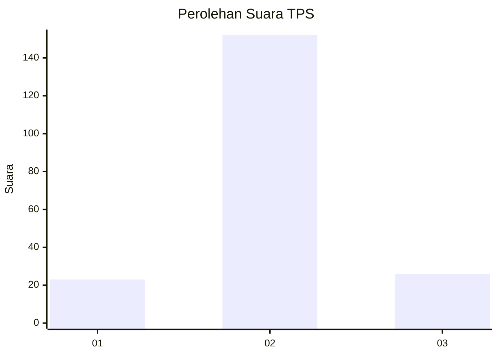
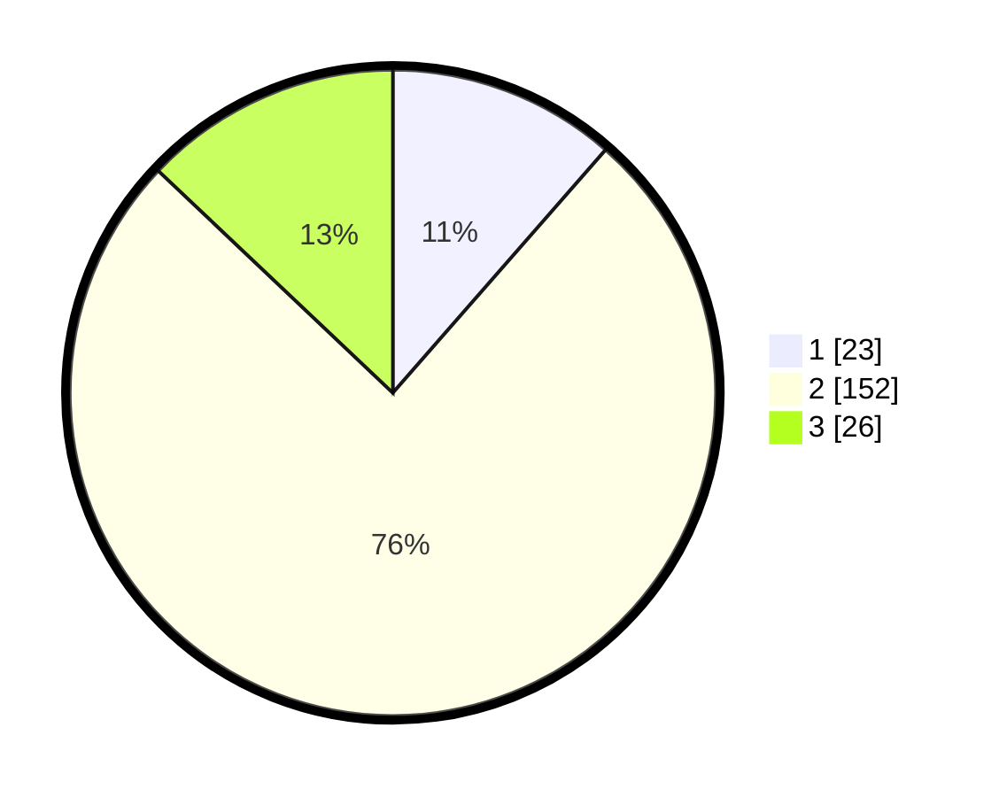

# Hasil

## Grafik

## Tabel

| No. | Nama Paslon    | Suara | Suara (raw) | Persentase |
|:--- |:-------------- | -----:| -----------:| ----------:|
| 1   | ANIES MUHAIMIN | 23    | [23][p-1]   | 11,44      |
| 2   | PRABOWO GIBRAN | 152   | [152][p-2]  | 75,62      |
| 3   | GANJAR MAHFUD  | 26    | [26][p-3]   | 12,94      |

[p-1]: https://github.com/gigit-pemilu/pemilu-2024/blob/main/pilpres/hitung-suara/sub/35-jawa-timur/sub/06-kediri/sub/04-ngadiluwih/sub/2006-dukuh/sub/022-tps/sub/paslon-1.txt
[p-2]: https://github.com/gigit-pemilu/pemilu-2024/blob/main/pilpres/hitung-suara/sub/35-jawa-timur/sub/06-kediri/sub/04-ngadiluwih/sub/2006-dukuh/sub/022-tps/sub/paslon-2.txt
[p-3]: https://github.com/gigit-pemilu/pemilu-2024/blob/main/pilpres/hitung-suara/sub/35-jawa-timur/sub/06-kediri/sub/04-ngadiluwih/sub/2006-dukuh/sub/022-tps/sub/paslon-3.txt

## Foto C Plano

https://sirekap-obj-formc.kpu.go.id/fcf7/pemilu/ppwp/35/06/04/20/06/3506042006022-20240223-215746--8cd29964-eaeb-428e-9995-fb1ed2435463.jpg

https://sirekap-obj-formc.kpu.go.id/fcf7/pemilu/ppwp/35/06/04/20/06/3506042006022-20240223-220030--d64ff0c2-8fd0-49e0-952b-d8b32568bd45.jpg

https://sirekap-obj-formc.kpu.go.id/fcf7/pemilu/ppwp/35/06/04/20/06/3506042006022-20240223-220203--62b0d953-0d19-429e-8aa0-a1b8d4812f9c.jpg

## Metadata

| Key        | Value               |
| ---------- | ------------------- |
| Time Stamp | 2024-02-25 00:00:00 |

