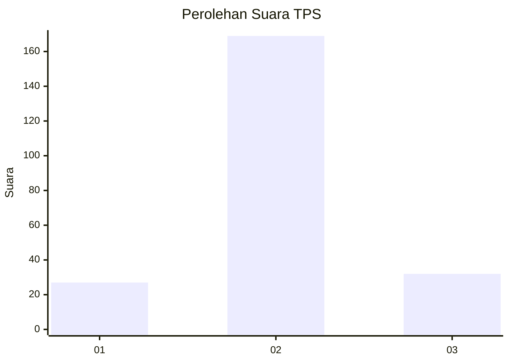
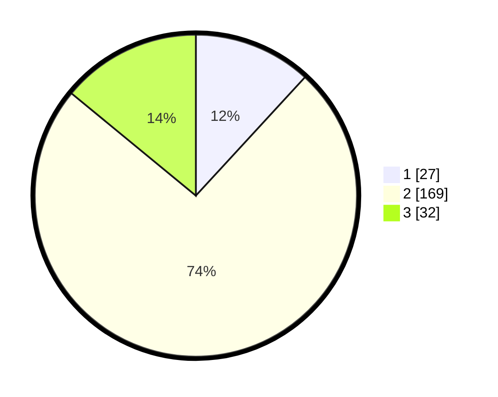

# Hasil

## Grafik

## Tabel

| No. | Nama Paslon    | Suara | Suara (raw) | Persentase |
|:--- |:-------------- | -----:| -----------:| ----------:|
| 1   | ANIES MUHAIMIN | 27    | [27][p-1]   | 11,84      |
| 2   | PRABOWO GIBRAN | 169   | [169][p-2]  | 74,12      |
| 3   | GANJAR MAHFUD  | 32    | [32][p-3]   | 14,04      |

[p-1]: https://github.com/gigit-pemilu/pemilu-2024-35-jawa-timur/blob/main/pilpres/hitung-suara/sub/35-jawa-timur/sub/06-kediri/sub/04-ngadiluwih/sub/2013-bedug/sub/007-tps/sub/paslon-1.txt
[p-2]: https://github.com/gigit-pemilu/pemilu-2024-35-jawa-timur/blob/main/pilpres/hitung-suara/sub/35-jawa-timur/sub/06-kediri/sub/04-ngadiluwih/sub/2013-bedug/sub/007-tps/sub/paslon-2.txt
[p-3]: https://github.com/gigit-pemilu/pemilu-2024-35-jawa-timur/blob/main/pilpres/hitung-suara/sub/35-jawa-timur/sub/06-kediri/sub/04-ngadiluwih/sub/2013-bedug/sub/007-tps/sub/paslon-3.txt

## Foto C Plano

https://sirekap-obj-formc.kpu.go.id/75ba/pemilu/ppwp/35/06/04/20/13/3506042013007-20240221-191131--9ef5434a-1979-4fc7-afe9-17ad29674d4a.jpg

https://sirekap-obj-formc.kpu.go.id/75ba/pemilu/ppwp/35/06/04/20/13/3506042013007-20240221-191204--d55776fa-036c-4525-8974-7458dcfb198c.jpg

https://sirekap-obj-formc.kpu.go.id/75ba/pemilu/ppwp/35/06/04/20/13/3506042013007-20240221-191303--a29ec16c-5db1-4328-9f1b-f8eb39f7acdd.jpg

## Metadata

| Key        | Value               |
| ---------- | ------------------- |
| Time Stamp | 2024-02-21 22:00:00 |

