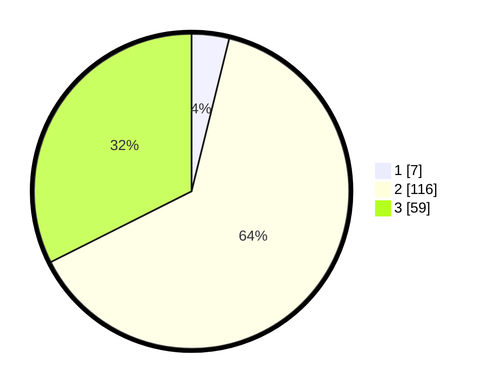

# Hasil

## Grafik

## Tabel

| No. | Nama Paslon    | Suara | Suara (raw) | Persentase |
|:--- |:-------------- | -----:| -----------:| ----------:|
| 1   | ANIES MUHAIMIN | 7     | [7][p-1]    | 3,85       |
| 2   | PRABOWO GIBRAN | 116   | [116][p-2]  | 63,74      |
| 3   | GANJAR MAHFUD  | 59    | [59][p-3]   | 32,42      |

[p-1]: https://github.com/gigit-pemilu/pemilu-2024/blob/main/pilpres/hitung-suara/sub/35-jawa-timur/sub/06-kediri/sub/05-kandat/sub/2005-cendono/sub/013-tps/sub/paslon-1.txt
[p-2]: https://github.com/gigit-pemilu/pemilu-2024/blob/main/pilpres/hitung-suara/sub/35-jawa-timur/sub/06-kediri/sub/05-kandat/sub/2005-cendono/sub/013-tps/sub/paslon-2.txt
[p-3]: https://github.com/gigit-pemilu/pemilu-2024/blob/main/pilpres/hitung-suara/sub/35-jawa-timur/sub/06-kediri/sub/05-kandat/sub/2005-cendono/sub/013-tps/sub/paslon-3.txt

## Foto C Plano

https://sirekap-obj-formc.kpu.go.id/dce2/pemilu/ppwp/35/06/05/20/05/3506052005013-20240217-071534--4cff834e-4f64-4120-966d-579d1df7585e.jpg

https://sirekap-obj-formc.kpu.go.id/dce2/pemilu/ppwp/35/06/05/20/05/3506052005013-20240217-071733--e447a5fa-c674-422f-a06b-2b4594736936.jpg

https://sirekap-obj-formc.kpu.go.id/dce2/pemilu/ppwp/35/06/05/20/05/3506052005013-20240217-071933--dd646ebf-9b99-4031-9b2c-401e14d37e6c.jpg

## Metadata

| Key        | Value               |
| ---------- | ------------------- |
| Time Stamp | 2024-02-17 17:30:00 |

## DATA PEMILIH TETAP

Jumlah pemilih dalam DPT: **220**.
 * L: **448**.
 * P: **402**.

## DATA PENGGUNA HAK PILIH

Jumlah pengguna hak pilih dalam DPT: **888**.
 * L: **804**.
 * P: **859**.

Jumlah pengguna hak pilih dalam DPTb: **588**.
 * L: **80**.
 * P: **8**.

Jumlah pengguna hak pilih dalam DPK: **884**.
 * L: **0**.
 * P: **6**.

Jumlah pengguna hak pilih: **686**.
 * L: **98**.
 * P: **88**.

## JUMLAH SUARA SAH DAN TIDAK SAH

JUMLAH SELURUH SUARA SAH: **182**.

JUMLAH SUARA TIDAK SAH: **4**.

JUMLAH SELURUH SUARA SAH DAN SUARA TIDAK SAH: **186**.

