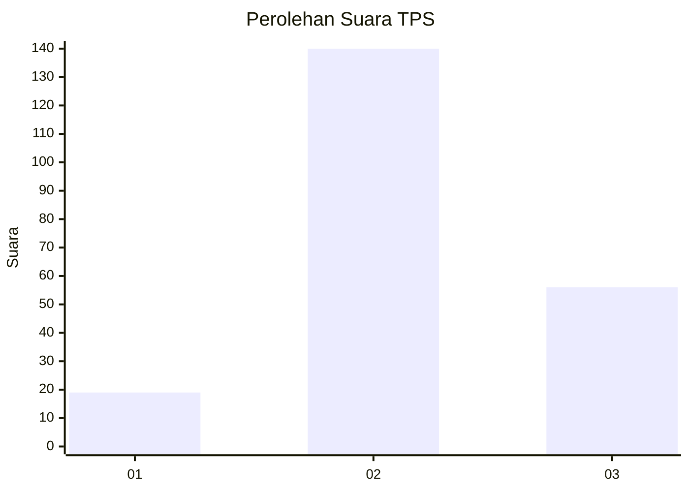
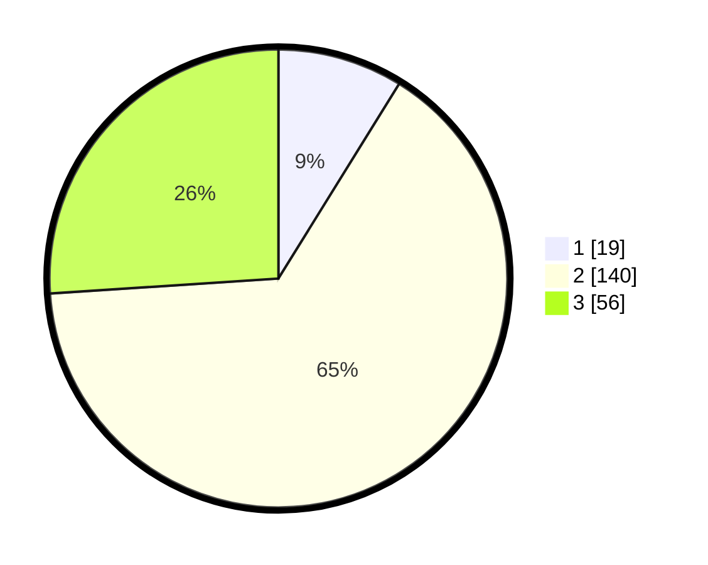

# Hasil

## Grafik

## Tabel

| No. | Nama Paslon    | Suara | Suara (raw) | Persentase |
|:--- |:-------------- | -----:| -----------:| ----------:|
| 1   | ANIES MUHAIMIN | 19    | [19][p-1]   | 8,84       |
| 2   | PRABOWO GIBRAN | 140   | [140][p-2]  | 65,12      |
| 3   | GANJAR MAHFUD  | 56    | [56][p-3]   | 26,05      |

[p-1]: https://github.com/gigit-pemilu/pemilu-2024/blob/main/pilpres/hitung-suara/sub/35-jawa-timur/sub/06-kediri/sub/05-kandat/sub/2011-blabak/sub/004-tps/sub/paslon-1.txt
[p-2]: https://github.com/gigit-pemilu/pemilu-2024/blob/main/pilpres/hitung-suara/sub/35-jawa-timur/sub/06-kediri/sub/05-kandat/sub/2011-blabak/sub/004-tps/sub/paslon-2.txt
[p-3]: https://github.com/gigit-pemilu/pemilu-2024/blob/main/pilpres/hitung-suara/sub/35-jawa-timur/sub/06-kediri/sub/05-kandat/sub/2011-blabak/sub/004-tps/sub/paslon-3.txt

## Foto C Plano

https://sirekap-obj-formc.kpu.go.id/a49f/pemilu/ppwp/35/06/05/20/11/3506052011004-20240217-080432--2a624a39-7fe8-4e59-b4b5-f75a7ecfee16.jpg

https://sirekap-obj-formc.kpu.go.id/a49f/pemilu/ppwp/35/06/05/20/11/3506052011004-20240217-141655--493a33a0-92ec-4d58-90f3-c8c54f6c65c1.jpg

https://sirekap-obj-formc.kpu.go.id/a49f/pemilu/ppwp/35/06/05/20/11/3506052011004-20240223-001909--d11ace13-7b38-4493-ad6a-73fb8828ec1f.jpg

## Metadata

| Key        | Value               |
| ---------- | ------------------- |
| Time Stamp | 2024-02-24 22:31:28 |

