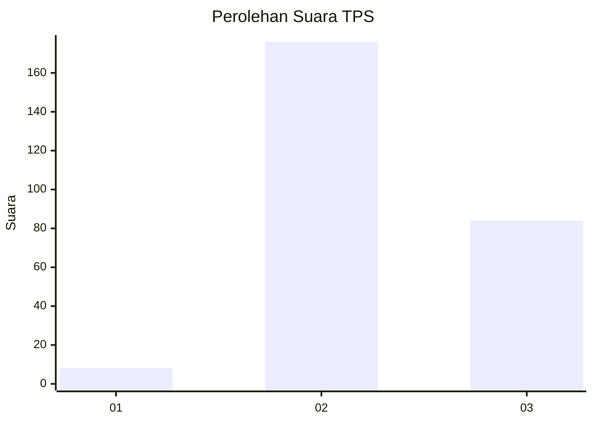
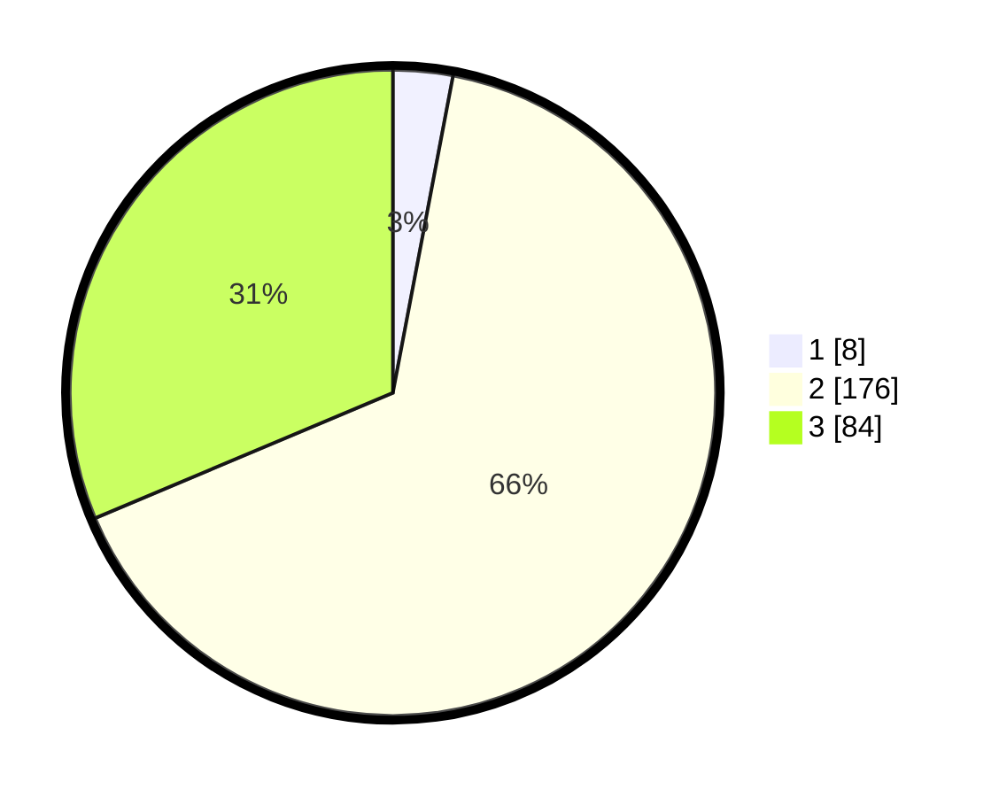

# Hasil

## Grafik

## Tabel

| No. | Nama Paslon    | Suara | Suara (raw) | Persentase |
|:--- |:-------------- | -----:| -----------:| ----------:|
| 1   | ANIES MUHAIMIN | 8     | [8][p-1]    | 2,99       |
| 2   | PRABOWO GIBRAN | 176   | [176][p-2]  | 65,67      |
| 3   | GANJAR MAHFUD  | 84    | [84][p-3]   | 31,34      |

[p-1]: https://github.com/gigit-pemilu/pemilu-2024-35-jawa-timur/blob/main/pilpres/hitung-suara/sub/35-jawa-timur/sub/06-kediri/sub/05-kandat/sub/2012-ngreco/sub/009-tps/sub/paslon-1.txt
[p-2]: https://github.com/gigit-pemilu/pemilu-2024-35-jawa-timur/blob/main/pilpres/hitung-suara/sub/35-jawa-timur/sub/06-kediri/sub/05-kandat/sub/2012-ngreco/sub/009-tps/sub/paslon-2.txt
[p-3]: https://github.com/gigit-pemilu/pemilu-2024-35-jawa-timur/blob/main/pilpres/hitung-suara/sub/35-jawa-timur/sub/06-kediri/sub/05-kandat/sub/2012-ngreco/sub/009-tps/sub/paslon-3.txt

## Foto C Plano

https://sirekap-obj-formc.kpu.go.id/5abb/pemilu/ppwp/35/06/05/20/12/3506052012009-20240221-231004--bbe3fadf-b661-4c7e-8f36-19cfdf0d2527.jpg

https://sirekap-obj-formc.kpu.go.id/5abb/pemilu/ppwp/35/06/05/20/12/3506052012009-20240221-230758--f0907c9b-8e20-45c1-a825-0be9a7da7d73.jpg

https://sirekap-obj-formc.kpu.go.id/5abb/pemilu/ppwp/35/06/05/20/12/3506052012009-20240221-230838--822e37e0-aeed-49b3-9884-4dbec2dd8a47.jpg

## Metadata

| Key        | Value               |
| ---------- | ------------------- |
| Time Stamp | 2024-02-22 00:00:00 |

