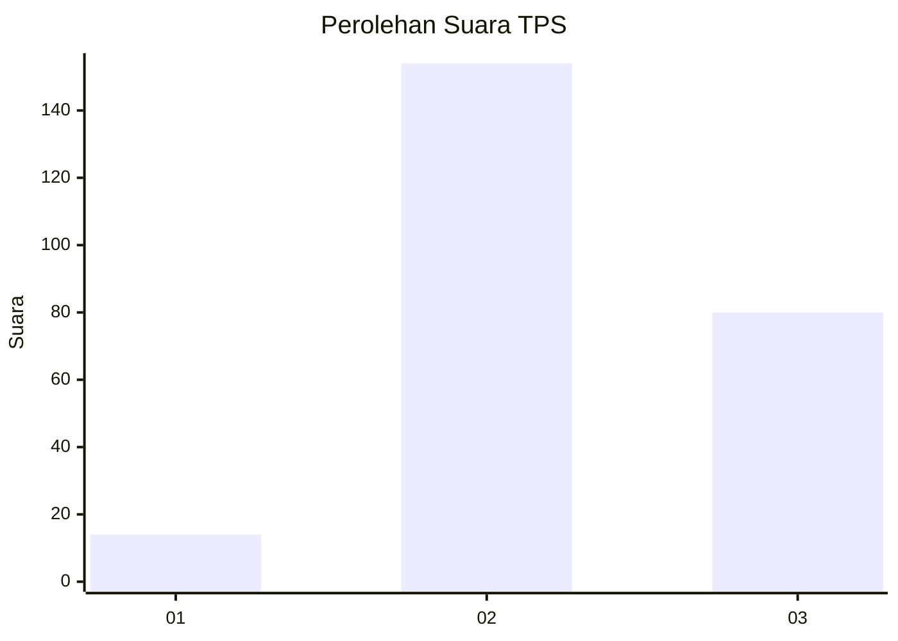
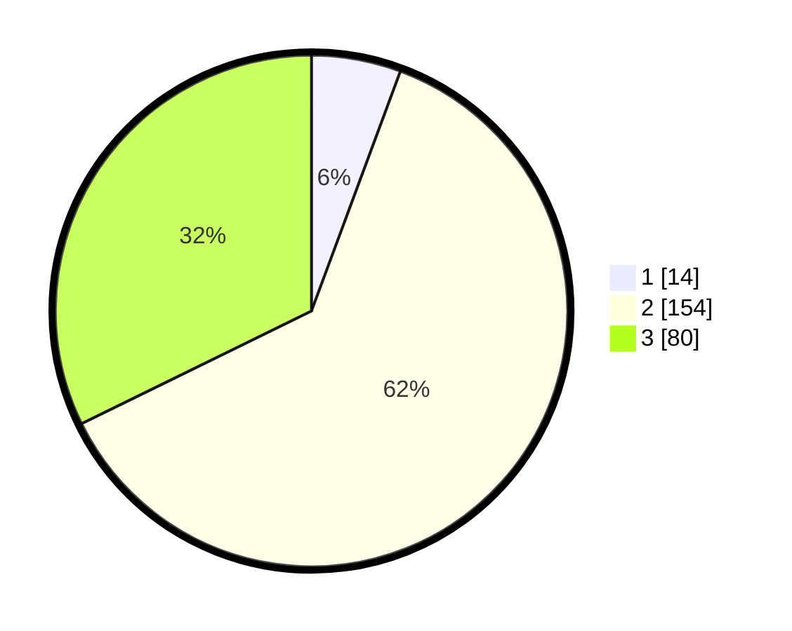

# Hasil

## Grafik

## Tabel

| No. | Nama Paslon    | Suara | Suara (raw) | Persentase |
|:--- |:-------------- | -----:| -----------:| ----------:|
| 1   | ANIES MUHAIMIN | 14    | [14][p-1]   | 5,65       |
| 2   | PRABOWO GIBRAN | 154   | [154][p-2]  | 62,10      |
| 3   | GANJAR MAHFUD  | 80    | [80][p-3]   | 32,26      |

[p-1]: https://github.com/gigit-pemilu/pemilu-2024-35-jawa-timur/blob/main/pilpres/hitung-suara/sub/35-jawa-timur/sub/06-kediri/sub/06-wates/sub/2018-janti/sub/008-tps/sub/paslon-1.txt
[p-2]: https://github.com/gigit-pemilu/pemilu-2024-35-jawa-timur/blob/main/pilpres/hitung-suara/sub/35-jawa-timur/sub/06-kediri/sub/06-wates/sub/2018-janti/sub/008-tps/sub/paslon-2.txt
[p-3]: https://github.com/gigit-pemilu/pemilu-2024-35-jawa-timur/blob/main/pilpres/hitung-suara/sub/35-jawa-timur/sub/06-kediri/sub/06-wates/sub/2018-janti/sub/008-tps/sub/paslon-3.txt

## Foto C Plano

https://sirekap-obj-formc.kpu.go.id/cdaf/pemilu/ppwp/35/06/06/20/18/3506062018008-20240215-003037--56e1cbd9-3365-455d-bc5f-13d2baf8af70.jpg

https://sirekap-obj-formc.kpu.go.id/cdaf/pemilu/ppwp/35/06/06/20/18/3506062018008-20240215-002859--b3f186d4-f9a0-4df0-bd44-354814c26f59.jpg

https://sirekap-obj-formc.kpu.go.id/cdaf/pemilu/ppwp/35/06/06/20/18/3506062018008-20240214-213658--f675249f-6e95-4fc0-a971-7d04ed8ab81a.jpg

## Metadata

| Key        | Value               |
| ---------- | ------------------- |
| Time Stamp | 2024-02-15 04:00:24 |

