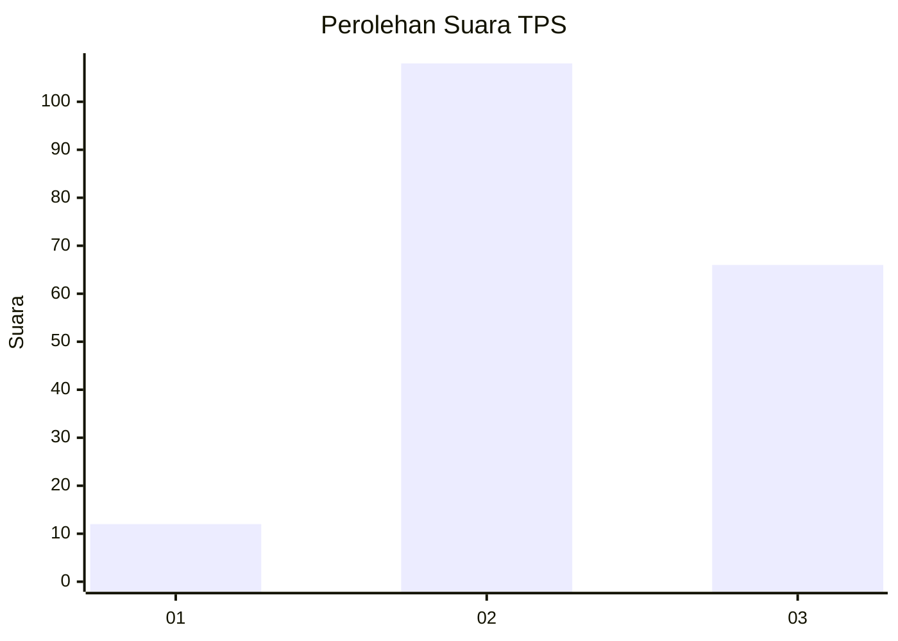
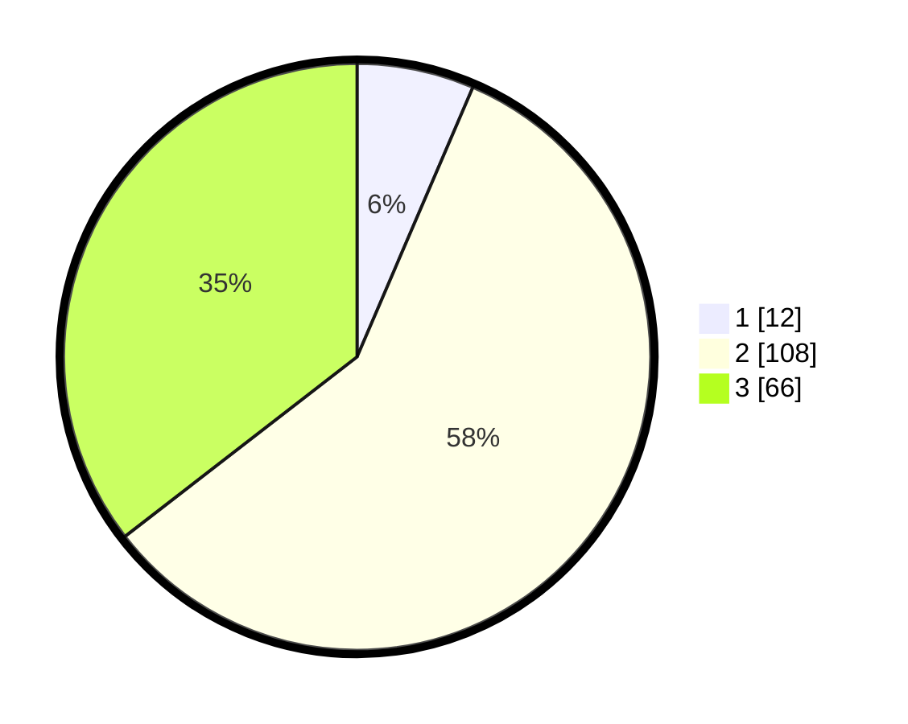

# Hasil

## Grafik

## Tabel

| No. | Nama Paslon    | Suara | Suara (raw) | Persentase |
|:--- |:-------------- | -----:| -----------:| ----------:|
| 1   | ANIES MUHAIMIN | 12    | [12][p-1]   | 6,45       |
| 2   | PRABOWO GIBRAN | 108   | [108][p-2]  | 58,06      |
| 3   | GANJAR MAHFUD  | 66    | [66][p-3]   | 35,48      |

[p-1]: https://github.com/gigit-pemilu/pemilu-2024-35-jawa-timur/blob/main/pilpres/hitung-suara/sub/35-jawa-timur/sub/06-kediri/sub/09-plosoklaten/sub/2013-sumberagung/sub/020-tps/sub/paslon-1.txt
[p-2]: https://github.com/gigit-pemilu/pemilu-2024-35-jawa-timur/blob/main/pilpres/hitung-suara/sub/35-jawa-timur/sub/06-kediri/sub/09-plosoklaten/sub/2013-sumberagung/sub/020-tps/sub/paslon-2.txt
[p-3]: https://github.com/gigit-pemilu/pemilu-2024-35-jawa-timur/blob/main/pilpres/hitung-suara/sub/35-jawa-timur/sub/06-kediri/sub/09-plosoklaten/sub/2013-sumberagung/sub/020-tps/sub/paslon-3.txt

## Foto C Plano

https://sirekap-obj-formc.kpu.go.id/c75c/pemilu/ppwp/35/06/09/20/13/3506092013020-20240218-001413--19ceb640-2ecc-46f7-bf42-f2f8d30b7293.jpg

https://sirekap-obj-formc.kpu.go.id/c75c/pemilu/ppwp/35/06/09/20/13/3506092013020-20240218-000827--eced7cea-b35d-40f2-829d-d05034128b1e.jpg

https://sirekap-obj-formc.kpu.go.id/c75c/pemilu/ppwp/35/06/09/20/13/3506092013020-20240218-000913--fafb9a65-62cc-4c28-b010-c343d84c2d0e.jpg

## Metadata

| Key        | Value               |
| ---------- | ------------------- |
| Time Stamp | 2024-02-19 06:16:00 |

