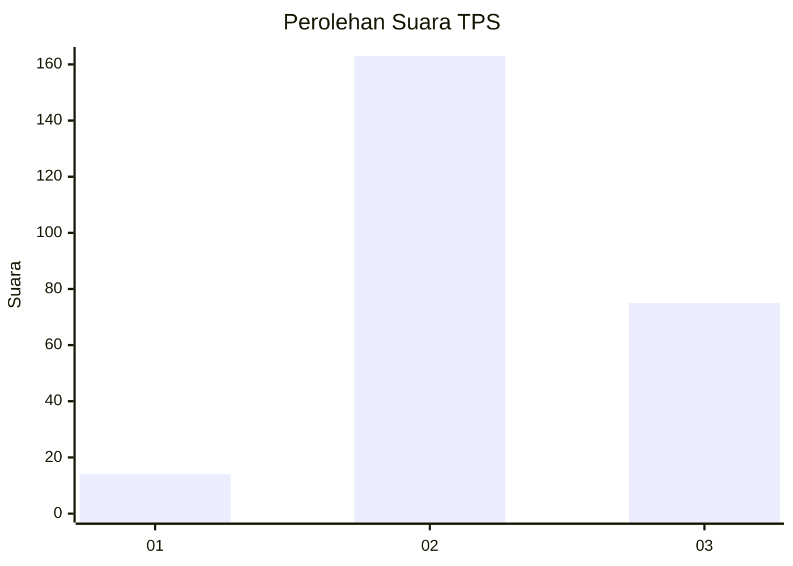

# Hasil

## Grafik

## Tabel

| No. | Nama Paslon    | Suara | Suara (raw) | Persentase |
|:--- |:-------------- | -----:| -----------:| ----------:|
| 1   | ANIES MUHAIMIN | 14    | [14][p-1]   | 5,56       |
| 2   | PRABOWO GIBRAN | 163   | [163][p-2]  | 64,68      |
| 3   | GANJAR MAHFUD  | 75    | [75][p-3]   | 29,76      |

[p-1]: https://github.com/gigit-pemilu/pemilu-2024-35-jawa-timur/blob/main/pilpres/hitung-suara/sub/35-jawa-timur/sub/06-kediri/sub/09-plosoklaten/sub/2014-wonorejo-trisulo/sub/011-tps/sub/paslon-1.txt
[p-2]: https://github.com/gigit-pemilu/pemilu-2024-35-jawa-timur/blob/main/pilpres/hitung-suara/sub/35-jawa-timur/sub/06-kediri/sub/09-plosoklaten/sub/2014-wonorejo-trisulo/sub/011-tps/sub/paslon-2.txt
[p-3]: https://github.com/gigit-pemilu/pemilu-2024-35-jawa-timur/blob/main/pilpres/hitung-suara/sub/35-jawa-timur/sub/06-kediri/sub/09-plosoklaten/sub/2014-wonorejo-trisulo/sub/011-tps/sub/paslon-3.txt

## Foto C Plano

https://sirekap-obj-formc.kpu.go.id/03fd/pemilu/ppwp/35/06/09/20/14/3506092014011-20240217-105319--98d74ca6-9142-4071-a633-53866e73ca60.jpg

https://sirekap-obj-formc.kpu.go.id/03fd/pemilu/ppwp/35/06/09/20/14/3506092014011-20240217-105551--2f58c9aa-ab4b-40e0-92d8-3c54f7eb8578.jpg

https://sirekap-obj-formc.kpu.go.id/03fd/pemilu/ppwp/35/06/09/20/14/3506092014011-20240217-105633--93367401-843b-4820-a309-86b332e3ad9c.jpg

## Metadata

| Key        | Value               |
| ---------- | ------------------- |
| Time Stamp | 2024-02-17 11:30:03 |

