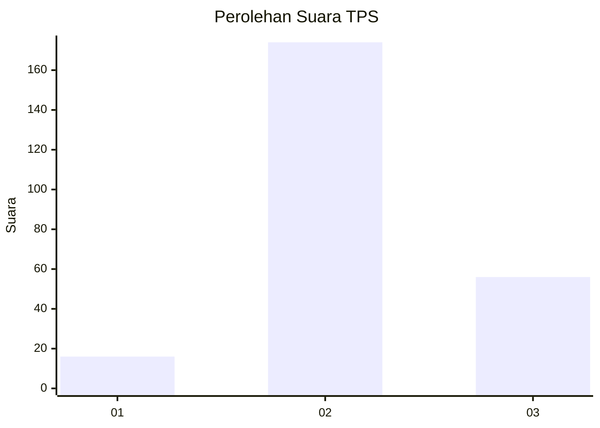
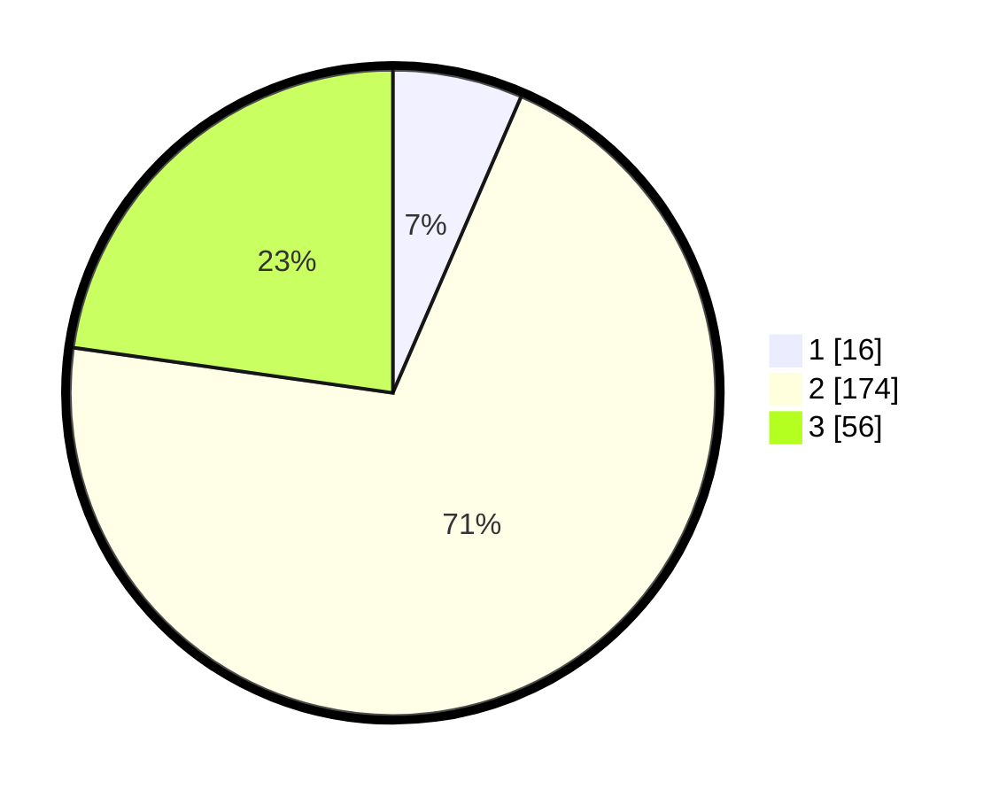

# Hasil

## Grafik

## Tabel

| No. | Nama Paslon    | Suara | Suara (raw) | Persentase |
|:--- |:-------------- | -----:| -----------:| ----------:|
| 1   | ANIES MUHAIMIN | 16    | [16][p-1]   | 6,50       |
| 2   | PRABOWO GIBRAN | 174   | [174][p-2]  | 70,73      |
| 3   | GANJAR MAHFUD  | 56    | [56][p-3]   | 22,76      |

[p-1]: https://github.com/gigit-pemilu/pemilu-2024-35-jawa-timur/blob/main/pilpres/hitung-suara/sub/35-jawa-timur/sub/06-kediri/sub/09-plosoklaten/sub/2014-wonorejo-trisulo/sub/013-tps/sub/paslon-1.txt
[p-2]: https://github.com/gigit-pemilu/pemilu-2024-35-jawa-timur/blob/main/pilpres/hitung-suara/sub/35-jawa-timur/sub/06-kediri/sub/09-plosoklaten/sub/2014-wonorejo-trisulo/sub/013-tps/sub/paslon-2.txt
[p-3]: https://github.com/gigit-pemilu/pemilu-2024-35-jawa-timur/blob/main/pilpres/hitung-suara/sub/35-jawa-timur/sub/06-kediri/sub/09-plosoklaten/sub/2014-wonorejo-trisulo/sub/013-tps/sub/paslon-3.txt

## Foto C Plano

https://sirekap-obj-formc.kpu.go.id/71b3/pemilu/ppwp/35/06/09/20/14/3506092014013-20240221-200148--15c84ec6-dd73-4ffe-ad67-4bb225ea0709.jpg

https://sirekap-obj-formc.kpu.go.id/71b3/pemilu/ppwp/35/06/09/20/14/3506092014013-20240222-161925--4f96de13-9706-4bd2-b4d6-1a72acc25b24.jpg

https://sirekap-obj-formc.kpu.go.id/71b3/pemilu/ppwp/35/06/09/20/14/3506092014013-20240222-161717--060380d1-2213-4211-97da-a5199903996d.jpg

## Metadata

| Key        | Value               |
| ---------- | ------------------- |
| Time Stamp | 2024-02-22 17:00:00 |

