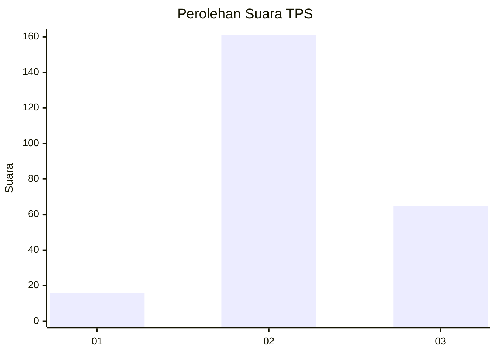

# Hasil

## Grafik

## Tabel

| No. | Nama Paslon    | Suara | Suara (raw) | Persentase |
|:--- |:-------------- | -----:| -----------:| ----------:|
| 1   | ANIES MUHAIMIN | 16    | [16][p-1]   | 6,61       |
| 2   | PRABOWO GIBRAN | 161   | [161][p-2]  | 66,53      |
| 3   | GANJAR MAHFUD  | 65    | [65][p-3]   | 26,86      |

[p-1]: https://github.com/gigit-pemilu/pemilu-2024-35-jawa-timur/blob/main/pilpres/hitung-suara/sub/35-jawa-timur/sub/06-kediri/sub/10-gurah/sub/2008-wonojoyo/sub/014-tps/sub/paslon-1.txt
[p-2]: https://github.com/gigit-pemilu/pemilu-2024-35-jawa-timur/blob/main/pilpres/hitung-suara/sub/35-jawa-timur/sub/06-kediri/sub/10-gurah/sub/2008-wonojoyo/sub/014-tps/sub/paslon-2.txt
[p-3]: https://github.com/gigit-pemilu/pemilu-2024-35-jawa-timur/blob/main/pilpres/hitung-suara/sub/35-jawa-timur/sub/06-kediri/sub/10-gurah/sub/2008-wonojoyo/sub/014-tps/sub/paslon-3.txt

## Foto C Plano

https://sirekap-obj-formc.kpu.go.id/2c64/pemilu/ppwp/35/06/10/20/08/3506102008014-20240214-155525--8ee58d21-a35a-4e1e-8a97-1ae3a924713d.jpg

https://sirekap-obj-formc.kpu.go.id/2c64/pemilu/ppwp/35/06/10/20/08/3506102008014-20240217-102100--0e284bbf-b67f-49c3-b16c-c03f5c40b580.jpg

https://sirekap-obj-formc.kpu.go.id/2c64/pemilu/ppwp/35/06/10/20/08/3506102008014-20240217-102307--4459fc1e-5679-4950-9822-3eabf4946298.jpg

## Metadata

| Key        | Value               |
| ---------- | ------------------- |
| Time Stamp | 2024-02-17 10:30:03 |

