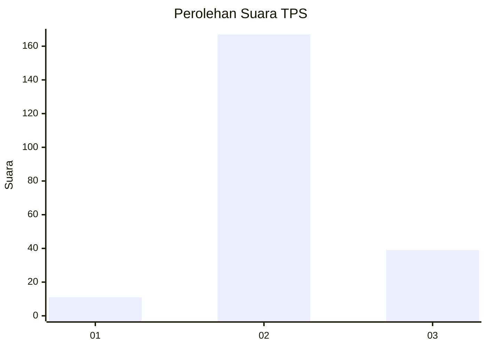

# Hasil

## Grafik

## Tabel

| No. | Nama Paslon    | Suara | Suara (raw) | Persentase |
|:--- |:-------------- | -----:| -----------:| ----------:|
| 1   | ANIES MUHAIMIN | 11    | [11][p-1]   | 5,07       |
| 2   | PRABOWO GIBRAN | 167   | [167][p-2]  | 76,96      |
| 3   | GANJAR MAHFUD  | 39    | [39][p-3]   | 17,97      |

[p-1]: https://github.com/gigit-pemilu/pemilu-2024/blob/main/pilpres/hitung-suara/sub/35-jawa-timur/sub/06-kediri/sub/12-gampengrejo/sub/2010-jongbiru/sub/012-tps/sub/paslon-1.txt
[p-2]: https://github.com/gigit-pemilu/pemilu-2024/blob/main/pilpres/hitung-suara/sub/35-jawa-timur/sub/06-kediri/sub/12-gampengrejo/sub/2010-jongbiru/sub/012-tps/sub/paslon-2.txt
[p-3]: https://github.com/gigit-pemilu/pemilu-2024/blob/main/pilpres/hitung-suara/sub/35-jawa-timur/sub/06-kediri/sub/12-gampengrejo/sub/2010-jongbiru/sub/012-tps/sub/paslon-3.txt

## Foto C Plano

https://sirekap-obj-formc.kpu.go.id/73be/pemilu/ppwp/35/06/12/20/10/3506122010012-20240217-104028--ce55117d-549c-417e-8d2b-fe21ab506f21.jpg

https://sirekap-obj-formc.kpu.go.id/73be/pemilu/ppwp/35/06/12/20/10/3506122010012-20240217-104205--e591f190-4530-4bed-b630-cf12eb638004.jpg

https://sirekap-obj-formc.kpu.go.id/73be/pemilu/ppwp/35/06/12/20/10/3506122010012-20240217-115312--d2337c08-a076-4630-bfcd-f2e8492df62f.jpg

## Metadata

| Key        | Value               |
| ---------- | ------------------- |
| Time Stamp | 2024-02-19 06:16:00 |

