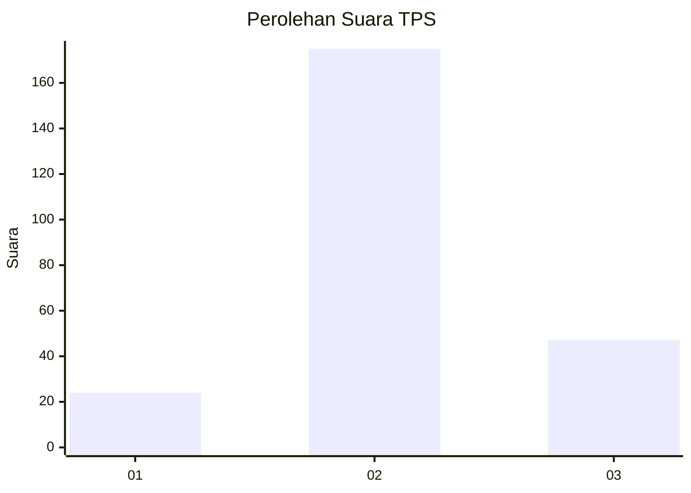
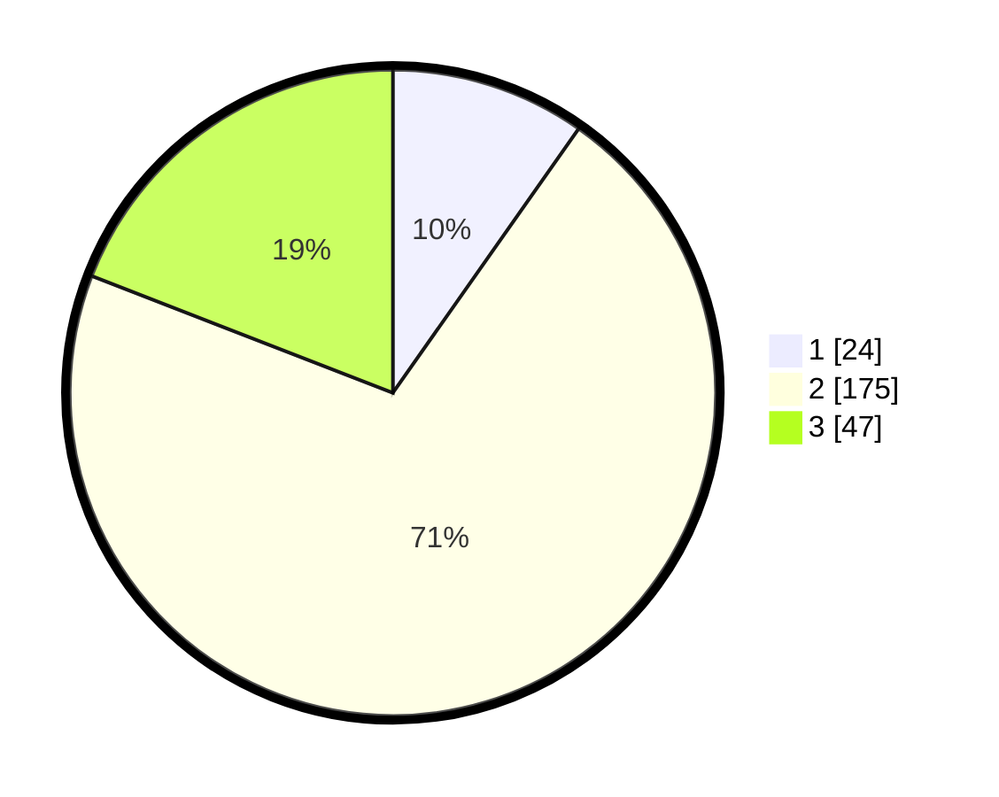

# Hasil

## Grafik

## Tabel

| No. | Nama Paslon    | Suara | Suara (raw) | Persentase |
|:--- |:-------------- | -----:| -----------:| ----------:|
| 1   | ANIES MUHAIMIN | 24    | [24][p-1]   | 9,76       |
| 2   | PRABOWO GIBRAN | 175   | [175][p-2]  | 71,14      |
| 3   | GANJAR MAHFUD  | 47    | [47][p-3]   | 19,11      |

[p-1]: https://github.com/gigit-pemilu/pemilu-2024-35-jawa-timur/blob/main/pilpres/hitung-suara/sub/35-jawa-timur/sub/06-kediri/sub/12-gampengrejo/sub/2021-gampeng/sub/001-tps/sub/paslon-1.txt
[p-2]: https://github.com/gigit-pemilu/pemilu-2024-35-jawa-timur/blob/main/pilpres/hitung-suara/sub/35-jawa-timur/sub/06-kediri/sub/12-gampengrejo/sub/2021-gampeng/sub/001-tps/sub/paslon-2.txt
[p-3]: https://github.com/gigit-pemilu/pemilu-2024-35-jawa-timur/blob/main/pilpres/hitung-suara/sub/35-jawa-timur/sub/06-kediri/sub/12-gampengrejo/sub/2021-gampeng/sub/001-tps/sub/paslon-3.txt

## Foto C Plano

https://sirekap-obj-formc.kpu.go.id/d3df/pemilu/ppwp/35/06/12/20/21/3506122021001-20240217-105133--8c5eb10c-d33c-4ee5-a9f7-a5104d184032.jpg

https://sirekap-obj-formc.kpu.go.id/d3df/pemilu/ppwp/35/06/12/20/21/3506122021001-20240220-122336--588deab9-cdec-4f95-8dbf-9bdb58c57371.jpg

https://sirekap-obj-formc.kpu.go.id/d3df/pemilu/ppwp/35/06/12/20/21/3506122021001-20240220-124828--0dfd6305-dbc9-4849-8c1e-6112b6ea91ae.jpg

## Metadata

| Key        | Value               |
| ---------- | ------------------- |
| Time Stamp | 2024-02-20 18:00:00 |

