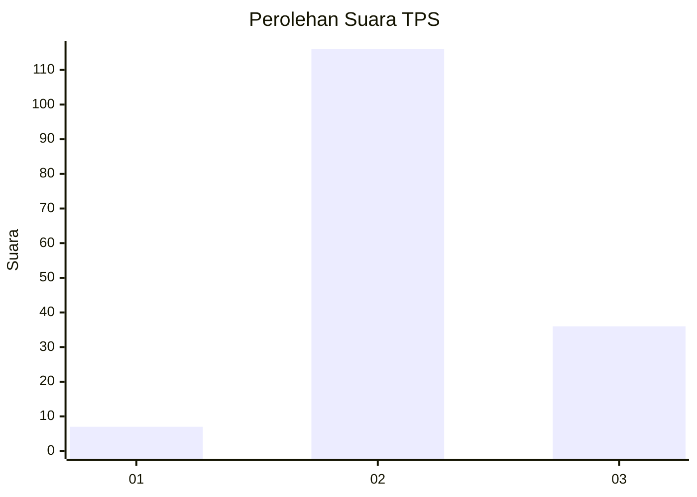
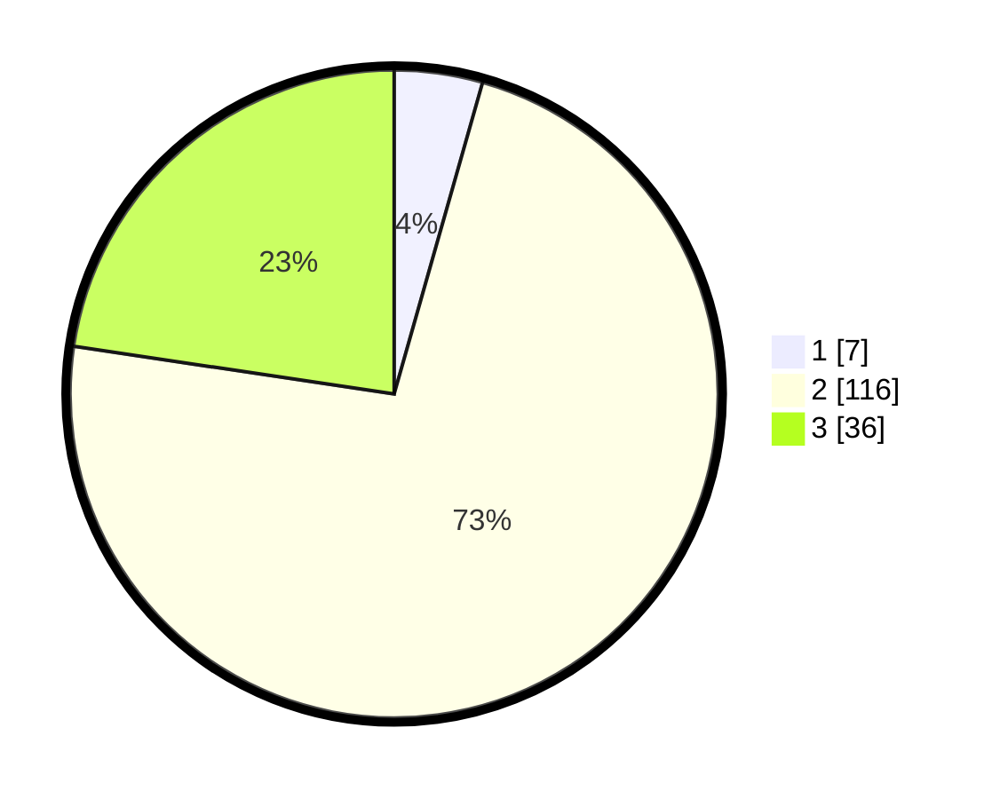

# Hasil

## Grafik

## Tabel

| No. | Nama Paslon    | Suara | Suara (raw) | Persentase |
|:--- |:-------------- | -----:| -----------:| ----------:|
| 1   | ANIES MUHAIMIN | 7     | [7][p-1]    | 4,40       |
| 2   | PRABOWO GIBRAN | 116   | [116][p-2]  | 72,96      |
| 3   | GANJAR MAHFUD  | 36    | [36][p-3]   | 22,64      |

[p-1]: https://github.com/gigit-pemilu/pemilu-2024/blob/main/pilpres/hitung-suara/sub/35-jawa-timur/sub/06-kediri/sub/13-grogol/sub/2001-kalipang/sub/001-tps/sub/paslon-1.txt
[p-2]: https://github.com/gigit-pemilu/pemilu-2024/blob/main/pilpres/hitung-suara/sub/35-jawa-timur/sub/06-kediri/sub/13-grogol/sub/2001-kalipang/sub/001-tps/sub/paslon-2.txt
[p-3]: https://github.com/gigit-pemilu/pemilu-2024/blob/main/pilpres/hitung-suara/sub/35-jawa-timur/sub/06-kediri/sub/13-grogol/sub/2001-kalipang/sub/001-tps/sub/paslon-3.txt

## Foto C Plano

https://sirekap-obj-formc.kpu.go.id/9756/pemilu/ppwp/35/06/13/20/01/3506132001001-20240218-212106--e8d1c9af-fd80-488a-944a-7cb6255282fa.jpg

https://sirekap-obj-formc.kpu.go.id/9756/pemilu/ppwp/35/06/13/20/01/3506132001001-20240218-194431--1a41dc39-5c50-4727-8733-b007e9d20c04.jpg

https://sirekap-obj-formc.kpu.go.id/9756/pemilu/ppwp/35/06/13/20/01/3506132001001-20240218-212107--fbb98fa7-b412-4d9b-8a4a-c15e123c149d.jpg

## Metadata

| Key        | Value               |
| ---------- | ------------------- |
| Time Stamp | 2024-02-19 06:16:00 |

## DATA PEMILIH TETAP

Jumlah pemilih dalam DPT: **201**.
 * L: **114**.
 * P: **87**.

## DATA PENGGUNA HAK PILIH

Jumlah pengguna hak pilih dalam DPT: **164**.
 * L: **90**.
 * P: **74**.

Jumlah pengguna hak pilih dalam DPTb: **0**.
 * L: **0**.
 * P: **0**.

Jumlah pengguna hak pilih dalam DPK: **0**.
 * L: **0**.
 * P: **0**.

Jumlah pengguna hak pilih: **164**.
 * L: **90**.
 * P: **74**.

## JUMLAH SUARA SAH DAN TIDAK SAH

JUMLAH SELURUH SUARA SAH: **159**.

JUMLAH SUARA TIDAK SAH: **5**.

JUMLAH SELURUH SUARA SAH DAN SUARA TIDAK SAH: **164**.

