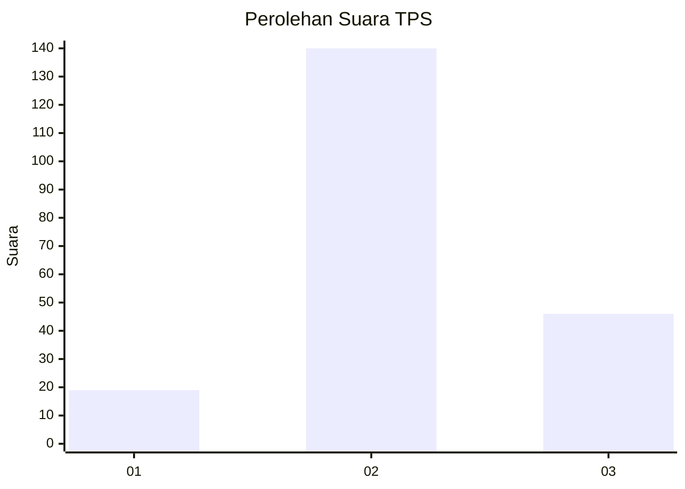
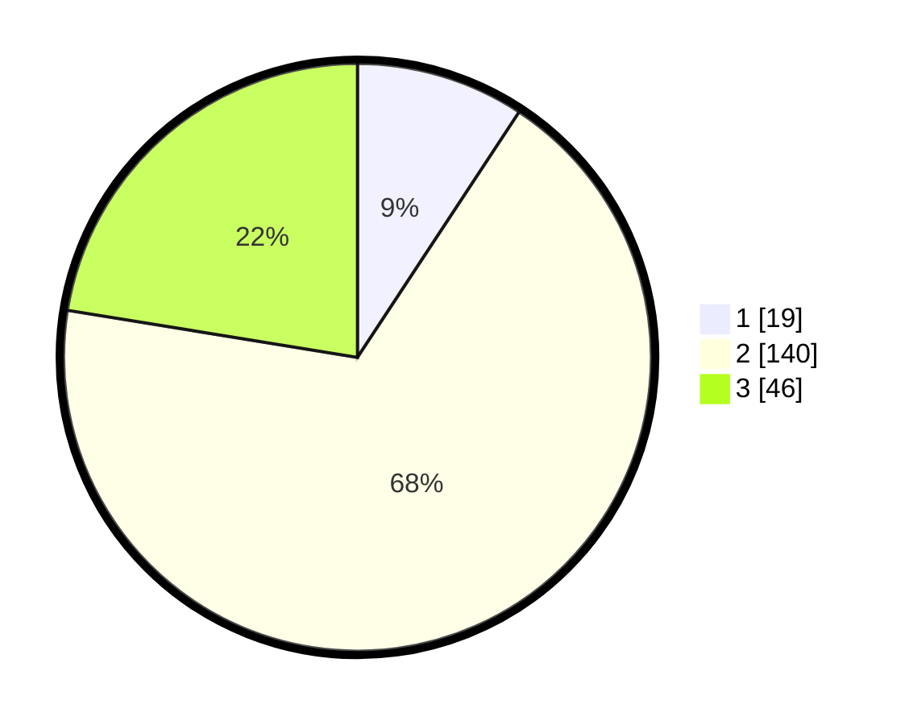

# Hasil

## Grafik

## Tabel

| No. | Nama Paslon    | Suara | Suara (raw) | Persentase |
|:--- |:-------------- | -----:| -----------:| ----------:|
| 1   | ANIES MUHAIMIN | 19    | [19][p-1]   | 9,27       |
| 2   | PRABOWO GIBRAN | 140   | [140][p-2]  | 68,29      |
| 3   | GANJAR MAHFUD  | 46    | [46][p-3]   | 22,44      |

[p-1]: https://github.com/gigit-pemilu/pemilu-2024/blob/main/pilpres/hitung-suara/sub/35-jawa-timur/sub/06-kediri/sub/13-grogol/sub/2008-gambyok/sub/006-tps/sub/paslon-1.txt
[p-2]: https://github.com/gigit-pemilu/pemilu-2024/blob/main/pilpres/hitung-suara/sub/35-jawa-timur/sub/06-kediri/sub/13-grogol/sub/2008-gambyok/sub/006-tps/sub/paslon-2.txt
[p-3]: https://github.com/gigit-pemilu/pemilu-2024/blob/main/pilpres/hitung-suara/sub/35-jawa-timur/sub/06-kediri/sub/13-grogol/sub/2008-gambyok/sub/006-tps/sub/paslon-3.txt

## Foto C Plano

https://sirekap-obj-formc.kpu.go.id/0f03/pemilu/ppwp/35/06/13/20/08/3506132008006-20240221-092442--6c496740-8197-4b1c-801d-d215a8a6401e.jpg

https://sirekap-obj-formc.kpu.go.id/0f03/pemilu/ppwp/35/06/13/20/08/3506132008006-20240221-092427--302de136-feb8-4dd2-81fb-1f5325de7284.jpg

https://sirekap-obj-formc.kpu.go.id/0f03/pemilu/ppwp/35/06/13/20/08/3506132008006-20240214-204126--71d2ffa0-ba97-438d-991f-fdcab96be94a.jpg

## Metadata

| Key        | Value               |
| ---------- | ------------------- |
| Time Stamp | 2024-02-21 10:00:00 |

