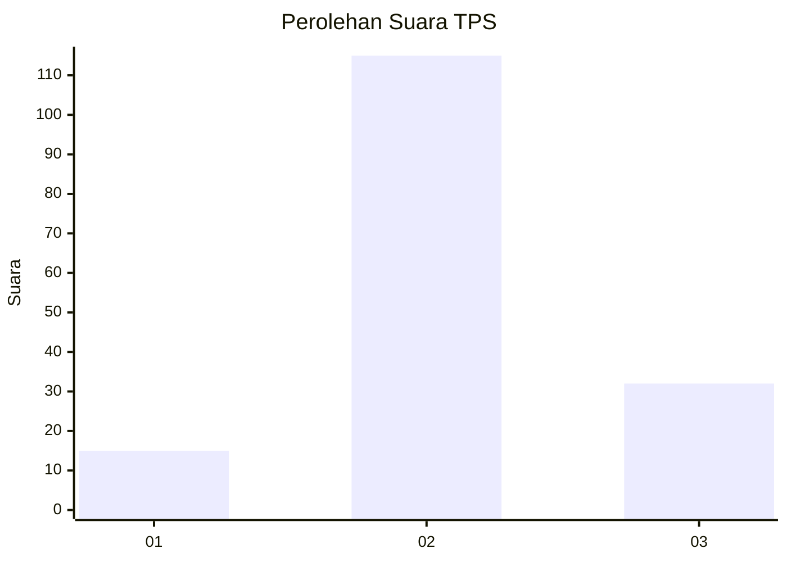
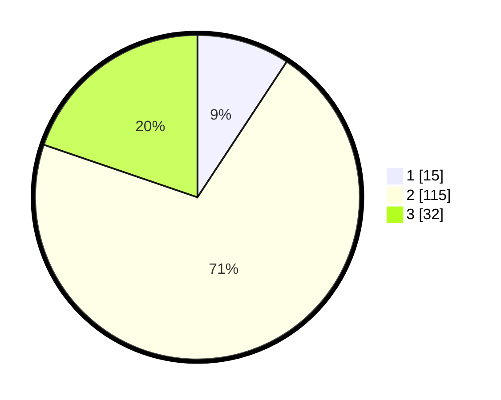

# Hasil

## Grafik

## Tabel

| No. | Nama Paslon    | Suara | Suara (raw) | Persentase |
|:--- |:-------------- | -----:| -----------:| ----------:|
| 1   | ANIES MUHAIMIN | 15    | [15][p-1]   | 9,26       |
| 2   | PRABOWO GIBRAN | 115   | [115][p-2]  | 70,99      |
| 3   | GANJAR MAHFUD  | 32    | [32][p-3]   | 19,75      |

[p-1]: https://github.com/gigit-pemilu/pemilu-2024-35-jawa-timur/blob/main/pilpres/hitung-suara/sub/35-jawa-timur/sub/06-kediri/sub/15-purwoasri/sub/2001-jantok/sub/007-tps/sub/paslon-1.txt
[p-2]: https://github.com/gigit-pemilu/pemilu-2024-35-jawa-timur/blob/main/pilpres/hitung-suara/sub/35-jawa-timur/sub/06-kediri/sub/15-purwoasri/sub/2001-jantok/sub/007-tps/sub/paslon-2.txt
[p-3]: https://github.com/gigit-pemilu/pemilu-2024-35-jawa-timur/blob/main/pilpres/hitung-suara/sub/35-jawa-timur/sub/06-kediri/sub/15-purwoasri/sub/2001-jantok/sub/007-tps/sub/paslon-3.txt

## Foto C Plano

https://sirekap-obj-formc.kpu.go.id/4673/pemilu/ppwp/35/06/15/20/01/3506152001007-20240214-205743--e25ef47c-b6cd-425a-a4d3-882b84115c22.jpg

https://sirekap-obj-formc.kpu.go.id/4673/pemilu/ppwp/35/06/15/20/01/3506152001007-20240214-210112--d4bc338d-5ff6-420b-b630-9bd0630dac61.jpg

https://sirekap-obj-formc.kpu.go.id/4673/pemilu/ppwp/35/06/15/20/01/3506152001007-20240214-210215--fc5da6f6-8bbc-48f9-85af-7864ccc77a8a.jpg

## Metadata

| Key        | Value               |
| ---------- | ------------------- |
| Time Stamp | 2024-02-16 22:30:00 |

