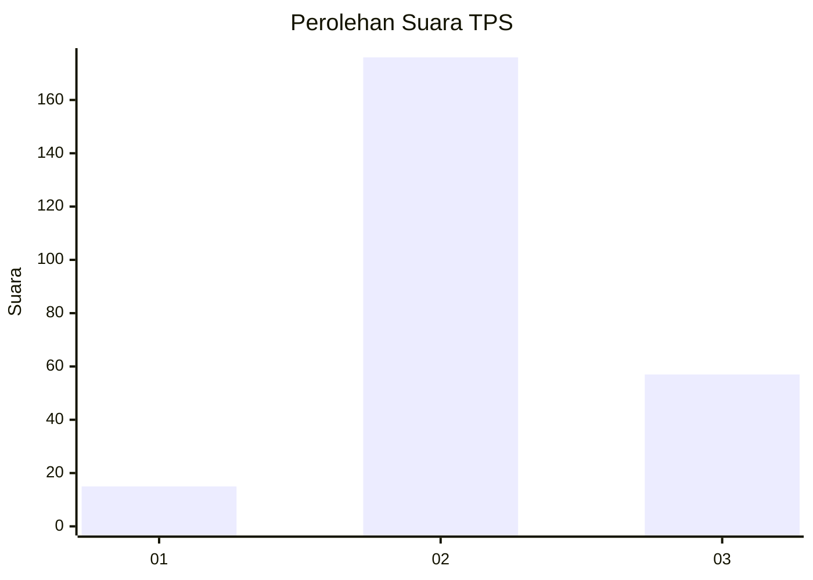
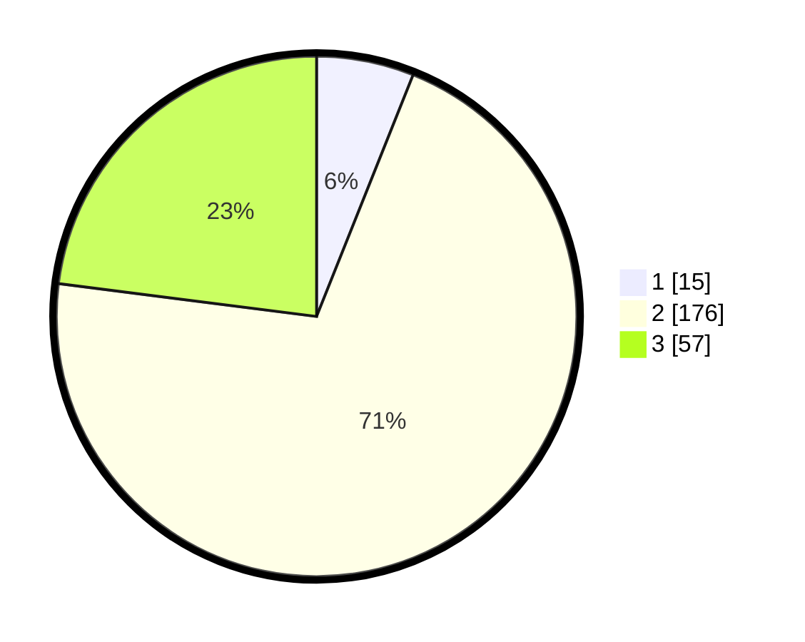

# Hasil

## Grafik

## Tabel

| No. | Nama Paslon    | Suara | Suara (raw) | Persentase |
|:--- |:-------------- | -----:| -----------:| ----------:|
| 1   | ANIES MUHAIMIN | 15    | [15][p-1]   | 6,05       |
| 2   | PRABOWO GIBRAN | 176   | [176][p-2]  | 70,97      |
| 3   | GANJAR MAHFUD  | 57    | [57][p-3]   | 22,98      |

[p-1]: https://github.com/gigit-pemilu/pemilu-2024/blob/main/pilpres/hitung-suara/sub/35-jawa-timur/sub/06-kediri/sub/15-purwoasri/sub/2004-purwoasri/sub/002-tps/sub/paslon-1.txt
[p-2]: https://github.com/gigit-pemilu/pemilu-2024/blob/main/pilpres/hitung-suara/sub/35-jawa-timur/sub/06-kediri/sub/15-purwoasri/sub/2004-purwoasri/sub/002-tps/sub/paslon-2.txt
[p-3]: https://github.com/gigit-pemilu/pemilu-2024/blob/main/pilpres/hitung-suara/sub/35-jawa-timur/sub/06-kediri/sub/15-purwoasri/sub/2004-purwoasri/sub/002-tps/sub/paslon-3.txt

## Foto C Plano

https://sirekap-obj-formc.kpu.go.id/5c28/pemilu/ppwp/35/06/15/20/04/3506152004002-20240215-001856--26c2971f-dafe-4dc2-8011-2d71571b0b73.jpg

https://sirekap-obj-formc.kpu.go.id/5c28/pemilu/ppwp/35/06/15/20/04/3506152004002-20240215-001950--2e189256-b3d5-46ed-8125-254640aa1492.jpg

https://sirekap-obj-formc.kpu.go.id/5c28/pemilu/ppwp/35/06/15/20/04/3506152004002-20240215-002123--8c8f0104-0eba-4eb0-b581-9242cd539810.jpg

## Metadata

| Key        | Value               |
| ---------- | ------------------- |
| Time Stamp | 2024-02-16 23:30:00 |

