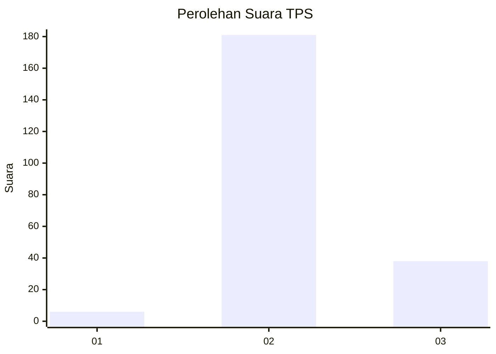
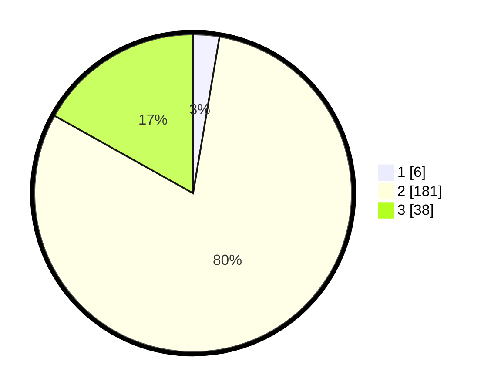

# Hasil

## Grafik

## Tabel

| No. | Nama Paslon    | Suara | Suara (raw) | Persentase |
|:--- |:-------------- | -----:| -----------:| ----------:|
| 1   | ANIES MUHAIMIN | 6     | [6][p-1]    | 2,67       |
| 2   | PRABOWO GIBRAN | 181   | [181][p-2]  | 80,44      |
| 3   | GANJAR MAHFUD  | 38    | [38][p-3]   | 16,89      |

[p-1]: https://github.com/gigit-pemilu/pemilu-2024-35-jawa-timur/blob/main/pilpres/hitung-suara/sub/35-jawa-timur/sub/06-kediri/sub/15-purwoasri/sub/2005-wonotengah/sub/007-tps/sub/paslon-1.txt
[p-2]: https://github.com/gigit-pemilu/pemilu-2024-35-jawa-timur/blob/main/pilpres/hitung-suara/sub/35-jawa-timur/sub/06-kediri/sub/15-purwoasri/sub/2005-wonotengah/sub/007-tps/sub/paslon-2.txt
[p-3]: https://github.com/gigit-pemilu/pemilu-2024-35-jawa-timur/blob/main/pilpres/hitung-suara/sub/35-jawa-timur/sub/06-kediri/sub/15-purwoasri/sub/2005-wonotengah/sub/007-tps/sub/paslon-3.txt

## Foto C Plano

https://sirekap-obj-formc.kpu.go.id/e6b5/pemilu/ppwp/35/06/15/20/05/3506152005007-20240215-041522--3110f126-0fa9-46cc-bb5e-771afa74510f.jpg

https://sirekap-obj-formc.kpu.go.id/e6b5/pemilu/ppwp/35/06/15/20/05/3506152005007-20240215-041612--f2f57a80-90eb-458c-88c5-fa6e796602aa.jpg

https://sirekap-obj-formc.kpu.go.id/e6b5/pemilu/ppwp/35/06/15/20/05/3506152005007-20240215-041654--c4c55b3f-66fa-499d-a372-56d2b1a66b38.jpg

## Metadata

| Key        | Value               |
| ---------- | ------------------- |
| Time Stamp | 2024-02-20 18:00:00 |

