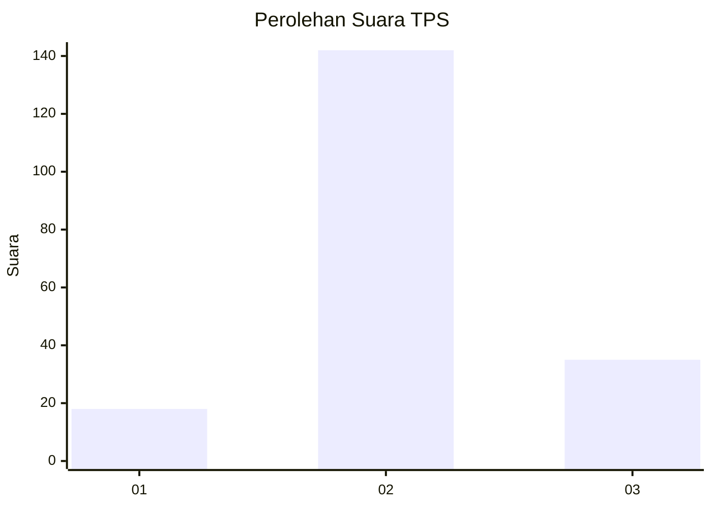
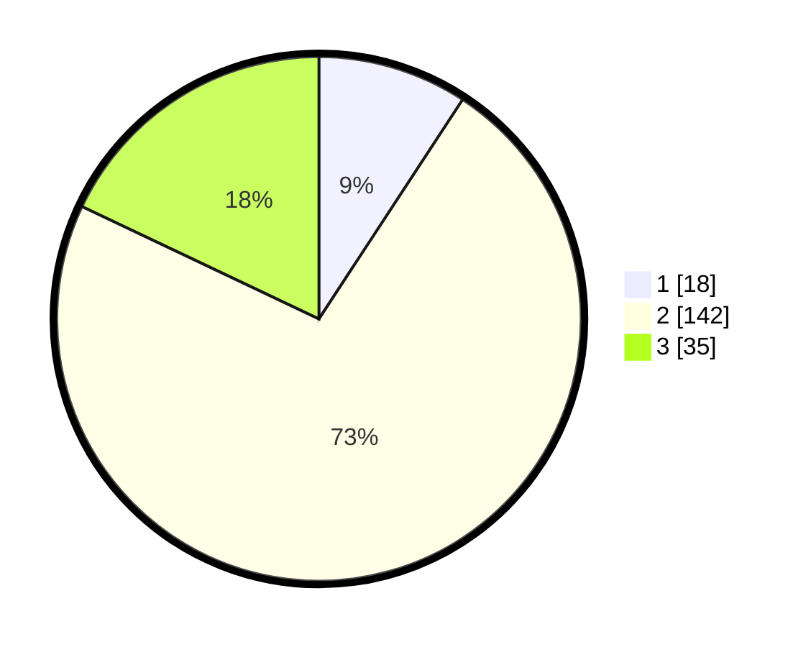

# Hasil

## Grafik

## Tabel

| No. | Nama Paslon    | Suara | Suara (raw) | Persentase |
|:--- |:-------------- | -----:| -----------:| ----------:|
| 1   | ANIES MUHAIMIN | 18    | [18][p-1]   | 9,23       |
| 2   | PRABOWO GIBRAN | 142   | [142][p-2]  | 72,82      |
| 3   | GANJAR MAHFUD  | 35    | [35][p-3]   | 17,95      |

[p-1]: https://github.com/gigit-pemilu/pemilu-2024/blob/main/pilpres/hitung-suara/sub/35-jawa-timur/sub/06-kediri/sub/15-purwoasri/sub/2006-ketawang/sub/001-tps/sub/paslon-1.txt
[p-2]: https://github.com/gigit-pemilu/pemilu-2024/blob/main/pilpres/hitung-suara/sub/35-jawa-timur/sub/06-kediri/sub/15-purwoasri/sub/2006-ketawang/sub/001-tps/sub/paslon-2.txt
[p-3]: https://github.com/gigit-pemilu/pemilu-2024/blob/main/pilpres/hitung-suara/sub/35-jawa-timur/sub/06-kediri/sub/15-purwoasri/sub/2006-ketawang/sub/001-tps/sub/paslon-3.txt

## Foto C Plano

https://sirekap-obj-formc.kpu.go.id/a242/pemilu/ppwp/35/06/15/20/06/3506152006001-20240215-033705--729bad63-d70a-4c28-b1d2-8655601cf067.jpg

https://sirekap-obj-formc.kpu.go.id/a242/pemilu/ppwp/35/06/15/20/06/3506152006001-20240215-034145--d2e16b2f-b3b0-4f25-87f8-b85874cb91ea.jpg

https://sirekap-obj-formc.kpu.go.id/a242/pemilu/ppwp/35/06/15/20/06/3506152006001-20240215-052240--07d55d35-b463-4373-8189-f3981ad42bf4.jpg

## Metadata

| Key        | Value               |
| ---------- | ------------------- |
| Time Stamp | 2024-02-16 23:00:00 |

