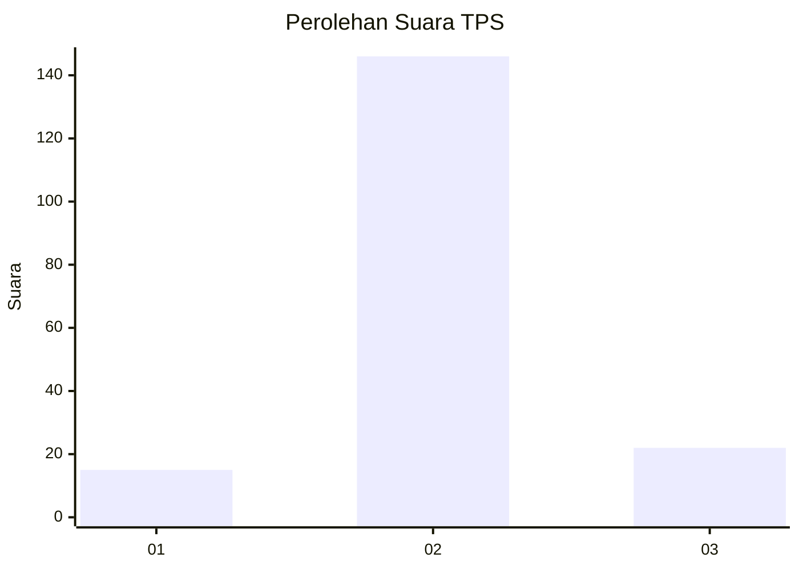
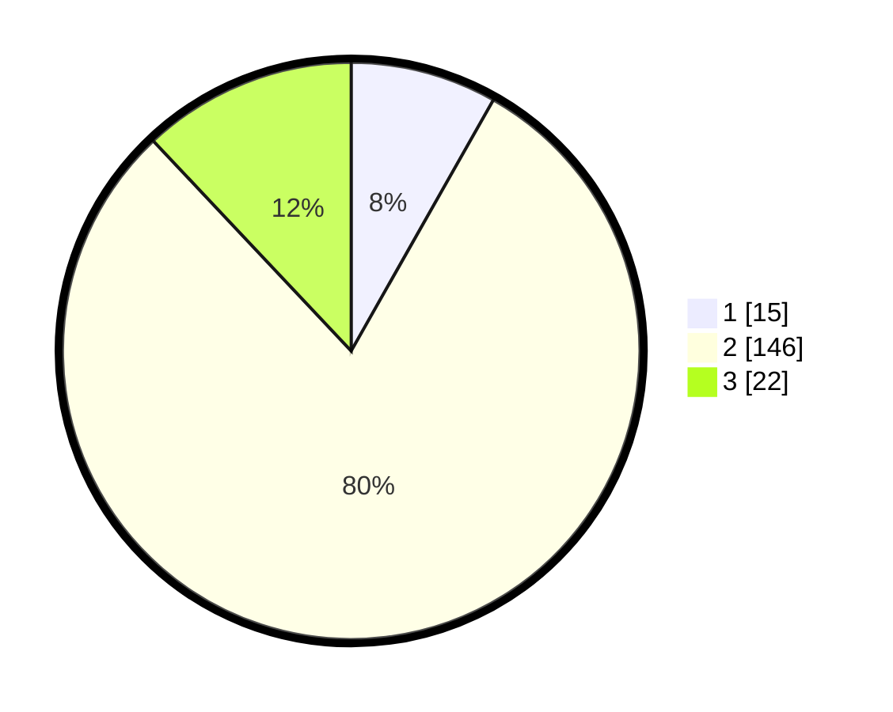

# Hasil

## Grafik

## Tabel

| No. | Nama Paslon    | Suara | Suara (raw) | Persentase |
|:--- |:-------------- | -----:| -----------:| ----------:|
| 1   | ANIES MUHAIMIN | 15    | [15][p-1]   | 8,20       |
| 2   | PRABOWO GIBRAN | 146   | [146][p-2]  | 79,78      |
| 3   | GANJAR MAHFUD  | 22    | [22][p-3]   | 12,02      |

[p-1]: https://github.com/gigit-pemilu/pemilu-2024-35-jawa-timur/blob/main/pilpres/hitung-suara/sub/35-jawa-timur/sub/06-kediri/sub/15-purwoasri/sub/2006-ketawang/sub/002-tps/sub/paslon-1.txt
[p-2]: https://github.com/gigit-pemilu/pemilu-2024-35-jawa-timur/blob/main/pilpres/hitung-suara/sub/35-jawa-timur/sub/06-kediri/sub/15-purwoasri/sub/2006-ketawang/sub/002-tps/sub/paslon-2.txt
[p-3]: https://github.com/gigit-pemilu/pemilu-2024-35-jawa-timur/blob/main/pilpres/hitung-suara/sub/35-jawa-timur/sub/06-kediri/sub/15-purwoasri/sub/2006-ketawang/sub/002-tps/sub/paslon-3.txt

## Foto C Plano

https://sirekap-obj-formc.kpu.go.id/1680/pemilu/ppwp/35/06/15/20/06/3506152006002-20240215-014238--87fbf6b5-67fc-49ce-988b-55053c5e9e5b.jpg

https://sirekap-obj-formc.kpu.go.id/1680/pemilu/ppwp/35/06/15/20/06/3506152006002-20240215-014303--3b269e8b-471a-4417-bff1-e2025c6c8b8e.jpg

https://sirekap-obj-formc.kpu.go.id/1680/pemilu/ppwp/35/06/15/20/06/3506152006002-20240215-014319--0d038a54-cadc-4602-a5bb-c4b577bc2caf.jpg

## Metadata

| Key        | Value               |
| ---------- | ------------------- |
| Time Stamp | 2024-02-16 23:00:00 |

