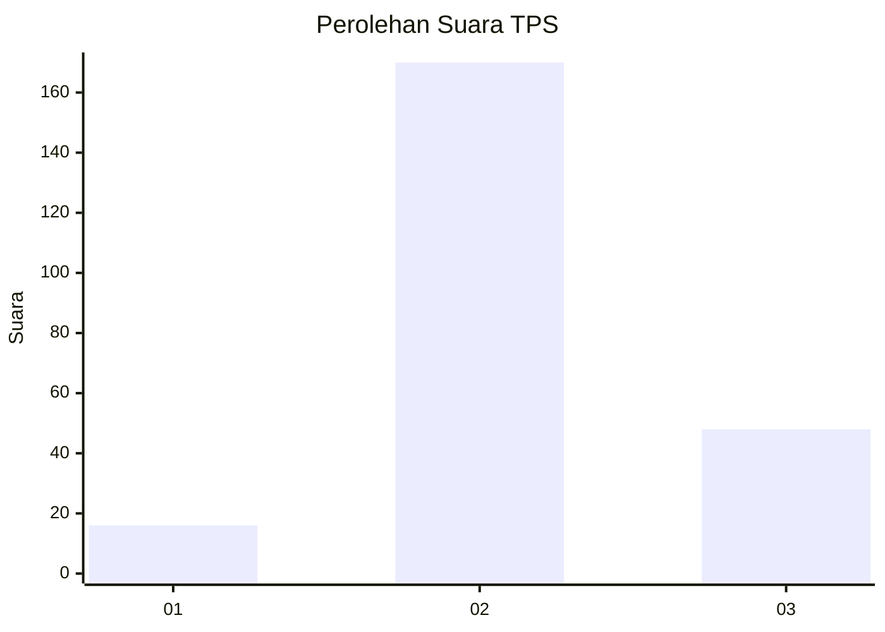

# Hasil

## Grafik

## Tabel

| No. | Nama Paslon    | Suara | Suara (raw) | Persentase |
|:--- |:-------------- | -----:| -----------:| ----------:|
| 1   | ANIES MUHAIMIN | 16    | [16][p-1]   | 6,84       |
| 2   | PRABOWO GIBRAN | 170   | [170][p-2]  | 72,65      |
| 3   | GANJAR MAHFUD  | 48    | [48][p-3]   | 20,51      |

[p-1]: https://github.com/gigit-pemilu/pemilu-2024/blob/main/pilpres/hitung-suara/sub/35-jawa-timur/sub/06-kediri/sub/15-purwoasri/sub/2009-pandansari/sub/001-tps/sub/paslon-1.txt
[p-2]: https://github.com/gigit-pemilu/pemilu-2024/blob/main/pilpres/hitung-suara/sub/35-jawa-timur/sub/06-kediri/sub/15-purwoasri/sub/2009-pandansari/sub/001-tps/sub/paslon-2.txt
[p-3]: https://github.com/gigit-pemilu/pemilu-2024/blob/main/pilpres/hitung-suara/sub/35-jawa-timur/sub/06-kediri/sub/15-purwoasri/sub/2009-pandansari/sub/001-tps/sub/paslon-3.txt

## Foto C Plano

https://sirekap-obj-formc.kpu.go.id/df4a/pemilu/ppwp/35/06/15/20/09/3506152009001-20240214-233554--6a1d2c09-1d2d-4a9c-95c8-7d1a12cb9730.jpg

https://sirekap-obj-formc.kpu.go.id/df4a/pemilu/ppwp/35/06/15/20/09/3506152009001-20240214-225322--5415ac54-3c90-407b-8be9-920aa439d11e.jpg

https://sirekap-obj-formc.kpu.go.id/df4a/pemilu/ppwp/35/06/15/20/09/3506152009001-20240214-225507--92525d07-ebdb-4ea1-afdd-653c8f920fef.jpg

## Metadata

| Key        | Value               |
| ---------- | ------------------- |
| Time Stamp | 2024-02-15 21:30:27 |

