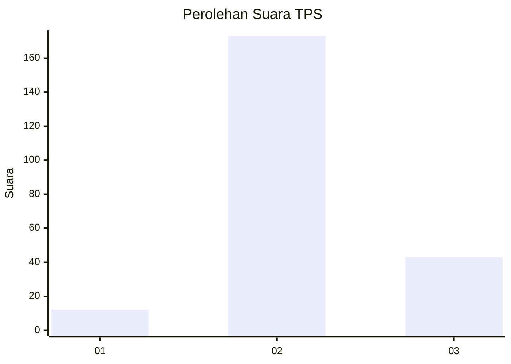
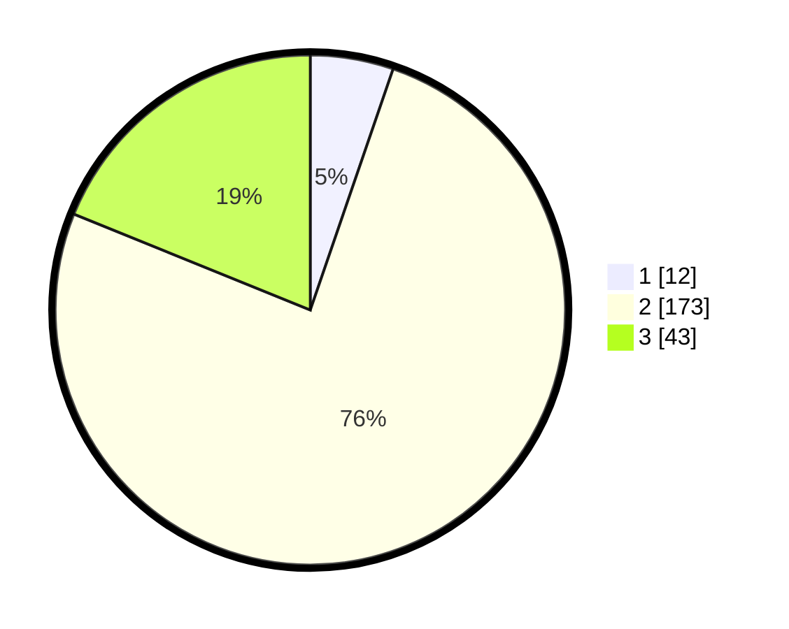

# Hasil

## Grafik

## Tabel

| No. | Nama Paslon    | Suara | Suara (raw) | Persentase |
|:--- |:-------------- | -----:| -----------:| ----------:|
| 1   | ANIES MUHAIMIN | 12    | [12][p-1]   | 5,26       |
| 2   | PRABOWO GIBRAN | 173   | [173][p-2]  | 75,88      |
| 3   | GANJAR MAHFUD  | 43    | [43][p-3]   | 18,86      |

[p-1]: https://github.com/gigit-pemilu/pemilu-2024/blob/main/pilpres/hitung-suara/sub/35-jawa-timur/sub/06-kediri/sub/15-purwoasri/sub/2010-purwodadi/sub/007-tps/sub/paslon-1.txt
[p-2]: https://github.com/gigit-pemilu/pemilu-2024/blob/main/pilpres/hitung-suara/sub/35-jawa-timur/sub/06-kediri/sub/15-purwoasri/sub/2010-purwodadi/sub/007-tps/sub/paslon-2.txt
[p-3]: https://github.com/gigit-pemilu/pemilu-2024/blob/main/pilpres/hitung-suara/sub/35-jawa-timur/sub/06-kediri/sub/15-purwoasri/sub/2010-purwodadi/sub/007-tps/sub/paslon-3.txt

## Foto C Plano

https://sirekap-obj-formc.kpu.go.id/5cb1/pemilu/ppwp/35/06/15/20/10/3506152010007-20240215-005753--011e32bc-b28d-4600-8ab7-9b00d2d65f44.jpg

https://sirekap-obj-formc.kpu.go.id/5cb1/pemilu/ppwp/35/06/15/20/10/3506152010007-20240215-005825--e1c3912c-0c46-4a61-8c3b-8a5c48af78b1.jpg

https://sirekap-obj-formc.kpu.go.id/5cb1/pemilu/ppwp/35/06/15/20/10/3506152010007-20240215-005856--3c140807-d17b-4b2c-a015-83be1055f85e.jpg

## Metadata

| Key        | Value               |
| ---------- | ------------------- |
| Time Stamp | 2024-02-20 18:00:00 |

