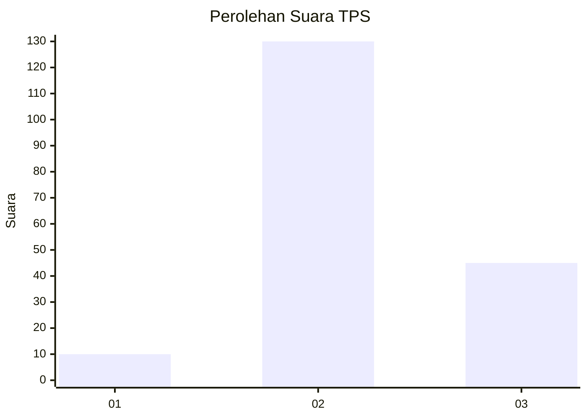
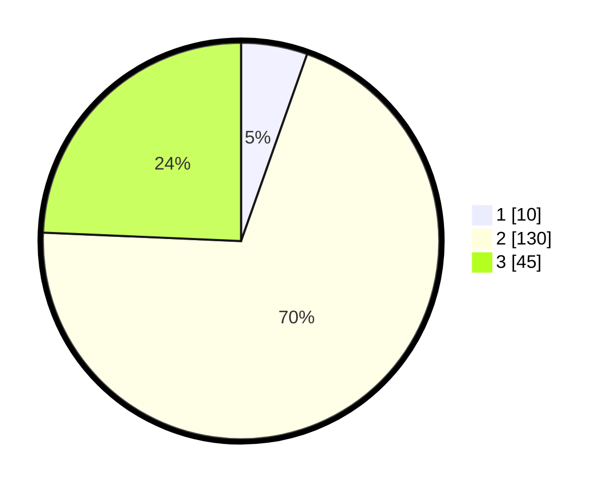

# Hasil

## Grafik

## Tabel

| No. | Nama Paslon    | Suara | Suara (raw) | Persentase |
|:--- |:-------------- | -----:| -----------:| ----------:|
| 1   | ANIES MUHAIMIN | 10    | [10][p-1]   | 5,41       |
| 2   | PRABOWO GIBRAN | 130   | [130][p-2]  | 70,27      |
| 3   | GANJAR MAHFUD  | 45    | [45][p-3]   | 24,32      |

[p-1]: https://github.com/gigit-pemilu/pemilu-2024/blob/main/pilpres/hitung-suara/sub/35-jawa-timur/sub/06-kediri/sub/15-purwoasri/sub/2013-sidomulyo/sub/004-tps/sub/paslon-1.txt
[p-2]: https://github.com/gigit-pemilu/pemilu-2024/blob/main/pilpres/hitung-suara/sub/35-jawa-timur/sub/06-kediri/sub/15-purwoasri/sub/2013-sidomulyo/sub/004-tps/sub/paslon-2.txt
[p-3]: https://github.com/gigit-pemilu/pemilu-2024/blob/main/pilpres/hitung-suara/sub/35-jawa-timur/sub/06-kediri/sub/15-purwoasri/sub/2013-sidomulyo/sub/004-tps/sub/paslon-3.txt

## Foto C Plano

https://sirekap-obj-formc.kpu.go.id/5d95/pemilu/ppwp/35/06/15/20/13/3506152013004-20240215-103228--c27b61df-6ea1-46e2-a5e0-b0468ccb58d5.jpg

https://sirekap-obj-formc.kpu.go.id/5d95/pemilu/ppwp/35/06/15/20/13/3506152013004-20240215-103341--cc81d043-94db-4808-b388-a04170f5535f.jpg

https://sirekap-obj-formc.kpu.go.id/5d95/pemilu/ppwp/35/06/15/20/13/3506152013004-20240215-103655--fc015a69-faa4-4d18-82dd-46eb4487e20f.jpg

## Metadata

| Key        | Value               |
| ---------- | ------------------- |
| Time Stamp | 2024-02-16 23:45:47 |

