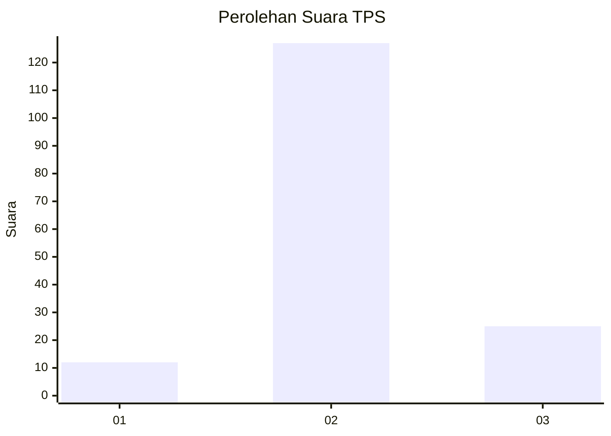

# Hasil

## Grafik

## Tabel

| No. | Nama Paslon    | Suara | Suara (raw) | Persentase |
|:--- |:-------------- | -----:| -----------:| ----------:|
| 1   | ANIES MUHAIMIN | 12    | [12][p-1]   | 7,32       |
| 2   | PRABOWO GIBRAN | 127   | [127][p-2]  | 77,44      |
| 3   | GANJAR MAHFUD  | 25    | [25][p-3]   | 15,24      |

[p-1]: https://github.com/gigit-pemilu/pemilu-2024-35-jawa-timur/blob/main/pilpres/hitung-suara/sub/35-jawa-timur/sub/06-kediri/sub/15-purwoasri/sub/2013-sidomulyo/sub/005-tps/sub/paslon-1.txt
[p-2]: https://github.com/gigit-pemilu/pemilu-2024-35-jawa-timur/blob/main/pilpres/hitung-suara/sub/35-jawa-timur/sub/06-kediri/sub/15-purwoasri/sub/2013-sidomulyo/sub/005-tps/sub/paslon-2.txt
[p-3]: https://github.com/gigit-pemilu/pemilu-2024-35-jawa-timur/blob/main/pilpres/hitung-suara/sub/35-jawa-timur/sub/06-kediri/sub/15-purwoasri/sub/2013-sidomulyo/sub/005-tps/sub/paslon-3.txt

## Foto C Plano

https://sirekap-obj-formc.kpu.go.id/8285/pemilu/ppwp/35/06/15/20/13/3506152013005-20240214-215221--34b61bae-81e1-422a-9931-4ccdb0114b89.jpg

https://sirekap-obj-formc.kpu.go.id/8285/pemilu/ppwp/35/06/15/20/13/3506152013005-20240214-194010--a131fce4-6ff2-4ed1-9187-32cf5fcb2033.jpg

https://sirekap-obj-formc.kpu.go.id/8285/pemilu/ppwp/35/06/15/20/13/3506152013005-20240214-194156--53c70ee1-a5f1-44a8-88f7-455a3e85063b.jpg

## Metadata

| Key        | Value               |
| ---------- | ------------------- |
| Time Stamp | 2024-02-15 04:00:24 |

